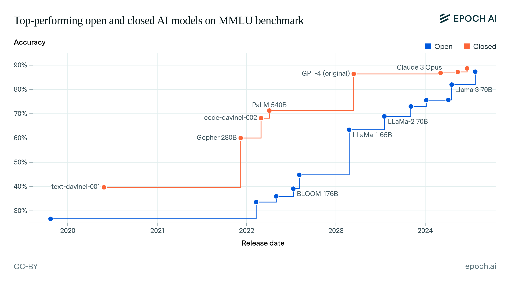

---

Generative AI has captured the world's imagination by enabling machines to create - from composing text to painting images and even writing code. Unlike traditional AI systems that might classify photos or predict numbers, generative models produce original content based on patterns learned from training data. For example, text-based AI like OpenAI's GPT series (ChatGPT) can draft essays or have conversations, image models such as DALL-E or Stable Diffusion render artwork from a simple prompt, and coding assistants like GitHub Copilot or Amazon's CodeWhisperer suggest software code as you type. In short, generative AI refers to deep learning models that generate high-quality text, images, and other content (including computer code) by learning the structure of training data and then creating new examples in similar style [^1] [^2]. This technology has rapidly advanced over the past few years, finding applications in writing, design, entertainment, and software development.

[^1]: https://research.ibm.com/blog/what-is-generative-AI
[^2]: https://www.youngwonks.com/blog/generative-ai-:-beyond-texts-and-images
​

But what enabled this sudden leap in AI creativity? A big part of the story is scale. Modern generative AI is powered by large neural networks (often called large language models or LLMs when they deal with language) trained on massive datasets. Developers have found that making these models **bigger** - in terms of the number of parameters (the model's internal configuration size), the volume of training data, and the amount of compute power - tends to make them better. GPT-3, for instance, had 175 billion parameters and was able to produce remarkably coherent text that smaller predecessors like GPT-2 (with 1.5 billion parameters) could not. Similarly, image generators evolved from producing blurry low-res pictures to photorealistic art as their neural networks and training image collections grew. This section explains the principle of scaling in AI and how it historically drove progress, before exploring whether this approach is now hitting a point of diminishing returns.

## The Scaling Revolution in AI: Bigger Models, Better Results
For much of the 2010s, the dominant paradigm in AI was that **bigger is better**. If you wanted a more accurate or capable AI, you made the neural network larger and trained it on more data. This approach was wildly successful. Breakthroughs in deep learning - from image recognition to language translation - were often achieved by scaling up models. Researchers observed empirical "scaling laws" that as you increase a model's size (parameters), the size of its training dataset, and the compute time, the performance on various tasks improves in a predictable way​ [^3]. In fact, a famous study by OpenAI in 2020 showed that neural network performance (measured by loss or error) follows a power-law improvement as models get larger - requiring exponentially more compute for linear gains, but gains nonetheless​. This drove a race in the AI field to train ever-larger models on ever-bigger data.

[^3]: https://medium.com/@tahirbalarabe2/what-are-llm-scaling-laws-f3a9b523245f

Crucially, it wasn't just about throwing resources mindlessly; it was about balancing those factors. As one explainer puts it: if you scale one factor (say parameters) without scaling the others (data, compute), you hit diminishing returns​. Researchers learned to scale all three in tandem. This led to milestone models: GPT-3 in 2020 showed that an LLM with 175 billion parameters, trained on ~500 billion words from the internet, could perform "few-shot learning" - doing tasks it wasn't explicitly trained for, like translating or arithmetic, just by being prompted with examples​ [^4]. Soon after, Google's PaLM in 2022 pushed the envelope to 540 billion parameters and achieved state-of-the-art performance across many language tasks​. Google reported that as they scaled PaLM's model size, the model not only got more accurate but also *"unlocked new capabilities"* that weren't present in smaller models. In other words, qualitative leaps - sometimes called emergent abilities - seemed to emerge once models reached a certain scale.

[^4]: https://research.google/blog/pathways-language-model-palm-scaling-to-540-billion-parameters-for-breakthrough-performance/

The impact of scale was evident across modalities. In imaging, OpenAI's DALL-E 2 (2022) had billions of parameters and could generate much more detailed, realistic images than earlier generative adversarial networks (GANs), thanks to a larger model and more training data. In coding, GitHub Copilot was built on OpenAI's Codex model (a GPT-3 derivative fine-tuned on code) and demonstrated that an LLM could autocomplete code and even generate whole functions from comments. As the official GitHub blog describes it, "GitHub Copilot is a generative AI tool that functions as a coding assistant to help you write code faster"​ [^5] - something made possible by the underlying model's size and training on enormous volumes of source code. All these examples reinforced the same lesson: scaling up neural networks led to striking new results. It's no wonder that OpenAI's co-founder Ilya Sutskever remarked, "The 2010s were the age of scaling"​ [^6]in AI. Simply put, **scale propelled generative AI from niche experiments to mainstream marvels**.

[^5]: https://github.blog/ai-and-ml/github-copilot/what-can-github-copilot-do-examples/
[^6]: https://www.reuters.com/technology/artificial-intelligence/openai-rivals-seek-new-path-smarter-ai-current-methods-hit-limitations-2024-11-11/

However, this narrative of endlessly better models with increasing size came with a caveat that became more apparent by the early 2020s: each additional increment in scale was yielding smaller improvements than before. The gains, while real, followed a curve of diminishing returns. Researchers and industry leaders began to ask whether we are now approaching a plateau - a point where making the model 10x bigger might not be worth a 1% gain in performance. In the next section, we examine this idea of diminishing returns in generative AI, and look at the evidence as of 2023-2024 that suggests scaling might be hitting its limits.

## Signs of Diminishing Returns: Are Larger Models Still Better?
Scaling up AI models has unquestionably driven progress, but it is not a free lunch - and evidence is mounting that returns on scaling are slowing. The term "diminishing returns" in this context means that if you double your model size or data, you no longer see anything like double the improvement; the boost is much smaller. Initially, scaling from, say, 1 billion to 10 billion parameters might have brought a huge jump in capability. But going from 100 billion to 1 trillion parameters might yield only a marginal gain on many benchmarks. By 2023, many in the field observed that we may be hitting this regime of diminishing improvements.

Figure from https://epoch.ai/blog/open-models-report: Performance of top AI models on a challenging language benchmark (MMLU) from 2020 to 2024. Accuracy improves dramatically as models scale from 6 billion (blue, open-source models) to 175B and beyond (red, proprietary models). However, after GPT-4 in early 2023, the gains appear to plateau around ~90% accuracy despite further model tweaks, suggesting an approaching ceiling on this benchmark.

Several empirical signals support this view. OpenAI's own experience is illustrative. Their flagship GPT-4 model (released March 2023) was a leap over GPT-3 in many areas, but insiders noted it did not represent the order-of-magnitude leap that GPT-3 had been over GPT-2. As OpenAI continued to experiment with even more advanced models, the improvements were harder to come by. In fact, according to a TechCrunch report, employees testing a next-generation model (code-named "Orion", believed to be a GPT-5 prototype) found that its performance gains over GPT-4 were much smaller than the jump from GPT-3 to GPT-4 [^7]. In other words, even though this new model was presumably trained with more data or parameters, the wow factor was limited. This sentiment is echoed by prominent venture capitalists and AI researchers. Notably, Marc Andreessen mused that models might be reaching a "ceiling" in performance, and Ilya Sutskever - one of the chief architects of the scaling approach - told Reuters in late 2024 that "results from scaling up pre-training [...] have plateaued."​ [^8] Coming from Sutskever, this admission is significant: it suggests that simply feeding ever more data and compute into the same recipe is yielding diminishing returns.

[^7]: https://www.theintrinsicperspective.com/p/ai-progress-has-plateaued-at-gpt

[^8]: https://www.reuters.com/technology/artificial-intelligence/openai-rivals-seek-new-path-smarter-ai-current-methods-hit-limitations-2024-11-11/

Concrete data backs up these impressions. On standardized benchmarks used to evaluate AI, progress has slowed. A striking example is the Massive Multitask Language Understanding (MMLU) test - a suite of exams on subjects from history to mathematics. From 2020 to early 2023, large models' scores on MMLU surged from roughly 40% (not much better than random guessing) to around 85%, approaching expert human level. But since early 2023, no model has made a dramatic leap beyond this; improvements are incremental, suggesting a saturation point on that benchmark. In fact, an analysis by Epoch AI found that frontier models like GPT-4, Anthropic's Claude, and Meta's LLaMA 2 all clustered in the high 80s on MMLU, and progress was levelling off as models reached that upper bound​. This plateau hints that as models get very large, they may be hitting the limits of what can be achieved on certain academic tasks without fundamentally new techniques.

Another study highlighting diminishing returns comes from a different angle - not just academic quizzes but the real-world skill of persuasion. In 2024, researchers conducted an experiment with language models of various sizes (from under 1 billion parameters to tens of billions) to see how persuasive their generated political messages were. They discovered a logarithmic scaling law for persuasiveness: beyond a certain size, bigger models had only tiny increases in how convincing their messages were. In fact, current frontier models were barely more persuasive than models an order of magnitude smaller [^9]. The gains with size followed a log curve - classic diminishing returns. The study concluded that simply making models larger is unlikely to make AI-generated messages dramatically more persuasive​. This is a concrete example that for quality metrics outside of narrow benchmarks, massive scale might be hitting a wall of usefulness.

[^9]: https://ar5iv.labs.arxiv.org/html/2406.14508

Why might this be happening? One reason is that easy wins are exhausted. Early in scaling, a larger model can simply memorize and regurgitate more facts or patterns from training data, boosting performance. But once the model has ingested essentially the entire internet, adding more parameters doesn't teach it fundamentally new knowledge - there's little unseen data left to learn from. As one AI researcher quipped, many benchmarks are now basically testing memorization of trivia (and models have nearly saturated them). Indeed, high-quality data itself is becoming a bottleneck - there's only so much useful text on the web, and models like GPT-4 have arguably read most of it. Researchers at Epoch AI and elsewhere discuss that the diversity of data is a limiting factor; models trained on the entire Wikipedia and huge web corpora start to see returns diminish because they've seen most patterns already​. Beyond data, the cost and complexity of training ultra-large models is skyrocketing - multi-million-dollar training runs that occasionally fail or produce only marginally better models. This makes the marginal improvement very expensive to obtain.

We also see companies responding to diminishing returns by changing priorities. OpenAI, for example, has not simply continued to build ever-bigger GPT models as fast as possible. Instead, after GPT-4, they shifted focus to optimizing the model's quality (reducing errors and "hallucinations") and leveraging techniques like reinforcement learning from human feedback (RLHF) to make the AI more aligned and useful, rather than just bigger. Google's path provides another telling case: their first PaLM model was 540B parameters, but the subsequent PaLM 2 model unveiled in 2023 was reportedly just 340B parameters - yet trained on 5x more data (3.6 trillion tokens vs 0.78 trillion)​ [^10] [^11]. This move was informed by research (like DeepMind's Chinchilla study) that showed many models were under-trained on data for their size. By right-sizing the dataset to the model (instead of blindly increasing the model), PaLM 2 achieved better results with fewer parameters - a tacit acknowledgment that brute-force scale isn't always the most efficient path. In short, the industry is seeing more compute and effort yield smaller performance gains than a few years ago, prompting a search for new strategies.

[^10]: https://arxiv.org/html/2408.09895v2
[^11]: https://en.wikipedia.org/wiki/PaLM

Indeed, a 2025 survey of AI scientists reflected this changing outlook. When 475 researchers were polled on whether simply scaling up current large language models would reach artificial general intelligence (AGI), 76% responded "unlikely" or "very unlikely."​ [^12] In other words, most experts don't think just making GPT-5, 6,7... ever larger will magically produce human-level intelligence. This is a notable shift from a few years prior, when many assumed we just needed to push scale further. The sense now is that we are at or nearing a plateau with the current approach - at least in terms of bang-for-buck. As one 2024 analysis bluntly put it, the performance gains relative to the resources invested have begun to decline, with incremental improvements now appearing marginal​ [^13].

[^12]: https://www.livescience.com/technology/artificial-intelligence/current-ai-models-a-dead-end-for-human-level-intelligence-expert-survey-claims

[^13]: https://medium.com/@jongoodey/has-ai-hit-a-plateau-in-improvements-c77ca06de7f7

However, hitting a plateau in one dimension doesn't mean progress in AI will stall out. It could indicate that we need new directions to keep advancing. In the next section, we'll explore some of these emerging paths beyond brute-force scaling, which many believe will drive the next era of generative AI development.

## Beyond Brute Force: New Directions for Generative AI
If simply piling on more layers and data is yielding less return, how will generative AI improve? Researchers are actively exploring a range of techniques to transcend the plateau of scale. Instead of solely making models bigger, the focus is shifting to making them smarter, more efficient, and more integrated into broader systems. Here are a few key directions:

- Algorithmic Efficiency and New Architectures: One approach is designing better algorithms that get more out of each parameter. This could mean models that are architecturally different from the standard transformer network, or training methods that converge faster. A classic example was DeepMind's Chinchilla law finding: rather than a 175B parameter model trained on 300B tokens, a 70B model trained on 1.4 trillion tokens could perform better - essentially a more efficient use of the same compute​ [^14]. Researchers are also revisiting ideas like Mixture-of-Experts (MoE) models, which keep overall parameters high but only activate portions of the network as needed, reducing computation. In 2023, models like GPT-4 Turbo by OpenAI aimed to optimize GPT-4 to run faster and cheaper without loss of ability, indicating efficiency gains. As Ilya Sutskever noted, "scaling the right thing matters more now than ever"​ - meaning find the parts of the model or training that actually improve capability, and scale those, not just everything blindly. We're in an "age of optimization and innovation" following the age of raw scaling. For instance, a researcher at OpenAI, Noam Brown, revealed that letting an AI "think" for 20 seconds on a problem (by cycling through possible solutions internally) gave the same boost as scaling the model 100,000x in size and training time​. Such algorithmic tricks - sometimes called test-time compute, or improved reasoning strategies - can massively enhance performance without requiring a new monster model. This line of work, including techniques like tree-of-thought or improved fine-tuning, is expected to yield more gains than sheer scale at this point.

- Retrieval-Augmented Generation (RAG): Another promising direction is augmenting models with external knowledge or tools, rather than baking everything into the model weights. In retrieval-augmented generation, a language model is connected to a large database or search system and can fetch relevant information on-the-fly to inform its answers. This bypasses the need to memorize every fact in its parameters. DeepMind's RETRO model demonstrated the power of this approach: RETRO had only 7.5 billion parameters but was linked to a terabyte-scale text index. Astonishingly, it matched or exceeded GPT-3 (175B) on many language tasks by retrieving facts as needed​ [^15]. This was 25x fewer parameters with similar performance, thanks to smart use of external data. Retrieval not only makes models smaller and faster; it also can make their outputs more up-to-date and factual (since the model can look up current info). Today's generative AI assistants (like Bing Chat or ChatGPT with plugins) use retrieval to provide sources or handle queries about recent events. We can expect future systems to rely more on retrieval, search, and databases to complement the model, rather than just making one standalone gargantuan neural network. This shift is analogous to how human experts use libraries or the internet - you don't need to memorize everything to be effective, if you have a good information lookup ability.

- Multimodality and Embodied AI: Thus far, we've mostly discussed scaling within a single modality (text or images or code). Another frontier is combining modalities - e.g. models that simultaneously understand language, vision, audio, and more. It's possible that some problems can't be solved by text-only models no matter how big, but a model that sees and hears could develop more general intelligence. For instance, GPT-4 introduced a form of multimodality by accepting image inputs: it can analyze and describe images or diagrams, not just text. Google has gone further with its upcoming Gemini model (by the DeepMind team), which is explicitly multimodal - integrating text and vision (and perhaps other modalities) from the ground up. Early reports suggest Gemini is being designed to handle text, images, and other inputs collectively, enabling it to perform tasks like interpreting a chart and then answering a question about it. Multimodal models might yield new emergent abilities by understanding the world in a richer way, potentially overcoming some plateau in purely text-based reasoning. Beyond virtual data, embodied AI that interacts with the physical world (robots, IoT devices) can also provide feedback and grounding that pure text models lack. For example, a generative model controlling a robot could learn from real-world trial and error, not just static datasets. Such avenues represent qualitatively different scaling - not just "bigger" in the same dimension, but expanding along new dimensions (sensory, interactive) that could open up new capabilities.

- Human-AI Collaboration and Alignment: As AI systems plateau in isolated performance, another way forward is enhancing how they work with humans. Rather than viewing AI as an autonomous oracle that just needs more training, many researchers see the future as collaborative systems where AI amplifies human abilities. For example, large language models can be used as copilots or assistants in creative workflows - the human provides guidance, the AI provides suggestions, and together they produce a better result than either could alone. By focusing on the interface and collaboration (chat interfaces, interactive prompts, refining outputs), we can get more value out of existing models without needing them to be perfect or superhuman. Moreover, involving humans in the loop can help address the model's blind spots or errors on the fly. Another aspect of this is alignment: making sure AI systems' goals and behaviors are aligned with human intentions and values. Instead of just trying to brute-force intelligence, there's increasing effort on training AIs to be safe, truthful, and helpful. Techniques like Reinforcement Learning from Human Feedback (RLHF) have been critical in making models like ChatGPT more aligned. Going forward, research on alignment (including AI that can critique or supervise other AIs) is seen as vital. Some at OpenAI argue that we should focus on better aligning models as we scale them, so that even if they're not vastly more "intelligent" with size, they are more usable and reliable for humans​. In short, one future direction is quality over quantity - deepen the partnership between humans and AI, and improve AI's behavior, not just raw IQ points.

[^14]: https://medium.com/@tahirbalarabe2/what-are-llm-scaling-laws-f3a9b523245f

[^15]: https://deepmind.google/discover/blog/improving-language-models-by-retrieving-from-trillions-of-tokens/

Each of these directions represents a shift from the earlier paradigm of scale-at-all-costs. We are likely to see smaller or mid-sized models that are more efficient, domain-specialized, or supported by external tools outperform giant all-encompassing models in many tasks. This doesn't mean model size won't increase further (it likely will, but in a more judicious way), rather that the community is broadening its focus. The next breakthrough in generative AI might come not from a trillion-parameter behemoth alone, but from a clever new algorithm or a well-orchestrated system combining multiple AIs and data sources.

## Implications: Energy, Access, and Alignment
The discussion of scaling isn't just academic or economic - it has real policy and ethical implications. The era of ever-bigger models raised concerns about environmental impact, equitable access to AI, and the challenges of controlling powerful generative models.

Energy and Environmental Costs: Large AI models consume astonishing amounts of electricity for training and deployment. As models scaled, so did their carbon footprint. For example, training GPT-3 (175B) is estimated to have consumed 1,287 MWh of electricity, producing about 502 metric tons of CO₂ emissions​ [^16]. That single training run is equivalent to the yearly emissions of ~110 gasoline cars - for one model. GPT-4, which is larger and underwent multiple training runs, likely used even more compute (though OpenAI hasn't disclosed details). And training is only part of the story: running these models for millions of user queries (inference) also draws significant power. A study cited by Alex de Vries estimates AI computing could grow from 85 to 134 TWh of electricity by 2027 globally, rivaling countries or industries in energy usage. This has led to calls for greener AI, through both better efficiency (as discussed earlier) and using renewable energy for data centers. If we hit diminishing returns, one silver lining might be a slowdown in the "arms race" of model size, which could curb exponential growth in energy demand. Nonetheless, any continued progress in AI must grapple with sustainability - policy may be needed to encourage efficient research rather than just brute-force approaches that burn more carbon.

[^16]: https://planbe.eco/en/blog/ais-carbon-footprint-how-does-the-popularity-of-artificial-intelligence-affect-the-climate/

Model Access and Inequality: As models got bigger and more expensive, fewer players could afford to train them. This concentration has implications for who controls the technology. The largest generative models today (GPT-4, Google's models, etc.) are mostly in the hands of tech giants or well-funded labs. This raises concerns about equitable access and open research. If diminishing returns make extreme scale less attractive, it could democratize things somewhat - researchers might focus on smaller models that more organizations or academics can handle. Indeed, the open-source community made strides with models like Meta's LLaMA (2023), a 65B-parameter model that was released to researchers and soon leaked, allowing developers worldwide to experiment at a smaller scale. By optimizing and distilling models, some projects managed to run pretty capable LLMs on a single GPU or even a smartphone (e.g. 7B-parameter variants). The gap between the best open models and closed models narrowed to perhaps a year's difference in 2023 [^17]. However, if companies do find ways to push to 10 trillion-parameter models, we could return to a situation where only a few entities hold "frontier AI" capabilities. This dynamic has attracted regulatory attention - for instance, discussions of treating very large foundation models as critical infrastructure that might need oversight or sharing. There's also an ethical argument that knowledge gained from training these behemoths (which often use public internet data) should be shared rather than kept proprietary. Striking the right balance between open innovation and safety (since open models can be misused too) is a key policy challenge. In summary, the plateau of scale might open up the field to more contributors if the emphasis shifts to ingenuity over raw resources.

[^17]: https://epoch.ai/blog/open-models-report

Safety and Alignment Challenges: Larger generative models have shown not just greater capabilities but sometimes greater propensity for unintended behaviors. With GPT-4 and its peers, we've seen AI outputs that are more convincing - which is a double-edged sword. They can produce more persuasive misinformation, more complex hate speech, or even help in bio-weapon design (in one controversial experiment) if not properly aligned. The bigger the model, the harder it can be to interpret its inner workings, and the more severe the consequences if it behaves badly. This has underscored the importance of AI safety research. Paradoxically, some alignment problems may also exhibit diminishing returns: simply making the model follow instructions better with more training data might not solve fundamental issues like reasoning errors or bias. Ensuring a model is truthful and fair might require new techniques or constraints (for example, citing sources for its statements, or having separate modules critique outputs). Policymakers are increasingly concerned about models that are powerful but unaligned. In 2023, there were calls for a pause on the training of the largest AI models until safety protocols catch up, and governments started drafting regulations (such as the EU's AI Act) that would impose testing and transparency requirements on advanced generative AI. The alignment challenge grows as models grow - some AI scientists worry that a sufficiently advanced model could even learn to "game" its safety guardrails (a speculative but hotly debated topic). Thus, another implication of hitting a scaling plateau is that it gives us a chance to catch our breath and improve safety before the next leap. As one paper outlined, there are numerous foundational challenges to assuring the alignment of LLMs with human values​ [^18]. Addressing these - from reducing harmful biases to preventing malicious use - is just as critical as improving raw performance. Society will need to invest in oversight, ethics, and perhaps limits on deployment of certain capabilities, to ensure generative AI develops in a beneficial way.

[^18]: https://arxiv.org/abs/2404.09932

In summary, the diminishing returns of scale have multifaceted implications. Environmentally, it pressures us to seek efficiency. Socially and economically, it raises questions of access: will AI be a ubiquitous utility or controlled by a few? And in terms of ethics, it highlights that bigger isn't automatically better if we can't ensure bigger is safe and aligned. These considerations are shaping a new mindset in AI development that prizes responsibility and sustainability alongside innovation.

## Conclusion: Plateau or Springboard?
So, are we nearing the plateau of generative AI's capabilities with current scaling methods? The evidence suggests that we are approaching a point of diminishing returns where making models much larger yields only modest improvements. Performance on many benchmarks is flattening out, and pioneers of the field have openly stated that new ideas are needed beyond brute force. However, reaching a plateau in one sense can be a springboard in another - it often spurs innovation in new directions. Just as the plateau of classical computing performance led to new parallel architectures and cloud computing, the apparent plateau of scale is pushing AI researchers toward fresh strategies like algorithmic efficiency, retrieval augmentation, multimodal learning, and better human-AI interaction.

It's worth noting that "plateau" doesn't mean an end to progress. History of technology is full of S-curves - rapid gains, then saturation, then a leap to a new S-curve. Generative AI might be at the top of one S-curve now. The next leaps might come from qualitatively different advances (perhaps an AI that can learn new skills on the fly, or one that integrates reasoning and memory in a novel way). Moreover, there are still unexplored frontiers even in scaling - for example, training on multi-modal data or lifelong learning approaches that continuously update a model without forgetting. Human creativity in how we design and use AI will be the driving force to overcome current limits.

In accessible terms, we can think of it like flying: early airplanes kept needing bigger engines to fly faster or farther, until at some point, just adding horsepower stopped giving big returns. Then engineers invented new designs: jet engines, swept wings, and so on. AI might be at a similar juncture. Our current "engines" (massive neural networks trained on internet data) might be hitting their practical max speeds. To go further, we likely need new designs and smarter ways to soar.

One thing is clear: generative AI is now a permanent part of the technology landscape, plateau or not. Its ability to produce text, images, and code has unlocked incredible productivity and creativity, and society is only beginning to adapt to this capability. In the coming years, instead of simply asking "how many billions of parameters," we'll be asking how and for what we deploy these AI systems. The conversation is shifting from pure power to purpose and principle. Are we using AI to truly augment human lives and solve important problems? Can we make AI efficient enough to be widely accessible and environmentally friendly? Can we align AI outputs with our values and factual reality?

Answering these questions will define the next chapter of generative AI. We may indeed be near the end of the era where scaling alone drives the biggest leaps. But rather than lament a plateau, we can view it as an opportunity - a chance to refocus on innovation beyond sheer size, to ensure the continued and responsible growth of this transformative technology. Generative AI's journey is far from over; it may no longer be a rocket climbing exponentially, but it can glide forward and upward on the wings of new ideas. The plateau of scale, in that sense, might just mark the end of the beginning. 

---

## Bibliography

Andreessen, M. (2024) AI Scaling Plateau? [a16z Youtube/ Podcast]; https://www.youtube.com/watch?v=hookUj3vkE4

Anwar, U., Saparov, A., Rando, J., Paleka, D., Turpin, M., Hase, P., ... & Krueger, D. (2024) Foundational Challenges in Assuring Alignment and
Safety of Large Language Models; https://arxiv.org/pdf/2404.09932

Epoch AI (2024) How Far Behind Are Open Models?; https://epoch.ai/blog/open-models-report

GitHub Blog (2025) How to use GitHub Copilot: What it can do and real-world examples; https://github.blog/ai-and-ml/github-copilot/what-can-github-copilot-do-examples/

Google Deepmind (2021) Improving language models by retrieving from trillions of tokens; https://deepmind.google/discover/blog/improving-language-models-by-retrieving-from-trillions-of-tokens/

Google Research (2022) Pathways Language Model (PaLM): Scaling to 540 Billion Parameters for Breakthrough Performance; https://research.google/blog/pathways-language-model-palm-scaling-to-540-billion-parameters-for-breakthrough-performance/

Hackenburg, K., Tappin, B. M., Röttger, P., Hale, S., Bright, J., & Margetts, H. (2024) Evidence of a log scaling law for political persuasion with large language models; https://arxiv.org/pdf/2406.14508

IBM (2023) What is generative AI?; https://research.ibm.com/blog/what-is-generative-AI

Live Science (2025) Current AI models a 'dead end' for human-level intelligence, scientists agree; https://www.livescience.com/technology/artificial-intelligence/current-ai-models-a-dead-end-for-human-level-intelligence-expert-survey-claims

Medium@jongoodey (2024) Has AI Hit a Plateau in Improvements?;https://medium.com/@jongoodey/has-ai-hit-a-plateau-in-improvements-c77ca06de7f7

Medium@tahirbalarabe2 (2025) What are LLM Scaling Laws?; https://medium.com/@tahirbalarabe2/what-are-llm-scaling-laws-f3a9b523245f

Plan Be Eco (2024) AI's carbon footprint - how does the popularity of artificial intelligence affect the climate?; https://planbe.eco/en/blog/ais-carbon-footprint-how-does-the-popularity-of-artificial-intelligence-affect-the-climate/

Reuters (2024) OpenAI and others seek new path to smarter AI as current methods hit limitations; ttps://www.reuters.com/technology/artificial-intelligence/openai-rivals-seek-new-path-smarter-ai-current-methods-hit-limitations-2024-11-11/

The Intrinsic Perspective (2024)AI progress has plateaued below GPT-5 level; https://www.theintrinsicperspective.com/p/ai-progress-has-plateaued-at-gpt

Wikipedia (2024) PaLM; https://en.wikipedia.org/wiki/PaLM

Wu, C., & Tang, R. (2024) Performance Law of Large Language Models; https://arxiv.org/pdf/2408.09895

YoungWonks (2024) Generative AI : Beyond Texts and Images; https://www.youngwonks.com/blog/generative-ai-:-beyond-texts-and-images