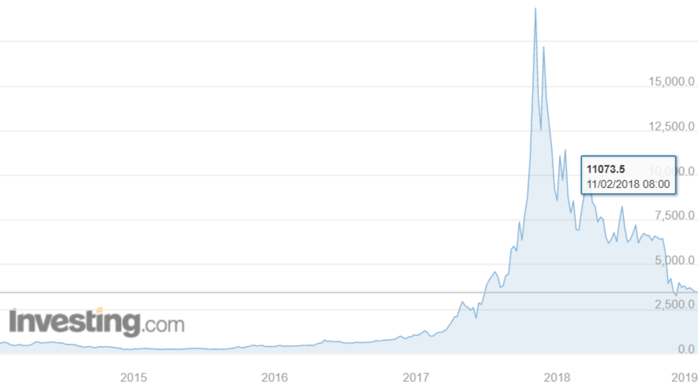
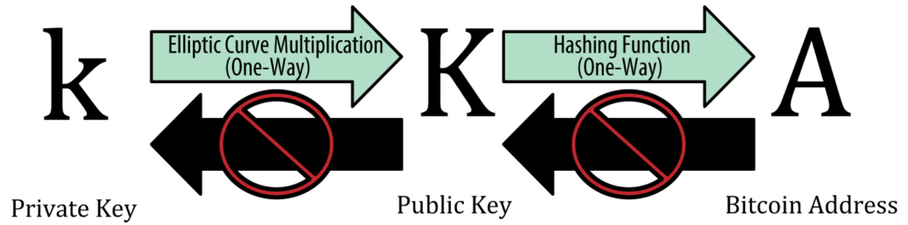

---

### Description
Written in 2018 and 2019 while I was still in high school, this essay investigates whether Bitcoin, as the most prominent cryptocurrency, could one day function as an everyday-use currency akin to the US Dollar. It begins by comparing the characteristics of USD in both cash and electronic forms with those of Bitcoin, evaluating core attributes such as durability, divisibility, portability, anonymity, transaction efficiency, and the role of intermediaries. The analysis draws on a wide range of credible sources and includes in-depth case studies - like the Bangladesh Bank cyberheist and the Mt. Gox Bitcoin theft - to examine issues of security, traceability, and public trust in digital currencies.

The essay goes further to explore the economic and political implications of widespread cryptocurrency adoption, particularly the potential conflict between decentralised systems and the centralised control required for effective monetary policy. It argues that for a cryptocurrency to become truly viable for daily use, it would need to evolve into a permissioned, central-bank-issued stablecoin - what the essay terms a "Crypto Dollar" - with fast transactions, user identification, and regulatory oversight. The work concludes by considering global dissatisfaction with USD hegemony and posits the possibility of a supranational cryptocurrency, such as a UN-backed digital currency, emerging to facilitate secure, efficient, and politically neutral cross-border trade.

---

# Literature Review

## 1. Introduction
With all the hype and excitement surrounding Bitcoin spawning a plethora of newly-minted cryptocurrencies, fresh ICO's (Initial Coin Offerings) and even reports of governments issuing, or planning to issue, their own cryptocurrency, the idea that there could be a new type of 'money' fascinated me. To what extent can cryptocurrency become everyday-use currency? What, exactly, is a cryptocurrency? Does it have the characteristics necessary to become everyday-use currency? This Literature Review explores various sources which address these and related questions, looking for independent corroboration of facts or conflicting evidence; contrasting opinions; evolving arguments and counter-arguments.

## 2. Everyday-Use Currency (USD)
For the purposes of this project, the USD (US Dollar) is used as the typical everyday-use currency because the USD is the most traded currency in the world, most widely-accepted globally, and the world's largest reserve currency in central banks.

### 2.1 Brief History of the USD
This research article is intended to (i) give context to the overall discussion on whether cryptocurrency can become an everyday-use currency similar to the USD; and (ii) draw some parallel into how cryptocurrency might evolve. It sources material primarily from Steven H. Russell [^1] ("The U.S. Currency System: A Historical Perspective"), an authoritative source.

[^1]: Steven Russell is an economist at the Federal Reserve Bank of St Louis. He posted this economic research paper in September 1991. His research explores the circumstances and drivers for the evolution of the US currency systems and suggests that, rather than evolving in a process of natural selection with the rejection of less efficient systems in favour of more efficient ones, previous systems seem to have risen and fallen for reasons that had more to do with political crises - particularly, major wars - than with efficiency considerations.

Today, the only legal currencies under the modern US currency system are the dollar bills issued by the Federal Reserve, and coins minted by the Treasury. They have not been convertible (into gold) for domestic holders since 1933, and for all others since 1971. Russell, after exploring the circumstances and drivers for the evolution of US currency systems, draws the startling conclusion that previous systems seem to have risen and fallen for reasons that had more to do with political crises - particularly, major wars - than with efficiency considerations. This may have a parallel for cryptocurrency.

By tracing the evolution of US currencies from commodities, gold and silver, to the invention of coins and the use of private paper bills of exchange, private paper bills of credit, private bank notes, state bank notes, and finally federal government paper currency, Russell's paper provides clear evidence that everyday-use currencies may be privately issued. In addition, they can be fiat and need not be convertible into specie or something else such as land. Further, a relatively decentralised currency system worked in the US prior to its Civil War.

### 2.2 USD Cash Characteristics
We need to first examine the characteristics of the USD in its physical cash form and electronic form in order to compare and contrast these with the characteristics of Bitcoin to better explore the extent to which the latter might become an everyday-use currency. Sources for this article include Mike Bryan [^2] ("What is Money? - An Economist's Perspective"), Tutor2U ("Money - Characteristics and Functions") [^3], and Berentsen and Schar ("A Short Introduction to the World of Cryptocurrencies") [^4].

[^2]: Mike Bryan, vice president and senior economist at the Federal Reserve Bank of Atlanta. This source is broadly similar to other credible sources on the subject. However, it does present some very fresh and interesting perspective on what money might mean to different people - including the notion that money is a 'memory' using the Yap stones as an example.
[^3]: Tutor2U partners with teachers and schools to help students maximise their performance in exams and fulfill their potential and is likely to be unbiased. It was last updated in 2016 but 'key characteristics' and 'key functions' of money appear up-to-date. The information is mainly factual with few gaps and consistent with lessons on money covered in both IGCSE & AS level microeconomics.
[^4]: Berentsen is a professor of economic theory at the University of Basel (Switzerland) and a research fellow at the Federal Reserve Bank of St. Louis. Schar is managing director of the Center for Innovative Finance at the Faculty of Business and Economics, University of Basel. This article was published First Quarter 2018 and provides fairly up-to-date information on the subject. The article was written as a research paper on monetary issues and provides useful and reasonably detailed information on the characteristics of cash, digital cash, electronic cash, distributed ledger system of the Yap stones, and Bitcoin. The factual information presented in this article is generally consistent with those from other reliable sources. However, there are some errors (e.g. article states that Bitcoin owners remain anonymous through use of pseudonyms whereas, in reality, pseudonyms are not even recorded on the blockchain) and discrepancies (e.g. article states average time between Bitcoin blocks is 10 minutes whereas other reputable sources generally state a longer interval). 

The definition of money from a typical textbook tends to be about its functions: store of value; unit of account; and medium of exchange. Defining money this way leaves so many questions unanswered and so there has been a move to list its characteristics instead. On this, I have not found any evidence of contradicting views.

Following is a summary list of the key characteristics of USD Cash:

- It is **durable**; it can last with low maintenance. 
- It can hold its **value** over time. 
- It is **divisible**; it can be used to buy big things and small things.
- It is **portable**; it can be easily given to someone else.
- It is **recognizable** & **hard to counterfeit**. 
- It is **generally acceptable** as a medium of exchange.

- There is **no third party requirement** for transactions; the cash is simply transferred from one party to another. Therefore, there is **no need for a central authority** to keep accounts in a cash transaction.
- **Anonymity** between the parties involved in a cash transaction is possible because there is no need for any credit relationship between the parties involved; both parties can remain anonymous if they so wish (i.e. neither party may know the identity of the other).
- **Participation is permissionless**. Anybody can participate in a cash transaction, nobody can be excluded. 
- **Physical limitation on counterparties**. In a normal cash transaction, both parties must be present at the same location and time for the transaction to occur. This is a significant disadvantage of cash. 
- **Transaction efficiency**, measured by how fast and cheap a transaction can occur, is relatively low.

### 2.3 USD Electronic Characteristics
Materials for this article are drawn primarily from Berentsen and Schar [^5] ("The Case for Central Bank Electronic Money and the Non-case for Central Bank Cryptocurrencies"), an authoritative source, and independently corroborated by other sources I've researched.

[^5]: Berentsen and Schar, 2018/Q2, "The Case for Central Bank Electronic Money and the Non-case for Central Bank Cryptocurrencies". Berentsen is a professor of economic theory at the University of Basel (Switzerland) and a research fellow at the Federal Reserve Bank of St. Louis. Schar is managing director of the Center for Innovative Finance at the Faculty of Business and Economics, University of Basel. This article provides fairly up-to-date information on the subject and was written as a research paper on monetary issues. The factual information presented in this article is consistent with those from other reliable sources. In addition, this source offers a refreshing non-biased viewpoint on whether central banks should get involved in issuing virtual currencies. 

To overcome the 'Physical limitation' of USD Cash noted above, cash can be deposited into an account where it becomes USD Electronic, a virtual money that exists only as a record in an accounting system which resides in computer systems. When a payment is made, the payment amount is deducted from the payer's account and credited to the payee's account. Payer and payee must each have their own account in a financial institution (or other intermediary) that will arrange the transaction between the parties; i.e. a trusted third party is required and both payer and payee would also lose their anonymity.

According to Revolut [^6], a fintech company, and Investopedia [^7], the intermediary can be a bank or some other types of financial services company which specialises in money-transfers. Intra-bank transfers simply involve the bank updating its internal records or ledger. Interbank transfers within the same country typically involves both banks holding accounts in the country's Central Bank. If the money transfer is across national borders, other intermediaries such as SWIFT and SEPA would be involved to keep track of the money flow and to establish ownership. 

[^6]: Revolut; 2018/2/15 update; "How an international money transfer works"
[^7]: Investopedia; 2018/8/3 update; "Telegraphic Transfer - TT" and Investopedia; 2019/2/10 update; "How the SWIFT System Works"

Generally, an international electronic funds transfer is complete within two to four business days. The fees involved would depend on the number of intermediaries involved. In this regard, the larger banks have an advantage of lower overall fees because they have branches globally.

Following is a summary list of the key characteristics of USD Electronic:

- It is **durable**; it can last with low maintenance 
- It can hold its **value** over time 
- It is **divisible**; it can be used to buy big things and small things 
- It is **portable**; it can be easily given to someone else
- It is **recognisable** & **hard to counterfeit** 
- It is **generally acceptable** as a medium of exchange

- A **third party is required** to keep track of accounts involved in a transaction 
- Parties involved in a USD Electronic transaction are **named** 
- **Participation requires permission** 
- There is **little or no physical limitation on counterparties** 
- **Transaction efficiency**, measured by how fast and cheap a transaction can occur, is relatively high

## 3. Cryptocurrency (Bitcoin)
A cryptocurrency is a digital currency that uses cryptography for security [^8]. It has no physical form and exists solely on the internet. Digital currency is currency that exists purely in electronic form. For the purposes of this project, Bitcoin is used as the representative cryptocurrency because it is the most successful.

[^8]: Investopedia, "What is a Cryptocurrency".

### 3.1 History of Cryptocurrencies; Were There Cryptocurrencies Before Bitcoin?
There were several attempts to popularise digital currencies before the advent of Bitcoin, most notably B-Money, Bit Gold, and Hashcash [^9]. Their common theme appears to be **decentralised** networks which could be used to transfer money without going through any financial institution.

[^9]: References in Nakamoto's white paper; Bernard Marr (Forbes contributor); David Hamilton (Coincentral contributor).

Bitcoin was launched through a white paper [^10] published in 2008 by Satoshi Nakamoto advocating the use of blockchain technology to create a decentralised digital currency. The Bitcoin software was made available to the public in early 2009 and 'mining' - the process by which new Bitcoins are created and transactions are recorded and verified on the blockchain - began.

[^10]: "Bitcoin: A Peer-to-Peer Electronic Cash System" by Satoshi Nakamoto can be downloaded from several independent websites, two of them being Bitcoin.org and the Nakamotoinstitute.org. 'Satoshi Nakamoto' is likely a pseudonym for a group of programmers advocating the use of blockchain technology to create a decentralised digital currency. This 9-page white paper provides the arguments for, and the mathematics and algorithms supporting, an electronic coin (Bitcoin) and the concept of a blockchain to overcome the issue of double-spending without the need for a trusted third party. Its intended readers are programmers and, therefore, the language used (e.g. technical jargon) assumes a certain level of technical background and understanding. This source laid the groundwork for the subsequent implementation of Bitcoin and the blockchain technology. It does not provide detailed algorithms required for implementation nor does it address all the nitty gritty issues associated with implementation.

### 3.2 How Does A Bitcoin Transaction Actually Work In Layman's Language?
Nakamoto's white paper does not detail exactly how a Bitcoin transaction would work. Finding good factual and reliable information about this subject was very challenging. Most online sources gave incomplete, misleading or false information because they were not original sources and were second-guessing. I finally sourced this article from Jimi Sinnige ("Blockchain: how mining works and transactions are processed in seven step") [^11]; Cointelegraph ("What is Bitcoin Mining") [^12]; Blockgeeks ("What is Cryptocurrency: Everything You Must Need To Know!") [^13] and Berentsen and Schar ("A Short Introduction to the World of Cryptocurrencies"). Following is a synopsis. 

[^11]: Jimi Sinnige represents himself as interested in financial tech, biotech, financial markets. He wrote this article because he "couldn't find any clear step by step explanation of this process". This source provides a useful synopsis of how the blockchain mining process works and how Bitcoin transactions are confirmed and added to the blockchain. It is primarily factual in nature and the contents are consistent with Satoshi Nakamoto's White Paper and other sources on the subject. It appears to be a reasonably accurate synopsis of the title. Nonetheless, this source does not detail exactly how the private key, public key and address work in a Bitcoin transaction.

[^12]: Cointelegraph is an independent digital media founded in 2013 to cover news on blockchain technology, crypto assets, and emerging fintech trends. Reviews (e.g. bitcoin-millionaire) I've found about the website are generally positive. A trawl through the internet did not uncover credibility issues with this source. Given the shady and murky world of cryptocurrencies and their lack of expert coverage by mainstream news agencies (for lack of expertise) - and the conflict-of-interest in those websites that do report on them - it is heartening to read on Cointelegraph 'about us' section: "our prerogative, our purpose, our life blood, is the art of truth-telling". This source provides useful factual information about Bitcoin mining. In some areas, it provides more details than Jimi Sinnige's article and vice versa. I used this source to validate the veracity of Sinnige's article. Nonetheless, both this article and Sinnige's do not go into sufficient details regarding how the private key, public key, and Bitcoin address work in a transaction.

[^13]: Blockgeeks is a website which promotes blockchain technology and offers training and services related to blockchain - hence this article to generate interest. This source does provide useful - but not particularly detailed - information on the subject but with too much hype. The information is presented in a manner which supports marketing rather than in a more organised fashion. Because it promotes blockchain technology, this source tends to state things more favourably than actual for the technology, e.g. it states "transactions are confirmed in a couple of minutes" whereas most other credible sources state "10-20 minutes" or longer.

Ownership of bitcoins is an accounting entry (a 'Bitcoin address') on an evergreen digital ledger (the Bitcoin blockchain) which resides on the internet and is accessible to anyone who connects to the Bitcoin network. Each Bitcoin address can only be accessed by someone having the unique alphanumeric code (or 'private key') associated with that address. Connection to the Bitcoin network is via software - 'Bitcoin wallet' - which can also store private keys. Bitcoin wallets facilitate sending and receiving bitcoins and gives ownership of any Bitcoin balance to the payer. The Bitcoin wallet comes in many forms: desktop, mobile, web and hardware.

When an owner (payer) of bitcoins signs off on a transaction from their wallet application to send bitcoins to someone else (payee), that proposed transaction is broadcast by the wallet application on the Bitcoin network. The validity (is there sufficient bitcoins at that address) and veracity (is the transaction requested by someone with the correct private key) of the proposed transaction is verified by participants called 'miners'. A verified proposed transaction goes through when that transaction is added to the evergreen digital ledger ('blockchain').

### 3.3 Bitcoin Characteristics

There is a lot of fascination surrounding the self-sustaining nature of the decentralised accounting system that is the Bitcoin blockchain. There is no central authority, no boss, no management - yet it works. The so-called miners are the bookkeepers. Proponents see the decentralised management of ownership of digital assets as a fundamental innovation, with "the potential to disrupt the current payment infrastructure and the financial system" [^14]. They note that cryptocurrencies combine the transactional advantages of virtual money - like the USD Electronic - with the systemic independence of decentralised transaction processing which should make the system more robust against failure.

[^14]: Berentsen and Schar; 2018/Q2; "The Case for Central Bank Electronic Money and the Non-case for Central Bank Cryptocurrencies".

The following table provides a summary list of the key characteristics of Bitcoin benchmarked against USD Cash and USD Electronic.

| Characteristics | USD Cash | USD Electronic | Bitcoin | Comments |
|-----------------|----------|----------------|---------|----------|
| It is **durable** | Yes | Yes | Yes | |
| Its **value is stable** over time. | Yes | Yes | Its value is volatile | The volatile nature of Bitcoin (see section "Value and Volatility) is a significant deterrent to its acceptance as an everyday-use currency. |
| It is **divisible**. | Yes | Yes | Yes | |
| It is **portable**; it can be easily given to someone else | Yes | Yes | Yes | |
| It is **recognisable** & **hard to counterfeit** | Yes | Yes | Yes | |
| It is **generally acceptable** as a medium of exchange | Yes | Yes | Yes | Not Yet | |
| A **third party is required** to keep track of accounts involved in a transaction | No | Yes | No | | 
| Parties involved in a transaction can be anonymous | Yes | No | Yes | This characteristic facilitates money laundering, tax evasion and promotes crime and can be the most significant impediment to Bitcoin's acceptance as currency by governments. |
| Participation is **permissionless** | Yes | No | Yes | |
| There is **little or no physical limitation** on counterparties in a transaction | No | Yes | Yes | This is the most significant disadvantage of Cash; it requires the physical presence of payer and payee. |
| **Transaction efficiency** [^15] measured by how fast and cheap a transaction can occur | Very Low | High | Low | Although a Bitcoin international transaction may be okay, a Bitcoin domestic transaction is too slow for most everyday-use. |

[^15]: According to Cointelegraph "What Is Lightning Network And How It Works", Bitcoin can handle only about seven (7) transactions per second versus Visa's average of 24,000 and a peak capacity of around 50,000 transactions per second. Wolla, in his March 2018 research paper, states that a Bitcoin transaction, on average, takes about 78 minutes to confirm and attracts a USD 28 fee.

## 4. Security and Theft
For something to be widely acceptable as an everyday-use currency, it should be relatively difficult to steal and, if stolen, must be readily traceable so that criminals can be brought to justice. This section attempts to compare and contrast the security issues surrounding the USD and Bitcoin through two case studies.

### 4.1 Bangladesh Bank Heist (USD)
This 2016 USD cyberheist was one of the most brazen, involving a country's central bank and almost USD one billion. Materials for this case study were sourced from a Reuters special report "How the New York Fed fumbled over the Bangladesh Bank cyber-heist" [^16], New York Times Magazine special report "The Billion-Dollar Bank Job" [^17] and a Bloomberg Market special report "A Baccarat Binge Helped Launder the World's Biggest Cyberheist" [^18] amongst others. As observed in the footnotes, there are slight discrepancies among these sources but the main argument is similar. 

[^16]: Reuters 2016/7/21 "How the New York Fed fumbled over the Bangladesh Bank cyber-heist" by Krishna N. Das and Jonathan Spicer. Das and Spicer are both investigative reporters working for Reuters and should be reliable. The article was one of the first investigative reports on the heist and does provide good details on the 'upstream' end of the heist: what happened between the Bangladesh Bank and New York Fed which allowed USD 101 million to be transferred out of the Bangladesh Bank's account with the Fed. It does not probe into the 'downstream' end of the heist, i.e. how the stolen money was laundered and made to disappear.

[^17]: New York Times Magazine, 2018/5/3; "The Billion-Dollar Bank Job" written by Joshua Hammer, a writer and independent foreign correspondent for many publications including the Smithsonian Magazine, Outside and New York Times. He has worked for Newsweek for almost two decades and should be fairly reliable. He wrote this article to probe into the weakness of the system by which money moves around the world. This article is an investigative report and does provide sufficient details into how the theft was carried out although, because the heist involves a Central Bank and the global SWIFT network, there is obvious sensitivity on how much information can be made public. This source is generally consistent with other sources on the subject. There are some number discrepancies but these are not material to the security issues discussed. This source does not provide sufficient details on why certain individuals were not prosecuted; perhaps this is because investigations and litigations are ongoing and the full and complete story has yet to be made publicly available, albeit this might have to be pieced together from various sources. 

[^18]: Bloomberg Markets, 2017/8/3, "A Baccarat Binge Helped Launder the World's Biggest Cyberheist" by Alan Katz and Wenxin Fan, both investigative reporters. This article reports on the Bangladesh Bank Heist and exposes the gravity of the money laundering business in the Philippines. This source is generally consistent with other sources on the subject. It does not provide details of how hackers managed to issue bogus SWIFT instructions from the Bangladesh Bank to the Federal Reserve Bank of New York but does an excellent job on how the stolen electronic USD was laundered and the background of the people involved. 

Hackers were able to penetrate the Swift messaging network using the bank's terminals and send bogus instructions to transfer money to fake bank accounts in the Philippines because (i) they were able to plant malware into the bank's computer network either via a contaminated website or email attachment; and (ii) the Swift messaging network was not isolated within the bank. The stolen money was subsequently laundered in the local casino industry. 

As far as traceability, recovery, restitution and justice are concerned, as of the date of writing, only one person - the then bank branch manager of the fake accounts - has been charged and only USD 15 million (out of the USD 81 million successfully stolen) has been recovered.

### 4.2 Mt. Gox Heist & Bitcoin Security
Prior to 2014, apprehending criminals behind Bitcoin heists was widely thought to be impossible because no identity is included in a blockchain transaction data - only the Bitcoin addresses of the payer and payee, quantity, date and time. Moreover, Bitcoin exchanges did not require customers to provide legal identification. The Mt. Gox heist and subsequent initiatives of investigators have since changed this general opinion regarding Bitcoin security besides triggering regulatory intervention of the industry by governments.

Information in this subsection is drawn from The Wall Street Journal [^19]; Fortune Magazine [^20]; the blog of Kim Nilsson [^21]; and Science [^22]. Each of these sources provides a different perspective and slightly different information (see footnotes) but the general theme remains intact.

[^19]: WSJ 2018/8/10, "The Man Who Solved Bitcoin's Most Notorious Heist" by Justin Scheck and Bradley Hope, both financial reporters at The Wall Street Journal. The article is one of the latest investigative reports on the Mt. Gox heist by a reputable newspaper. This source provides useful and detailed information on the Mt. Gox Bitcoin heist including how the theft occurred, how the money was laundered and how the money trail was uncovered. At the time of publication, no court case related to the heist had concluded yet so information presented have yet to be confirmed to be factual. There are many versions of the Mt. Gox Bitcoin heist on the internet but not many original sources. This WSJ article is one of the few original reputable sources and is quite consistent with the report written by Kim Nilsson (a direct online investigator who followed the money trail of the heist) in July 2017.

[^20]: Fortune 2018/4/19, "Mt. Gox and the Surprising Redemption of Bitcoin's Biggest Villain" by Jen Wieczner, Senior Writer at Fortune Magazine. While most investigative reports are written in a manner which makes them interesting to read rather than merely presenting dry facts, this source presents a heavier dose of artistic opinion and literary devices than most. Her writing style makes it difficult for the reader to distinguish facts from opinions and made-up fiction to make the article more interesting. Although Wieczner has written this article in a manner which implies it is an original source, the information presented is not entirely consistent with those from other original sources. I feel uncomfortable with the casual way that Wieczner makes assertion in her article (e.g. "It's been proved that the other 650,000 missing Bitcoins were stolen - we now know, by various hackers") without providing supporting evidence. No other direct source has stated that it is certain that there are 'various' hackers and the number of stolen bitcoins quoted by investigators who followed the money trail is 630,000; not 650,000. Nonetheless, the overall theme of the article is consistent with those from other direct sources.

[^21]: Kim Nilsson, 2017/7/27, "Breaking open the MtGox case, part 1". Nilsson is the person widely credited with following the money trail of the Mt. Gox heist on the blockchain and unravelling the mystery of the theft. He published this blog post on 27 July 2017 only after news of Vinnik's arrest in Greece broke. This article provides useful and detailed information - almost entirely factual and presented somewhat blandly - on his findings, how he followed the money trail, and the lucky breaks which helped him to solve the heist mystery. 

[^22]: Science, 2016/3/9, "Why criminals can't hide behind Bitcoin" by John Bohannon. 

Some 630,000 bitcoins were stolen gradually from the Mt. Gox exchange over months by hackers using replicated private keys contained in a wallet.dat file that they had hacked into. Investigators were able to piece together information which allowed them to indict one person - but only because there were lucky breaks involving careless identity handling. Today, investigators also have versions of the software that buyers and sellers use to transact on the Bitcoin network. This allows them to download a copy of every single packet of data - including the IP [^23] address - transmitted by every computer on the Bitcoin network. A database of Bitcoin addresses linked to IP addresses facilitates tracing the money flow on the blockchain to individual hardware. In addition, cryptocurrency exchanges are now required to collect real names of customers which further enhances Bitcoin security. 

[^23]: Internet Protocol address is a unique string of numbers separated by full stops that identifies each device using the Internet Protocol to communicate over a network. That network might be your Internet service provider (ISP) at home, or a company network at work, or a wireless network at a hotel or a coffee shop when you're on the road. 

## 5. Value and Volatility
According to Wolla [^24], "because money also serves as a store of value, the stability of that value is even more important". Bitcoin's value, however, has not been stable over its history. The following chart from Investing.com shows the value of Bitcoin in USD changing over time, reaching its highest value ever at over USD 19,000 in December 2017. Note how volatile Bitcoin's value has been so far.

[^24]: Scott Wolla, 2018/3, "Bitcoin: Money or Financial Investment?"

## 6. Opinions Regarding Cryptocurrencies
Due to the newness of Bitcoin and other cryptocurrencies, there is a dearth of quality, unbiased papers or discussions on the extent to which cryptocurrency can become everyday-use currency. The initial reaction of most credible, smart people to Bitcoin tends to be sceptical as can be seen from their quotes on Bloomberg [^25]. 

[^25]: https://www.bloomberg.com/features/bitcoin-bulls-bears/ .

In a refreshing research paper [^26] published in the Federal Reserve Bank of St. Louis Review, Berentsen and Schar argue that there is no case for a reputable central bank to issue their own cryptocurrency; the distinguishing characteristics of cryptocurrencies which allow users to remain anonymous would make the reputational risk too high - imagine a hypothetical 'Fedcoin' used by drug cartels to launder money, or terrorist organisations to acquire weapons. Moreover, commercial banks would rightfully question why they have to follow KYC (Know Your Customer) and AML (Anti-Money Laundering) regulations when the central bank is undermining any effects of the regulations by issuing an anonymous cryptocurrency with permissionless access. Nonetheless, the authors note that history shows that governments can be bad actors as well as some citizens. For this reason, they welcome anonymous cryptocurrencies - but don't see governments providing them.

[^26]: Berentsen and Schar, 2018/Q2, "The Case for Central Bank Electronic Money and the Non-case for Central Bank Cryptocurrencies". Berentsen is a professor of economic theory at the University of Basel (Switzerland) and a research fellow at the Federal Reserve Bank of St. Louis. Schar is managing director of the Center for Innovative Finance at the Faculty of Business and Economics, University of Basel. This article provides fairly up-to-date information on the subject and was written as a research paper on monetary issues. The factual information presented in this article is consistent with those from other reliable sources. In addition, this source offers a refreshing non-biased viewpoint on whether central banks should get involved in issuing virtual currencies. 

Wolla, in his research paper [^27] published in the Federal Reserve Bank of St. Louis Economic Research, concludes that "Bitcoin has characteristics that allow it to function as money and make it a useful payment method". However, issues such as "security problems and volatile price fluctuations" make it less desirable for everyday transactions. He notes that, on average, a Bitcoin transaction takes 78 minutes to confirm and costs USD 28. 

[^27]: Scott Wolla, 2018/3, "Bitcoin: Money or Financial Investment?".

## 7. Conclusion
Despite the scarcity of quality, unbiased papers or discussions on the extent to which cryptocurrency can become everyday-use currency - and the divergence of viewpoints on its utility - researched articles do provide sufficient material for us to extrapolate and deduce what has to happen in order for cryptocurrency to become everyday use currency. 

---

# Dissertation: To What Extent Can Cryptocurrency Become Everyday-Use Currency?

## A. Introduction
Using Bitcoin as a representative, this paper explores whether cryptocurrency can, at some time in the future, become everyday-use currency and what might have to happen in order for this to occur - e.g. can a 'Crypto Dollar' one day displace the mighty USD (US Dollar)? 

When this project was first contemplated, Bitcoin was priced at over USD 6,000 and I had just been invited by friends to study the viability of mining Bitcoin with them. My knowledge of Bitcoin then was imprecise, to put it mildly, and heavily clouded with visions of 'striking gold' and enriching myself by being a successful miner of Bitcoin. When the opportunity arose to actually research Bitcoin and other cryptocurrencies in this project, I seized it because the idea that there could be a new type of 'money' fascinated me. Money is at the heart of economics and economics, as a subject and science, is one of my passions. Money and economics are intertwined; I want to explore if use of cryptocurrency can lead to more efficient transactions while, at the same time, allow central banks to stimulate the economy through traditional monetary means.

## B. Cryptocurrency and Everyday-Use Currency
To further discuss the extent to which cryptocurrency can become everyday-use currency, let us first better understand what a 'currency' is, and what a 'cryptocurrency' is.

Currency can be defined as money which circulates, or passes from hand to hand. Modern everyday-use currency is a generally accepted form of money and widely circulated within an economy. It includes the cash or physical form - coins and paper notes - as well as the electronic form when cash is deposited into an account and can be transferred electronically to another account. For the purposes of this project, the USD (US Dollar) is used as the typical everyday-use currency because the USD is the most traded currency in the world, most widely-accepted globally, and the world's largest reserve currency in central banks.

Comparatively, the name 'cryptocurrency' comes from joining two words, 'crypto' and 'currency'. 'Crypto' means hidden or secret. According to Investopedia, "A cryptocurrency is a digital or virtual currency that uses cryptography for security". It has no physical form and exists solely on the internet. It is created through an algorithm agreed to by all participants and all transactions are documented on an evergreen online ledger called the blockchain. For the purposes of this project, Bitcoin is used as the representative cryptocurrency because it is the first successful decentralised cryptocurrency and the most successful. It has received a lot of attention from the media since late 2017 when its price spiked to over USD 19,000 resulting in more available information on it than the other thousands of cryptocurrencies.

The definition of money from a typical textbook tends to be about its functions: store of value, unit of account, and medium of exchange. However, defining money this way leaves many questions unanswered and so there has been a move to list its characteristics instead. Adopting this approach, let us examine the characteristics of the USD and Bitcoin and see if this might illuminate how Bitcoin can become an everyday-use currency. 

Both USD and Bitcoin are durable; they can last with low maintenance. They are both divisible; they can be used to buy big things and small things. They are both portable; they can be easily given to someone else. They are both recognizable & hard to counterfeit. 

However, unlike the USD which can hold its value over time, the value of Bitcoin is very volatile and it can drop sharply. Its price volatility is substantially higher than that for all major currencies of the world, stocks, gold and even crude oil. This is a characteristic of Bitcoin that must be addressed before it can become widely acceptable for use as a currency. 

In its physical form, USD has no third party requirement for transactions; the cash is simply transferred from one party to another. Therefore, there is no need for a central authority to keep accounts in a cash transaction. In addition, anonymity between the parties involved in a cash transaction is possible because there is no need for any credit relationship between the parties involved; both parties can remain anonymous if they so wish. Furthermore, participation is permissionless; anybody can participate in a cash transaction, nobody can be excluded. These foregoing characteristics make cash the favourite medium of exchange for crimes and money laundering. However, in a normal cash transaction, both parties must be present at the same location and time for the transaction to occur; this physical limitation on counterparties is a significant disadvantage of cash and its transaction efficiency, measured by how fast and cheap a transaction can occur, is relatively low. 

To overcome this physical limitation and to gain transaction efficiency, USD Cash can be deposited into an account where it becomes USD Electronic, a virtual money that exists only as a record in an accounting system which resides in computer systems. When a payment is made, the payment amount is deducted from the payer's account and credited to the payee's account. Payer and payee must each have their own account in a financial institution or some other intermediary that will arrange the transaction between the parties; i.e. a trusted third party is required, participation has to be authorised, and both payer and payee lose their anonymity. 

Bitcoin sits between USD Cash and USD Electronic on these characteristics. Like USD Electronic, it has no physical limitation on counterparties and has a higher transaction efficiency than cash. Its transaction speed, nonetheless, must be improved before it can be used for most everyday transactions. Unlike USD Electronic and like USD Cash, it has no third party requirement for transactions; it has no need for a central authority to keep accounts; anonymity between the parties involved in a transaction is possible; and participation is permissionless. This last set of characteristics facilitates crime and money laundering and must be addressed before governments can support Bitcoin becoming an everyday-use currency. Ironically, it is precisely because of these same qualities that the private citizen will support Bitcoin as everyday-use currency, just as they have supported cash - if Bitcoin's volatility and transaction speed can be resolved. The private citizen tends to have an inherent mistrust of the central government and will lean towards usage of a currency that protects their privacy.

There is a lot of fascination surrounding the self-sustaining nature of the decentralised accounting system that is the Bitcoin blockchain. There is no central authority, no boss, no management - yet it works. Proponents see the decentralised management of ownership of digital assets as a fundamental innovation, with the potential to disrupt the current payment infrastructure and the financial system. They note that cryptocurrencies combine the transactional advantages of virtual money - like the USD Electronic - with the systemic independence of decentralised transaction processing which should make the system more robust against failure.

Ownership of bitcoins is an accounting entry (a 'Bitcoin address') on an evergreen digital ledger (the Bitcoin blockchain) which resides on the internet and is accessible to anyone who connects to the Bitcoin network. Each Bitcoin address can only be accessed by someone having the unique alphanumeric code (or 'private key') associated with that address. Connection to the Bitcoin network is via software - 'Bitcoin wallet' - which can also store private keys. Bitcoin wallets facilitate sending and receiving bitcoins and gives ownership of any Bitcoin balance to the payer. The Bitcoin wallet comes in many forms: desktop, mobile, web and hardware.

When an owner (payer) of bitcoins signs off on a transaction from their wallet application to send bitcoins to someone else (payee), that proposed transaction is broadcast by the wallet application on the Bitcoin network. The validity (is there sufficient bitcoins at that address) and veracity (is the transaction requested by someone with the correct private key) of the proposed transaction is verified by participants called 'miners'. A verified proposed transaction goes through when that transaction is added to the evergreen digital ledger ('blockchain'). Authentication of transactions requires a significant amount of computing power because it involves a trial-and-error algorithm and cryptography. People are incentivised to make the necessary investments to become miners through bitcoins awarded by the system to successful miners. However, the mining process is also energy-intensive and, hence, even until recently, almost ten years after its inception, there are only a few Bitcoin miners according to Berentsen and Schar in their 2018/Q2 paper. With so few participants on the supply-side of its ecosystem, the price of Bitcoin is more vulnerable to manipulation and this could be a factor in its price volatility.

It is because the Bitcoin verification process involves trial-and-error that makes its transaction speed relatively slow compared to USD Electronic. According to Cointelegraph "What Is Lightning Network And How It Works", Bitcoin can handle only about seven (7) transactions per second versus Visa's average of 24,000 and a peak capacity of around 50,000 transactions per second. Wolla, in his March 2018 research paper, states that a Bitcoin transaction, on average, takes about 78 minutes to confirm and attracts a USD 28 fee. In order to achieve higher transaction speeds, more and faster mining computing power is required (which would likely consume even more energy per transaction) or, more practically, Bitcoin participants can agree on modifying the mining algorithm such that less trial-and-error iterations are required before a Bitcoin transaction block can be formally certified. 

## C. Lessons from Cyber Heists
For something to be widely acceptable as an everyday-use currency, it should be relatively difficult to steal and, if stolen, must be readily traceable so that restitution can be made and criminals brought to justice. Here, we want to examine the thefts of USD Electronic and Bitcoin, both being virtual assets existing on electronic ledgers. 

The 2016 Bangladesh Bank Heist was one of the most brazen USD cyberheists, involving a country's central bank and almost one billion USD. Hackers were able to penetrate the SWIFT system - a vast messaging network used by banks and other financial institutions to quickly, accurately and securely send and receive information such as money transfer instructions - using the bank's terminals and send bogus instructions to transfer money to fake bank accounts in the Philippines because (i) they were able to plant malware into the bank's computer network either via a contaminated website or email attachment; and (ii) the SWIFT messaging network was not isolated within the bank. The stolen money was subsequently laundered in the local casino industry. As far as traceability, recovery, restitution and justice are concerned, as of the date of writing, only one person - the then bank branch manager of the fake accounts - has been charged and only USD 15 million (out of the USD 81 million successfully stolen) has been recovered.

The Mt. Gox Heist is the biggest Bitcoin heist to have ever occurred as at the time of writing. Some 630,000 bitcoins were stolen gradually from the Mt. Gox exchange from 2011 through 2013 by hackers using replicated private keys contained in a wallet.dat file that they had hacked into. Investigators were able to piece together information which allowed them to indict one person in 2017 - but only because there were lucky breaks involving careless identity handling. However, although investigators could trace the money trail, no bitcoins could be recovered because authorities did not have access to their private keys. It is doubtful if any of the stolen 630,000 bitcoins can be recovered. In a similar case reported by Reuters, US federal law enforcement agencies returned the grand sum of 27.7 bitcoins out of almost 120,000 bitcoins that were stolen from the Bitfinex exchange in 2016. Prior to 2014, apprehending criminals behind Bitcoin heists was widely thought to be impossible because no identity is included in a blockchain transaction data - only the Bitcoin addresses of the payer and payee, quantity, date and time. Moreover, Bitcoin exchanges did not require customers to provide legal identification. Today, investigators have versions of the software that buyers and sellers use to transact on the Bitcoin network. This allows them to download a copy of every single packet of data - including the IP address - transmitted by every computer on the Bitcoin network. A database of Bitcoin addresses linked to IP addresses facilitates tracing the money flow on the blockchain to individual hardware. In addition, cryptocurrency exchanges are now required to collect real names of customers which further enhances Bitcoin security.

In both these cyberheists, thieves were successful because they could penetrate the financial institution's computer network, usually via malware planted through a contaminated website or email attachment. In both cases, once the stolen assets are laundered - converted into untraceable cash in the case of USD and Bitcoin, or put through electronic mixers in the case of Bitcoin - it is not possible to recover them unless the masterminds behind the thefts can be identified and prosecuted. In both cases, investigators could identify the key money launderers but have yet to pin down and prosecute the actual thieves or masterminds. 

The USD theft was stealing from a country's central bank whereas the Bitcoin theft was stealing from a Bitcoin exchange. One would expect a central bank to have significantly better cyber security in place versus an exchange in a new industry which is not regulated. This might explain why there seems to be more reports of cryptocurrency thefts than conventional money electronic heists. Over time, with more mainstream financial players participating in the cryptocurrency industry and improved regulation, the cyber security standards of both Bitcoin and USD financial institutions should be at par. Nonetheless, while it is possible to freeze the USD account of a criminal, it is not quite the same with Bitcoin. This is because ownership of bitcoins is an accounting entry (a 'Bitcoin address') on the Bitcoin blockchain which resides on the internet. Hence, even if the Bitcoin exchange account of a criminal is frozen, they can still access any stolen Bitcoin with the corresponding private keys by connecting to the Bitcoin network directly as in a peer-to-peer transaction. This makes it more difficult to recover stolen Bitcoin versus stolen USD. 

## D. Central Bank and Monetary Policy
Whether a central bank would support cryptocurrency becoming everyday-use currency depends on whether they believe they can continue to effectively set and implement the country's monetary policy. The Federal Reserve System ('the Fed') is the central bank of the United States (US). From its website, the Fed controls the three tools of monetary policy: the discount rate, reserve requirements, and open market operations. The discount rate is the interest rate charged to commercial banks and other depository institutions on loans they receive from their regional Federal Reserve Bank. Reserve requirements are the amount of funds that a depository institution must hold in reserve against specified deposit liabilities. Open market operations is the purchase and sale of securities in the open market by the Fed. The Fed buys and sells US Treasury bills and bonds to control the country's money supply and manage interest rates. When the Fed buys debt securities in the open market, their price increases and their yield decreases. Vice versa, when the Fed sells debt securities, their price decreases and their yield increases. Thus, when the Fed wants to increase rates it will sell securities and vice versa. Most commonly the Fed will utilize Treasury securities for open market operations but it can also use other types of securities. For example, following the 2008 Financial Crisis, the Fed used mortgage-backed securities as part of its open market operations.

Where does the Fed get the funds to purchase these assets? They simply create it out of thin air. This is what financial media speak of when they refer to the Federal Reserve printing money. In the US, only the Fed has this unique power. The Fed's liabilities after buying securities in the open market are primarily reserves in the sellers' accounts with the Fed; i.e. accounting entries. The goal is that the banks would lend and invest those reserves to stimulate growth.

Should a cryptocurrency, say, 'Crypto Dollar', substantially displace the USD as an everyday-use currency, theoretically, the Federal Reserve can still dictate the discount rate and reserve requirements of deposits and loans made in Crypto Dollar; after all, these are regulatory requirements and can simply be mandated by the governing body on financial institutions operating domestically. However, the Fed's ability to influence interest rates through open market operations is an entirely different matter. This is because the Fed would be unable to create Crypto Dollar simply through accounting entries if Crypto Dollar were to be based on a decentralised blockchain technology like Bitcoin. In order for the Fed to be able to create Crypto Dollar through accounting entries, the Fed must be the issuer of Crypto Dollar; i.e. even if cryptography is still used to authenticate transactions, Crypto Dollar would no longer be decentralised like Bitcoin and its users would no longer be anonymous. Removal of user anonymity would, in fact, be a prerequisite for the Fed to support any cryptocurrency - otherwise, this would go against the grain of their KYC (Know Your Customer) and AML (Anti-Money Laundering) regulations. 

## E. What Has to Happen
In order for a cryptocurrency to become an everyday-use currency, it must have the support of key stakeholders: the private citizens & businesses to use it for their everyday transactions; and the central government to legalise its usage. In order for such a cryptocurrency to be used across national borders and become a world reserve currency, it must have the support of other nations and be convertible to other national currencies. Using Bitcoin as the representative cryptocurrency, as we have done so far, let us surmise what has to happen in order for the modified Bitcoin - let's call the new cryptocurrency 'Crypto Dollar' - to become an everyday-currency.

For the private citizen and businesses, it is mandatory that the transaction speed of Bitcoin be improved very substantially before it can be used for most day-to-day payments. This can occur if the Bitcoin mining algorithm is modified such that, even with continued use of cryptography, less trial-and-error iterations are required before a transaction block can be authenticated. It is also imperative that the value of Bitcoin be stable before most private citizens and businesses would use it. This volatility issue can be solved by linking its value to an existing currency or a basket of currencies, making it a 'stablecoin' as the industry jargon calls it. 

For the central government and central bank, it is a prerequisite that users of Bitcoin must be readily identifiable in order to not facilitate crime and money-laundering. We know that regulating the industry to require customers to provide real names and addresses to cryptocurrency exchanges by itself will not work because this will not prevent direct peer-to-peer transactions which do not involve any third party. The removal of Bitcoin's anonymity can be done in several ways. One way is to mandate that each Bitcoin wallet must have a unique identification code and that each Bitcoin transaction information includes the wallet identification codes of both the payer and payee. In addition, each wallet owner must be registered with legal name and address. This regulation will change the nature of Bitcoin from 'permissionless' to 'permissioned'. Furthermore, the issuance of unique wallet identification codes will effectively transform the system from 'decentralised' to 'centralised' even if the mining operation remains largely unchanged, i.e. decentralised transaction processing.

The central bank will require two more modifications to Bitcoin before allowing it to become an everyday-use currency: the Bitcoin mining algorithm must be altered to allow creation of new bitcoins as simple accounting entries and the central bank must become the sole issuer (miner) of Bitcoin in order to be able to implement the country's monetary policy through open market operations. These last prerequisites completely change the nature of Bitcoin from 'decentralised' to 'centralised'. While many may abhor the idea of a single authorised miner of a cryptocurrency, experience tells us that this option might be better because even until recently, almost ten years after its inception, there are only a few Bitcoin miners and this makes the cryptocurrency more vulnerable to manipulation.

To summarise, such an everyday-use modified Bitcoin - renamed 'Crypto Dollar' - would be a kind of stablecoin with durable value. Its system is permissioned and centralised; users have no anonymity and best banking practices such as 'Know Your Customer' and Anti-Money Laundering regulations would continue to be facilitated. The Fed would be the sole issuer; new Crypto Dollar can be created through simple accounting entries much like present-day USD whenever the Fed is conducting open market operations except that a blockchain ledger and cryptography would be involved. The transaction verification process is done by the Fed or its agencies and the authenticating (mining) algorithm would not require trial-and-error iterations, giving Crypto Dollar fast transaction speed.

This deduction differs from that offered by Berentsen and Schar in their 2018/Q2 paper which opines that "there is no case for a central bank to issue their own cryptocurrency." However, the reason they state this is because they are of the opinion that "the distinguishing characteristics of cryptocurrencies are the decentralised nature of transaction handling and permissionless access which enable users to remain anonymous." In other words, their narrower definition of cryptocurrency has precluded any digital currency that employs a central agency to cryptographically authenticate each proposed transaction on a blockchain.

## F. Lessons from History
Today, the USD sits comfortably as the most widely-accepted currency globally and the world's largest reserve currency in central banks. Why would the US want to change or threaten this status quo by introducing a digital currency to displace - and perhaps even eventually replace - the USD? Several factors might spur the Fed to consider issuing a centralised blockchain digital currency including: (i) higher transaction efficiency, especially for cross-border payments; (ii) higher security, again especially for cross-border payments given learnings from the Bangladesh Bank Heist; and (iii) USD phase-out in favour of a blockchain ledger technology that literally documents all past transactions and electronic addresses (and, therefore, owners) of each Crypto Dollar involved. Besides deterring digital thefts and money laundering, this factor would also assist the US to enforce its unilateral extraterritorial sanctions. A fourth (iv) factor might be because the rest of the world is moving away from the USD system towards a more efficient global cryptocurrency system and the US is compelled to offer its own Crypto Dollar system as an alternative. 

Steven Russell, an economist at the Federal Reserve Bank of St Louis, draws a startling conclusion in his 1991 research paper on the history of the US currency system. His research suggests that, rather than evolving in a process of natural selection with the rejection of less efficient systems in favour of more efficient ones, previous systems seem to have risen and fallen for reasons that had more to do with political crises - particularly, major wars - than with efficiency considerations. 

Major political crises have certainly reared their ugly head during the past several years. A relatively recent example of such a major international political crisis was when US President Trump unilaterally pulled the US out of the '2015 Iran Nuclear Deal' - an agreement signed between Iran and the US, UK, France, China, Russia, Germany and the European Union - and reimposed US sanctions on Iran in 2018. Trump's reason was that the 2015 Iran Nuclear Deal was a 'bad deal' signed by his predecessor. Despite serious objections from all the other signatories, he was going to force Iran to renegotiate a new deal - through the use of US sanctions. And he was going to force all the other signatories, which include US allies, to 'play along' and comply with the US sanctions through legislations which allow the US government to prosecute any offender who breaks the sanctions, or act against its American assets, as long as they have USD payment flowing through a US bank or the US financial system. This gives the US extraterritorial reach over non-Americans trading with or financing a sanctioned party. The mere threat of prosecution can destabilise finances, trade and currency markets, effectively disrupting the activities of non-Americans. Such sanctions can target persons, entities, organizations, a regime or an entire country. Furthermore, secondary curbs restrict foreign corporations, financial institutions and individuals from doing business with sanctioned entities. The pervasiveness of the USD was so great that the Trump Administration could even impose upon the SWIFT system (which belongs to an international banking consortium and is based in Europe) to exclude Iran, thereby disrupting Iran from international trade. 

Arising from violations of such unilateral US economic sanctions, the French bank BNP Paribas was fined USD 9 billion and was suspended from USD clearing for one year. Another French bank Socit Gnrale was fined USD 1.3 billion. British banks HSBC Holdings Plc and Standard Chartered Plc, German banks Commerzbank AG and Clearstream Banking SA have all paid large fines for similar breaches. China's largest listed telecommunications equipment supplier, ZTE, was fined USD 1.2 billion after facing a technology ban which barred US companies from selling key technology components to it. Secondary sanctions made it difficult for Russia's United Co. Rusal, the world's second largest aluminium company by primary production output, to refinance USD borrowings when global businesses, banks and exchanges were forced to stop dealing with it even though the company sells only 14 percent of its products in the US, does not use American banks, and is listed in Moscow and Hong Kong. 

In effect, if a person or entity violates a sanction, then that person or entity, in turn, is subject to sanction. This domino effect 'schoolyard bullying' tactic is not lost on the international community. More recently, the US has threatened to impose sanctions on companies, including those from its allies, involved in building the 'Nord Stream 2' pipeline bringing natural gas from Russia to Germany in yet another example of unilateral extraterritorial sanctions. Russian President Putin has publicly criticized the US for viewing itself as an 'empire' lording over other nations and for weaponizing the USD this way, arguing that doing so undermined trust in the USD as the world's universal currency. To date, Russia has walked its talk and reportedly largely sold off its reserves of US Treasury securities and reinvested the proceeds into gold and IMF (International Monetary Fund) securities. While EU (European Union) leaders, being official allies of the US, cannot afford to be too publicly critical of the unilateral actions of the US and its use of a weaponized USD, they have been quietly supportive of 'de-dollarization' - the minimisation of USD use in international trade. 

Excessive use of unilateral sanctions by the US to force other nations, even friends, to comply with its wishes against those of others has considerably weakened the standing of the US in the global community and greatly incentivized other countries to move away from USD usage. It is in this context that one can conjecture and extrapolate that the 'rest of the world' could move away from the USD and gravitate towards a global cryptocurrency to facilitate their international trade. Such a global cryptocurrency has to be issued by an entity that is beyond the control of any one nation or bloc of nations - and yet be answerable to all member nations. The entity must be politically independent and impartial. Its primary purpose must be to facilitate international trade, secure financial stability, and promote high employment and sustainable economic growth in member nations. 

Perhaps a UN (United Nations) Cryptocurrency - UNC - will emerge as a global currency to facilitate cross-border payments and become a new global reserve currency. Such a UNC would likely be a stablecoin with its value linked to a basket of currencies or commodities or both. Its sole issuer would be a UN agency and transaction verification could be done by this agency or its agencies. Just like the IMF, this agency would be able to borrow funds by issuing securities such as bonds. And just like the Fed or ECB (European Central Bank), this agency would be able to create new UNC through accounting entries whenever they conduct open market operations except that a blockchain ledger and cryptography would be involved. In addition, to further enhance transaction efficiencies and allow uninterrupted instant transfer of funds, the private citizen could directly deposit UNC with this agency without the need for bank accounts, financial intermediaries or clearing counterparties. In essence, there would be no need for a system like SWIFT for cross-border UNC funds transfer - and no nation would have to face trade disruptions because they have been cut off from the global cross-border payment system due to the action of a lone superpower. 

## G. Conclusion
A careful exploration into Bitcoin suggests that a modified Bitcoin - let's call it 'Crypto Dollar' - can become everyday-use currency but it would be issued by the country's central bank and the system would be permissioned and centralised with no user anonymity. In addition, while Bitcoin's blockchain and cryptography concept would be retained, transaction speed will be very fast because the authenticating algorithm would no longer require trial-and-error iterations. The revised algorithm would also recognise new Crypto Dollar created by the central bank in the latter's open market operations. Crypto Dollar would also have a stable value because it is linked to a basket of currencies or commodities or both. Given the lessons from USD and Bitcoin heists, it is likely that such a Crypto Dollar system would not only permit faster and cheaper around-the-clock transactions, including cross-border transactions, but would be more secure.

Obviously before any country can phase out its existing currency, it must ensure that its citizens and residents have ready access to the hardware and software required for Crypto Dollar to become the sole everyday-use currency. There will be many other issues to consider and, to minimise unintended consequences, it is likely that countries will let their Crypto Dollar co-exist with their existing currency until the latter can be phased out, if at all. In order for Crypto Dollar to be convertible into other currencies, other countries would need access to the Crypto Dollar transaction software. And if other countries are also using their own cryptocurrency, each software needs to be able to communicate with the other in order to facilitate seamless cross-border transactions. Further research work can look into these and other issues. Perhaps a better solution would be something like a UN Cryptocurrency that will serve as a global currency to facilitate cross-border payments and become a new global reserve currency. In the future, each of us could be carrying an embedded UNC microchip on our bodies in order to transact. 

---

# Appendix

## Appendix A. A Deeper Dive Into Cryptography
In order to better explore the security and theft issues surrounding Bitcoin, a deeper dive into the technical aspects of cryptography as it relates to Bitcoin is warranted. Materials for this section are drawn from Andreas Antonopoulos ("Mastering Bitcoin") [^28], Berentsen and Schar ("A Short Introduction to the World of Cryptocurrencies") and Sims, Woollaston and Moldrich ("How Bitcoin works: Everything you need to know about cryptocurrency and the blockchain") [^29].

[^28]: On his LinkedIn page, Antonopoulos states he has a B.Sc. Computer Science from University College London, has a M.Sc. and was a Research Fellow in the same college. The book was first published in 2014. From being an initial sceptic when he first stumbled upon Bitcoin in 2011, he became an enthusiast when he dug deeper, characterising Bitcoin as the "most exciting technology" he's encountered "since the internet". He wrote the book to share his enthusiasm. This book is very comprehensive but may be difficult to read for the non-technical person. It is mainly intended for coders but the first few chapters can be used as an in-depth introduction to Bitcoin for non-coders. It provides useful and detailed information on the research area. I used chapter four of this book to dig deeper into how the private key, public key, and Bitcoin address work in a transaction. This chapter contains much more mathematics than I've included in my review. The information provided is almost entirely factual. 

[^29]: The people behind Alphr.com has a computer magazine background and relaunched the PC Pro website as Alphr in late 2014, subsequently broadening its content "for people who embrace new technology and thrive on change". This article was posted on 12 Dec 2018 and none of the 3 writers appear to have a strong computing tech background - Sims has an English Literature background, Woollaston is a freelance journo writing on a myriad of topics, and Moldrich specialises on writing about cars. Nonetheless, they have succeeded in pulling together relevant information to discuss a complex subject in a coherent manner. The information presented is broadly consistent with those from more credible sources. Because this is not an original source, it does have errors (e.g. it states, "When a user wants to send bitcoins to someone else, they broadcast the details of the transaction  their public key, the recipient's public key, and the bitcoin amount transferred  to a network of interlinked nodes." Factually, it is the recipient's Bitcoin address that is broadcast, not public key).

A Bitcoin is just a digital data that exists on the Bitcoin blockchain (the evergreen ledger in cyberspace that keeps track of all Bitcoin transactions). A person who owns several bitcoins may have their bitcoins recorded at several different places on this blockchain ledger; ownership of bitcoins is not physical, it's established by a set of records on the blockchain ledger. 

In order for a person (receiver) to receive bitcoins, the receiver must provide the sender a unique Bitcoin address [^30] for the sender to send the bitcoins to. This address is generated by a 'wallet' software, using as input, a unique sequence of alphanumeric characters called a 'public key' [^31]. In turn, this public key is also generated by a wallet software, using as input, another unique sequence of alphanumeric characters called a 'private key'. Most people would just use a randomly-generated, secure, unique private key produced by their wallet software although some may choose to create their private keys using other software. Note that the generation of a new private key, public key or address can be done offline. These digital private and public keys are very rarely seen by the users of Bitcoin - for the most part, they are stored inside the wallet file and managed by the wallet software.

[^30]: An example Bitcoin address: 1nikuYD1PUhAkhJaQWzLiLahuJBe9a2sZ

[^31]: Key: a string of bits used by a cryptographic algorithm

The thing to remember is that it's easy to generate a unique public key using a private key but it's almost impossible to derive or 'back-calculate' the private key that was used to generate the public key. Likewise, it's easy to generate a unique address using a public key but it's almost impossible to derive or 'back-calculate' the public key that was used to generate the address. This is illustrated in the following figure.

*Figure. Private key, public key, and bitcoin address*

In addition, most people would generate a different unique address for each transaction to receive bitcoins; this enhances their anonymity and provides more certainty on who sent them the bitcoins. 

Another thing to remember is that a **private key** - **public key unique pair** works together such that the sender uses the private key to digitally 'sign' [^32] a transaction and the Bitcoin miners use the public key to verify [^33] that the sender's specific private key was indeed the one that actually 'signed' that transaction, proving ownership to that specific address on the blockchain. 

[^32]: Signing: running (Hash of broadcast Data) + Private Key through a Signature Algorithm to create a digital output Signature.

[^33]: To verify, they run the sender's Signature + Public Key through a Verifying Algorithm to create a Hash which is then compared with the Hash created independently by running the broadcast Data through a Hashing Function.

When the sender sends a proposed transaction to the Bitcoin network, their wallet software creates a digital output ('signature') by running a private key and proposed transaction data through an algorithm. The proposed transaction data [^34], signature [^35] and public key (created from the same private key) are broadcast by the wallet application on the Bitcoin network for the miners to certify via their mining algorithm. If the mining algorithm, using the proposed transaction data and accompanying public key, is unable to certify the accompanying signature, that particular proposed transaction will not be accepted into the blockchain. In this manner, the digital signature (also referred to as a 'witness' in cryptography) can be said to testify to the true ownership of the funds being spent and guarantee the authenticity of the accompanying transaction data and provides proof that the transaction data is unmodified.

[^34]: Transaction data would include amount, sender's address, receiver's address, date, time

[^35]: Signature: digital output by running a private key and data through an algorithm.

In my research work on this area, I find that many sources are unable to crystallise and simplify the manner in which the Bitcoin private key, public key, and address work together in a Bitcoin transaction, resorting instead to using a whole bunch of jargon, perhaps to disguise the fact that the authors themselves do not know exactly what they are talking about. Instead of clarifying, they oftentimes confuse by using misplaced analogies; e.g. many sources use the concept of the cheque and signature to explain Bitcoin transaction validation when, in reality, verification of a Bitcoin transaction has nothing like a handwritten signature to match against an official signature. In addition, the word 'signature' has a specific technical meaning in cryptography (digital output by running a private key and data through an algorithm). 

## Appendix B. Bangladesh Bank Heist (USD)
This electronic USD heist was selected as a case study on the security weakness of the USD because this theft is one of the most brazen, involving a country's central bank and almost USD one billion. It is still the largest cyberheist [^36] in history as at the time of writing. In February 2016, over the span of about five days, a syndicate tried to steal USD 951 million from Bangladesh's central bank and it was only through the fortuitous intervention of fate that only USD 81 million was actually stolen. Of the USD 81 million stolen, only USD 15 million [^37] has been recovered as at the time of writing. Materials for this case study were sourced from a Reuters special report "How the New York Fed fumbled over the Bangladesh Bank cyber-heist" [^38], New York Times Magazine special report "The Billion-Dollar Bank Job" [^39] and a Bloomberg Market special report "A Baccarat Binge Helped Launder the World's Biggest Cyberheist" [^40] amongst others.

[^36]: Reuters, 2019/2/3; "SWIFT says helping Bangladesh Bank rebuild network after cyber heist"; https://www.reuters.com/article/us-cyber-heist-bangladesh-swift/swift-says-helping-bangladesh-bank-rebuild-network-after-cyber-heist-idUSKCN1PR0LE

[^37]: The reported amount of money recovered has some discrepancy with USD 15 million most widely quoted followed by USD 18 million. Reuters quoted 18 million in a 2016/7/21 report but 15 million in a 2016/5/24 article. The New York Times, Bloomberg, Nikkei reported USD 15 million. Casino.org reported 18 million. The order of magnitude is about the same and, therefore, the discrepancy is not significant to the conclusion. 

[^38]: Reuters 2016/7/21 "How the New York Fed fumbled over the Bangladesh Bank cyber-heist" by Krishna N. Das and Jonathan Spicer. Das and Spicer are both investigative reporters working for Reuters and should be reliable. The article was one of the first investigative reports on the heist and does provide good details on the 'upstream' end of the heist: what happened between the Bangladesh Bank and New York Fed which allowed USD 101 million to be transferred out of the Bangladesh Bank's account with the Fed. It does not probe into the 'downstream' end of the heist, i.e. how the stolen money was laundered and made to disappear.

[^39]: New York Times Magazine, 2018/5/3; "The Billion-Dollar Bank Job" written by Joshua Hammer, a writer and independent foreign correspondent for many publications including the Smithsonian Magazine, Outside and New York Times. He has worked for Newsweek for almost two decades and should be fairly reliable. He wrote this article to probe into the weakness of the system by which money moves around the world. This article is an investigative report and does provide sufficient details into how the theft was carried out although, because the heist involves a Central Bank and the global SWIFT network, there is obvious sensitivity on how much information can be made public. This source is generally consistent with other sources on the subject. There are some number discrepancies but these are not material to the security issues discussed. This source does not provide sufficient details on why certain individuals were not prosecuted; perhaps this is because investigations and litigations are ongoing and the full and complete story has yet to be made publicly available, albeit this might have to be pieced together from various sources. 

[^40]: Bloomberg Markets, 2017/8/3, "A Baccarat Binge Helped Launder the World's Biggest Cyberheist" by Alan Katz and Wenxin Fan, both investigative reporters. This article reports on the Bangladesh Bank Heist and exposes the gravity of the money laundering business in the Philippines. This source is generally consistent with other sources on the subject. It does not provide details of how hackers managed to issue bogus SWIFT instructions from the Bangladesh Bank to the Federal Reserve Bank of New York but does an excellent job on how the stolen electronic USD was laundered and background of the people involved. 

Due to the sensitivity of the case, there is no public official report on how hackers managed to issue fraudulent orders on the SWIFT payments system to wire USD 81 million from Bangladesh Bank's (the country's central bank) foreign reserve account at the Federal Reserve Bank of New York to four fictitious accounts at Manila-based Rizal Commercial Banking Corp (RCBC). The intruders most likely entered Bangladesh Bank's computer network through a single vulnerable terminal, using a contaminated website or email attachment, and planted malware that gave them total control, even a view of the screens they were manipulating. The malware was customised and, therefore, was unfamiliar to existing virus-protection programs. The hackers monitored for months to gain an understanding of the bank's business operations and harvested employee passwords, working their way to the most tightly guarded area of the network - the Swift server. Despite Swift's warnings to users to keep its network isolated from other networks, the bank had not segregated its Swift server from the rest of its computer network. 

After the hackers had sent their bogus payment orders via the secure Swift messaging network, they completely erased their footprints by deleting those orders from Bangladesh Bank's Swift database, wiping out the evidence from the printer statements and updating the balances in the bank's New York Fed account to make it appear that no money had been debited. In effect, the thieves figured out how to make themselves disappear. 

The thieves cleverly made use of the time difference between Dhaka (where the Bangladesh Bank is located) and New York, and the different weekend days in which banks were closed (Friday and Saturday in Dhaka versus Saturday and Sunday in New York) to execute their well-thought out plan when the banks were unable to communicate effectively. The Swift payment orders were made starting Thursday morning [^41] (4 Feb 2016), New York time, when the Bangladesh Bank was already closed for their weekend but the New York Fed could process the orders. Queries made by the New York Fed to the Bangladesh Bank went unanswered because it was weekend in Dhaka. When the Bank of Bangladesh tried to contact the New York Fed on Sunday, Dhaka time, they were unable to because it was a weekend in New York. Shockingly, given its importance as the de facto 'central bank' of global central banks, the New York Fed did not have a 24/7 hotline for emergencies such as this incident. In this manner, five (5) payment orders went through the New York Fed before any alarm was triggered: a USD 20 million to the Shalika Foundation (an agricultural NGO in Sri Lanka) account at Pan Asia Bank, and four (4) totalling USD 81 million to four fake accounts at the Jupiter branch of Rizal Commercial Banking Corporation (RCBC) near Manila. The next 30 payment orders, totalling USD 850 million, were held up by a fortunate coincidence because the name of the RCBC bank branch to which the Swift orders were addressed - "Jupiter" - matched the name of a totally different business on a sanctions list and, hence, were flagged for sanction compliance review, delaying execution of those orders. 

[^41]: Reuters 2016/7/21 report; the New York Times 2018/5/3 report quoted Thursday afternoon. It is more likely to be Thursday morning New York time as Dhaka is ahead of New York by 11 hours in February.

The USD 20 million to the Shalika Foundation account was not executed because a clerk at the Pan Asia Bank noticed that the amount transferred was unusually large and further investigation revealed that the word "Foundation" was misspelled. When the Bangladesh Bank was contacted, they issued a stop-payment order. Unfortunately, the transfer of USD 81 million to the four fake RCBC accounts (USD 6 million, 30 million, 20 million and 25 million) [^42] could not be stopped in time and the money was subsequently transferred out of RCBC and converted into cash, or transferred into the local casino industry and, ultimately, also converted into cash where the money trail stopped. 

[^42]: This breakdown of the 81 million into the four separate accounts was reported in a 2016/7/21 Reuters article. Nowhere else was such breakdown encountered. 

From these RCBC accounts, only USD 68,305 remained when the accounts were finally frozen. Maia Deguito, the then RCBC Jupiter branch manager, transferred the rest to a foreign exchange broker and remittance firm, PhilRem, owned by Michael and Salud Bautista. The Bautistas wired the equivalent of USD 29 million to Bloomberry Resorts' Solaire Casino for the account of Weikang Xu and USD 21 million to Eastern Hawaii Leisure (a casino operator) whose president is a Kim Wong, also a casino junket operator. The Bautistas claimed to have delivered the equivalent of USD 31 million in cash to Kim Wong but Wong said he received only about 14 million in cash; if true, this means that the Bautistas kept 17 million. 

Xu is supposed to be an ethnic Chinese foreigner who works for Zhize Ding. Some other reports say that the 29 million to Solaire went into the account of Ding. Irrespective of whose name, it is clear that the money was turned into casino chips and distributed to junket gamblers whose names were unregistered and winnings or losses unreported. At the end of the day, when the chips were converted back to cash, the gamblers left and, with them, the cash and the money trail ended. It is the ultimate money-laundering operation. 

According to Reuters [^43] Wong told the Philippines' Senate probe he received almost USD 35 million from PhilRem and has handed back 15 million to authorities. Much of the rest, he said, had been spent in buying chips for clients. The 35 million seems to match with the 21 million wired to Eastern Hawaii Leisure which is under his control and the 14 million cash he claimed to have received from the Bautistas. According to casino.org [^44], Wong claimed that the money came from Shuhua Gao and Zhize Ding, two high-rolling junket agents, who were repaying him USD 10 million debt and the remaining money was converted into casino chips for the men's high VIP clients. Gao and Ding, however, have simply vanished together with their junket gamblers.

[^43]: 2016/5/24 report.

[^44]: 2016/11/9 article.

There are several conflicting accounts and the truth on exactly how the USD 81 million was distributed is hard to establish. Who was the brain behind the heist? Who was the intended main beneficiary of the heist? Were the hackers and money-launderers part of the same syndicate or were some of them merely hired? 

Reuters focused on the New York Fed's lack of attention to details on the incoming Swift instructions from the Bangladesh Bank that let the global financial system down. The New York Times highlighted the non-segregated Swift system within the Bangladesh Bank as a key weak link. Bloomberg, on the other hand, emphasised the existence of the state-protected and largely unregulated casino industry of the Philippines as a global money laundromat which helped stolen money to disappear. 

As far as traceability, recovery, restitution and justice are concerned, as of the date of writing, only one person has been charged: the then RCBC Jupiter branch manager, Maia Deguito, for money-laundering. Only USD 15 million has been recovered - from Kim Wong, a casino junket operator, who voluntarily returned the money and has not been charged. The case is far from over.

## Appendix C. Mt. Gox Heist (Bitcoin)
The Mt. Gox heist was selected as a case study on the security issues of Bitcoin because this remains the biggest Bitcoin heist to have ever occurred as at the time of writing. The information is drawn from The Wall Street Journal [^45]; Fortune Magazine [^46]; the blog of Kim Nilsson [^47], the person widely credited with following the money trail of the Mt. Gox heist on the Bitcoin blockchain; and Science.

[^45]: WSJ 2018/8/10, "The Man Who Solved Bitcoin's Most Notorious Heist" by Justin Scheck and Bradley Hope, both financial reporters at The Wall Street Journal. The article is one of the latest investigative reports on the Mt. Gox heist by a reputable newspaper. This source provides useful and detailed information on the Mt. Gox Bitcoin heist including how the theft occurred, how the money was laundered and how the money trail was uncovered. At the time of publication, no court case related to the heist had concluded yet so information presented have yet to be confirmed to be factual. There are many versions of the Mt. Gox Bitcoin heist on the internet but not many original sources. This WSJ article is one of the few original reputable sources and is quite consistent with the report written by Kim Nilsson (a direct online investigator who followed the money trail of the heist) in July 2017.

[^46]: Fortune 2018/4/19, "Mt. Gox and the Surprising Redemption of Bitcoin's Biggest Villain" by Jen Wieczner, Senior Writer at Fortune Magazine. While most investigative reports are written in a manner which makes them interesting read rather than merely presenting dry facts, this source presents a heavier dose of artistic opinion and literary devices than most. Her writing style makes it difficult for the reader to distinguish facts from opinions and 'made-up' to make the article more interesting. Although Wieczner has written this article in a manner which implies it is an original source, the information presented is not entirely consistent with those from other original sources. I feel uncomfortable with the casual way that Wieczner makes assertion in her article (e.g. "It's been proved that the other 650,000 missing Bitcoins were stolen - we now know, by various hackers") without providing supporting evidence. No other direct source has stated that it is certain that there are 'various' hackers and the number of stolen bitcoins quoted by investigators who followed the money trail is 630,000; not 650,000. Nonetheless, the overall theme of the article is consistent with those from other direct sources.

[^47]: Kim Nilsson, 2017/7/27, "Breaking open the MtGox case, part 1". Nilsson is the person widely credited with following the money trail of the Mt. Gox heist on the blockchain and unravelling the mystery of the theft. He published this blog post on 27 July 2017 only after news of Vinnik's arrest in Greece broke. This article provides useful and detailed information - almost entirely factual and presented somewhat blandly - on his findings, how he followed the money trail, and the lucky breaks which helped him to solve the heist mystery. 

The story starts in 2007 when Jed McCaleb, an American programmer, purchased the mtgox.com domain and launched it as a Bitcoin exchange in 2010. In March 2011, he sold the platform to Mark Karpeles, a French programmer. In September 2011, hackers gained access to private keys in a wallet.dat file that they had copied and began to steal bitcoins from online wallets, sending the stolen bitcoins to wallets controlled by Alexander Vinnik, a Russian. By mid 2013, some 630,000 bitcoins have already been stolen from Mt. Gox. Unbelievably, the series of thefts went unreported - Karpeles would claim 'undetected' - instead, Karpeles resorted to falsifying data using a program, nicknamed 'Willy Bot', to conceal the theft and keep the company afloat until February 2014 when Mt. Gox halted withdrawals and filed for bankruptcy protection in Japan [^48]. By that time, Mt. Gox had become the world's leading Bitcoin exchange, handling about 70% of Bitcoin trades by volume. Over 99% of its customers were from outside Japan.

[^48]: Reuters, 2014/2/28, "Mt. Gox files for bankruptcy, hit with lawsuit". Accounts-keeping within Mt. Gox was so sloppy or confused by the continual thefts that at the time they filed for bankruptcy, they stated that the exchange had lost 750,000 of its users' bitcoins and 100,000 of its own. According to Jen Wieczner of Fortune, on 7 March 2014, Karpeles discovered that Mt. Gox still had 200,000 bitcoins, apparently "stashed away in an archived file in the cloud" and forgotten and untouched for three years. The facts seem to support 630,000 bitcoins stolen.

Following the money trail on the Bitcoin blockchain and unravelling the mystery behind a cryptocurrency heist has never been done before in 2014. Actually apprehending criminals behind Bitcoin heists was widely thought to be impossible then because of the anonymity concept underlying blockchain transactions: no names are included in a blockchain transaction data; only the Bitcoin addresses of the sender and receiver, quantity, date and time. 

Kim Nilsson, a Swedish software engineer who owned bitcoins at Mt. Gox, decided that he was going to try to follow the money trail. He developed a program to index the blockchain which allowed him to quickly search each transaction's input, output and addresses. However, in order to make more sense of the blockchain data, he needed the Mt. Gox database so that by cross-referencing the blockchain data against the Mt. Gox database, he could match pseudonyms (Mt. Gox did not require customers' real names) to Bitcoin addresses and transaction data that he has systematically documented with his program. A lucky break provided Nilsson with Mt. Gox's leaked database. He could figure out how much Bitcoin Mt. Gox lost by locating every Bitcoin wallet associated with the exchange, then tracing their transactions. He traced the flows of bitcoins that left Mt. Gox into other exchanges and discovered that wallets where Mt. Gox bitcoins ended up also contained bitcoins stolen in other thefts from other exchanges. He also found that some bitcoins stolen from Mt. Gox had been deposited into other Mt. Gox accounts and that one of these accounts was associated with the pseudonym 'WME'. Trawling the internet, he uncovered that WME wallets were also connected to the crypto exchange BTC-E. Some bitcoins from Mt. Gox ended up in BTC-E accounts and never seemed to leave, remaining in wallets linked to BTC-E's administrator. In another lucky break - caused by careless identity handling by WME - there was a trail of clues on the internet that ultimately led Nilsson and US government investigators to conclude that WME was Alexander Vinnik. That was in the summer of 2016 and Nilsson had been working the case part time for two years.

US government investigators determined that between 2013 and 2015, Vinnik was involved in laundering money between BTC-E and banks in Cyprus and Latvia. By the end of 2016, prosecutors had enough information to indict Vinnik. In July 2017, authorities arrested Vinnik in Greece. As at the time of writing, he remains in jail in Greece and there are extradition requests filed by the US, Russia and France where he is accused of various crimes. 

It is noteworthy that while Vinnik seems clearly linked to money laundering by virtue of controlling Bitcoin addresses used to receive stolen bitcoins, it is unclear who the thieves are. The notion that Vinnik is the brain behind the heist and operates BTC-E is doubtful because soon after Vinnik was arrested and jailed, the BTC-E exchange shut down - only to reopen as the WEX exchange. 

It is doubtful if any of the stolen 630,000 bitcoins can be recovered. In a similar case reported by Reuters [^49] recently, US federal law enforcement agencies returned the grand sum of 27.7 bitcoins out of almost 120,000 bitcoins that were stolen from the Bitfinex exchange in 2016.

[^49]: Reuters 2019/2/25, "U.S. returns to Bitfinex exchange fraction of bitcoin stolen in 2016 heist" by Tom Wilson.

The only other person charged to-date with any crime associated with the Mt. Gox heist is Karpeles. In August 2015, he was arrested in Tokyo on charges of manipulating electronic data, embezzlement and breach of trust. On 15 March 2019 [^50], the Tokyo District Court found him guilty of falsifying data to inflate the Mt. Gox's holdings but acquitted him of embezzlement and breach of trust charges.

[^50]: Bloomberg, 2019/3/15, "Former Mt. Gox CEO Mark Karpeles Gets Suspended Jail Term" by Yuki Furukawa. 

Mt. Gox and the proliferation of other cryptocurrency heists and money laundering have sowed the seeds of a new industry - crypto security or blockchain security. Strictly speaking, bitcoins are nothing more than amounts associated with addresses - unique strings of letters and numbers - on a blockchain. In a transaction, what's broadcast by the sender are: the proposed transaction data (date, time, sender's Bitcoin address, receiver's Bitcoin address, Bitcoin amount), signature (digital output from running private key + transaction data through an algorithm) and public key (created from the same private key). The beauty of Bitcoin, from a detective's point of view, is that the blockchain records all. If you can catch someone using something illegal like the Silk Road website, you can theoretically uncover their whole criminal history much like uncovering their books. The key is to link the Bitcoin addresses involved to the Internet Protocol (IP) addresses of the computers used by buyers or sellers - or the website's database of transaction data, as in the case of Mt. Gox and Nilsson. 

John Bohannon, writing for Science [^51], reports that investigators nowadays have versions of the software that buyers and sellers use to transact on the Bitcoin network which allow them to download a copy of every single packet of data - including the IP [^52] address - transmitted by every computer in the Bitcoin network. Sometimes a computer sends out information about only one transaction, meaning that the person at that IP address was the owner of that Bitcoin address. And sometimes a surge of transactions come from a single IP address - probably when the user is upgrading his or her Bitcoin client software. These transactions hold the key to a whole backlog of their Bitcoin addresses. Like unravelling a ball of string or playing Mastermind, once some of the addresses are isolated, others follow. Ultimately, investigators are able to map IP addresses to more and more Bitcoin addresses. Bohannon reports that government agencies have started using this technique of scooping up data packets from every computer on the Bitcoin network for surveillance and IP identification. 

[^51]: Science, 2016/3/9, "Why criminals can't hide behind Bitcoin" by John Bohannon, contributing correspondent. Interestingly, in 2013, in a sting operation collaboration with Science, he submitted fake papers to 255 journals owned by fee-charging open access publishers and exposed that 62% of these journals accepted his fake paper for publication! Science, also widely referred to as Science Magazine, is the peer-reviewed academic journal of the American Association for the Advancement of Science (AAAS) and, reportedly, one of the world's top academic journals. The information presented here is consistent with those from other reputable sources. It goes further to discuss newer techniques that might be used by investigators following the money trail in the blockchain. For obvious reason, not all the trade secrets were disclosed to Bohannon.

[^52]: 'Internet Protocol' address is a unique string of numbers separated by full stops that identifies each device using the Internet Protocol to communicate over a network. That network might be your Internet service provider (ISP) at home, or a company network at work, or a wireless network at a hotel or coffee shop when you're on the road. 

Nonetheless, even as the authorities get smarter with respect to following the money trail on the blockchain, criminals get smarter too and so-called 'mixing services' have emerged. The basic idea is to protect the anonymity of transactions by swapping many people's Bitcoin stashes with each other, as in a shell game. The forensic trail shows the money going in but then goes cold because it is impossible to know which Bitcoins belong to whom on the other end. This is the crypto online equivalent of money laundering. However, it is difficult to push large amounts of bitcoins through mixing services secretly because large amounts are extremely noticeable. 

---

# Bibliography

Antonopoulos, Andreas M.; 2014; "Mastering Bitcoin"; https://www.oreilly.com/library/view/mastering-bitcoin/9781491902639/ch08.html ; https://unglueit-files.s3.amazonaws.com/ebf/05db7df4f31840f0a873d6ea14dcc28d.pdf

Bajpai, Prableen; 2017/5/8; "How Central Banks Control the Supply of Money"; https://www.investopedia.com/articles/investing/053115/how-central-banks-control-supply-money.asp

Basel Committee; 2019/3/13; "Crypto-assets pose risks to global banks"; https://www.reuters.com/article/us-banks-crypto-bis/crypto-assets-pose-risks-to-global-banks-warns-basel-committee-idUSKBN1QU1DF

Berentsen and Schar; 2018/Q1; "A Short Introduction to the World of Cryptocurrencies"; https://files.stlouisfed.org/files/htdocs/publications/review/2018/01/10/a-short-introduction-to-the-world-of-cryptocurrencies.pdf

Berentsen and Schar; 2018/Q2; "The Case for Central Bank Electronic Money and the Non-case for Central Bank Cryptocurrencies"; https://research.stlouisfed.org/publications/review/2018/02/13/the-case-for-central-bank-electronic-money-and-the-non-case-for-central-bank-cryptocurrencies/

Bitcoin.org; organisation dedicated to help Bitcoin to develop in a sustainable way; https://bitcoin.org/en/about-us#owntxt2-title

Bitcoin.stackexchange.com; 2017/12/6; "Bitcoin: block reward for a tiny transaction"; 
https://bitcoin.stackexchange.com/questions/64355/bitcoin-block-reward-for-a-tiny-transaction

Blockgeeks; updated 2018/9/3; "What is Cryptocurrency: Everything You Must Need To Know!"; https://blockgeeks.com/guides/what-is-cryptocurrency/

Chaparro, Frank; 2017/8/24; "Bitcoin miners are making a killing in transaction fees"; https://www.businessinsider.my/bitcoin-price-miners-making-killing-in-transaction-fees-2017-8/?r=US&IR=T

Das, Krishna and Spicer, Jonathan; 2016/7/21 "How the New York Fed fumbled over the Bangladesh Bank cyber-heist" - Reuters; https://www.reuters.com/investigates/special-report/cyber-heist-federal/

Das, Satyajit; 2018/9/7; "How the US has made a weapon of the dollar" - Bloomberg, republished in The Economic Times; https://economictimes.indiatimes.com/news/international/business/how-the-us-has-made-a-weapon-of-the-dollar/articleshow/65715068.cms

Draglet; (Undated); Accessed 2019/2/17; "The Deflationary Economics of the Bitcoin Money Supply"; https://www.draglet.com/deflationary-economics-bitcoin/ 

Federal Reserve Bank of Atlanta; accessed 2018/10; "What is Money? - An Economist's Perspective (Transcript)"; https://www.frbatlanta.org/education/classroom-economist/what-is-money/economists-perspective-transcript.aspx 

Federal Reserve System, Board of Governors; accessed 2019/2; "About the Federal Reserve System"; 
https://www.federalreserve.gov/aboutthefed/structure-federal-reserve-system.htm

Gallant, Chris; 2018/3/16; How Central Banks Influence Money Supply; https://www.investopedia.com/articles/investing/053115/how-central-banks-control-supply-money.asp

Hamilton, David; 2018/11/24; "Virtual Coin | The History of Bitcoins Predecessors"; https://coincentral.com/virtual-coin-the-history-of-bitcoins-predecessors/

Hammer, Joshua; 2018/5/3; "The Billion-Dollar Bank Job" - New York Times Magazine; https://www.nytimes.com/interactive/2018/05/03/magazine/money-issue-bangladesh-billion-dollar-bank-heist.html

Investopedia; 2018/5/14 update; "Bitcoin Wallet"; https://www.investopedia.com/terms/b/bitcoin-wallet.asp

Investopedia; 2018/8/3 update; "Telegraphic Transfer - TT"; https://www.investopedia.com/terms/t/telegraphic-transfer.asp

Investopedia; 2018/12 update ; "What is a Cryptocurrency"; https://www.investopedia.com/terms/c/cryptocurrency.asp

Investopedia; 2019/2/10 update; "How the SWIFT System Works"; https://www.investopedia.com/articles/personal-finance/050515/how-swift-system-works.asp

Jimi S; 2018/5/3; "Blockchain: how mining works and transactions are processed in seven step"; https://medium.com/coinmonks/how-a-miner-adds-transactions-to-the-blockchain-in-seven-steps-856053271476

Katz, Alan and Fan, Wenxin; 2017/8/3, "A Baccarat Binge Helped Launder the Worlds Biggest Cyberheist" - Bloomberg Markets https://www.bloomberg.com/news/features/2017-08-03/a-baccarat-binge-helped-launder-the-world-s-biggest-cyberheist

Marr, Bernard; 2017/12/6; "A Short History Of Bitcoin And Crypto Currency Everyone Should Read"; https://www.forbes.com/sites/bernardmarr/2017/12/06/a-short-history-of-bitcoin-and-crypto-currency-everyone-should-read/#1b96d3a73f27

Martindale, Jon; 2019/1/3; "The First Bitcoin Block Was Mined 10 Years Ago Today"; https://www.digitaltrends.com/computing/bitcoin-10-years-of-mining-from-genesis-block-to-asic-and-beyond/

Marvin, Rob; 2019/7/15; "Crypto Comparison: Why Bitcoin and Libra Are Vastly Different" - PC Mag; 
https://sea.pcmag.com/news/33344/crypto-comparison-why-bitcoin-and-libra-are-vastly-different

Nakamoto, Satoshi; 2008; "Bitcoin: A Peer-to-Peer Electronic Cash System"; https://bitcoin.org/bitcoin.pdf

Napier, Russell; 2019/1/14; "Cracks are opening in the global monetary system" - Financial Times Opinion; https://www.ft.com/content/271f4a2e-17d5-11e9-9e64-d150b3105d21

Nilsson, Kim; 2017/7/27; "Breaking open the MtGox case, part 1"; https://blog.wizsec.jp/2017/07/breaking-open-mtgox-1.html

O'Neal, Stephen; 2018/7/19; "State-Issued Digital Currencies: The Countries Which Adopted, Rejected or Researched the Concept"; https://cointelegraph.com/news/state-issued-digital-currencies-the-countries-which-adopted-rejected-or-researched-the-concept

Revolut; 2018/2/15 update; "How an international money transfer works"; https://blog.revolut.com/how-your-money-moves-around-the-world/ 

Revolut; 2018/2/23 update; "SWIFT & SEPA: How international money transfers actually work"; https://blog.revolut.com/swift-sepa-how-international-money-transfers-actually-work/ 

Russell, Steven H; 1991/9; "The U.S. Currency System: A Historical Perspective"; https://research.stlouisfed.org/publications/review/1991/09/01/the-u-s-currency-system-a-historical-perspective/

Scheck, Justin and Hope, Bradley; 2018/8/10, "The Man Who Solved Bitcoins Most Notorious Heist" - Wall Street Journal; https://www.wsj.com/articles/the-man-who-solved-bitcoins-most-notorious-heist-1533917805

Smart, Christopher; 2018/12/16; "The Future of the Dollarand Its Role in Financial Diplomacy" - Carnegie Endowment for International Peace; 
https://carnegieendowment.org/2018/12/16/future-of-dollar-and-its-role-in-financial-diplomacy-pub-77986

Tutor2U; accessed 2018/10; "Money - Characteristics and Functions"; https://www.tutor2u.net/economics/reference/characteristics-and-functions-of-money

US Mint; accessed 2018/10; "Timeline of the United States Mint"; https://www.usmint.gov/learn/history/timeline-of-the-united-states-mint

Wieczner, Jen; 2018/4/19, "Mt. Gox and the Surprising Redemption of Bitcoins Biggest Villain" - Fortune; http://fortune.com/longform/bitcoin-mt-gox-hack-karpeles/

Wilson, Tom; 2019/1/25; "Crypto value unproven, blockchain years away from mainstream: JP Morgan"; https://www.reuters.com/article/us-crypto-currencies-jpmorgan/crypto-value-unproven-blockchain-years-away-from-mainstream-jp-morgan-idUSKCN1PI2E9

Wilson, Tom; 2019/2/25; "U.S. returns to Bitfinex exchange fraction of bitcoin stolen in 2016 heist"; https://www.reuters.com/article/crypto-currencies-bitfinex/us-returns-to-bitfinex-exchange-fraction-of-bitcoin-stolen-in-2016-heist-idUSL3N20H4UJ

Wolla, Scott A.; 2018/3/1; "Bitcoin: Money or Financial Investment?"; https://research.stlouisfed.org/publications/page1-econ/2018/03/01/bitcoin-money-or-financial-investment

Zhao, Wolfie; 2018/9/20; "Crypto Exchange Zaif Hacked In $60 Million Bitcoin Theft"; https://www.coindesk.com/crypto-exchange-zaif-hacked-in-60-million-6000-bitcoin-theft
