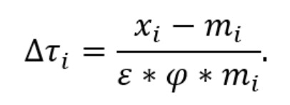
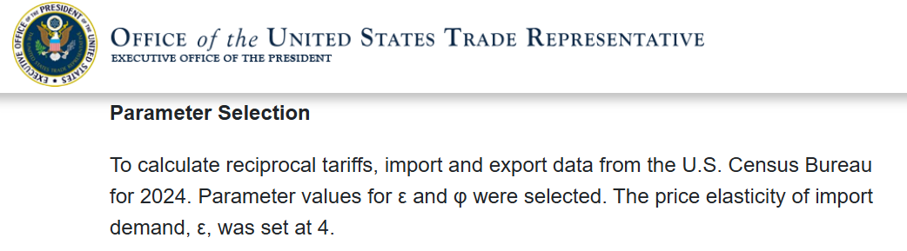
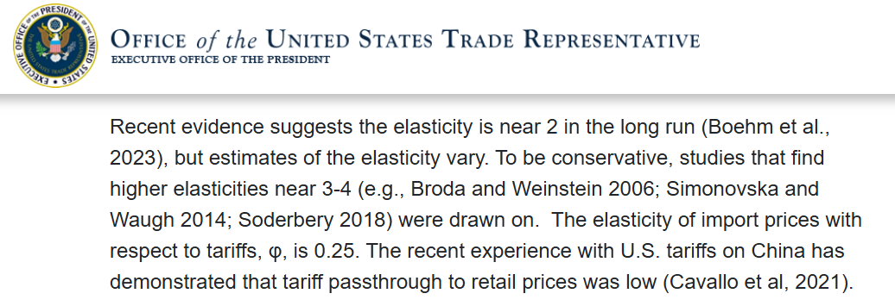
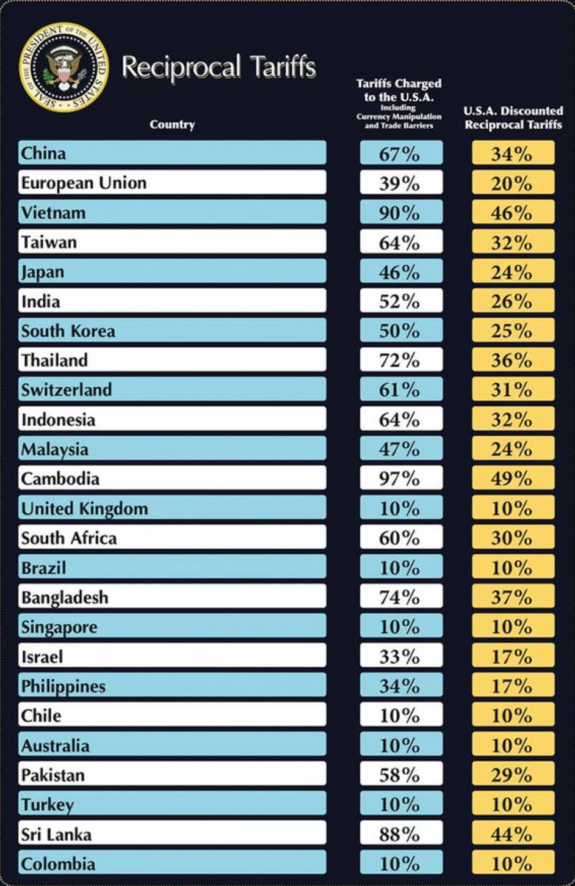

​On April 2, 2025, President Donald Trump proclaimed "Liberation Day," announcing a series of sweeping tariffs aimed at recalibrating the United States' trade relationships.

<blockquote class="instagram-media" data-instgrm-captioned data-instgrm-permalink="https://www.instagram.com/p/DH9shGNx_xs/?utm_source=ig_embed&amp;utm_campaign=loading" data-instgrm-version="14" style=" background:#FFF; border:0; border-radius:3px; box-shadow:0 0 1px 0 rgba(0,0,0,0.5),0 1px 10px 0 rgba(0,0,0,0.15); margin: 1px; max-width:540px; min-width:326px; padding:0; width:99.375%; width:-webkit-calc(100% - 2px); width:calc(100% - 2px);">
 <a href="https://www.instagram.com/p/DH9shGNx_xs/?utm_source=ig_embed&amp;utm_campaign=loading" style=" background:#FFFFFF; line-height:0; padding:0 0; text-align:center; text-decoration:none; width:100%;" target="_blank"> 
 

 
 

 

 
<svg width="50px" height="50px" viewBox="0 0 60 60" version="1.1" xmlns="https://www.w3.org/2000/svg" xmlns:xlink="https://www.w3.org/1999/xlink"><g stroke="none" stroke-width="1" fill="none" fill-rule="evenodd"><g transform="translate(-511.000000, -20.000000)" fill="#000000"><g><path d="M556.869,30.41 C554.814,30.41 553.148,32.076 553.148,34.131 C553.148,36.186 554.814,37.852 556.869,37.852 C558.924,37.852 560.59,36.186 560.59,34.131 C560.59,32.076 558.924,30.41 556.869,30.41 M541,60.657 C535.114,60.657 530.342,55.887 530.342,50 C530.342,44.114 535.114,39.342 541,39.342 C546.887,39.342 551.658,44.114 551.658,50 C551.658,55.887 546.887,60.657 541,60.657 M541,33.886 C532.1,33.886 524.886,41.1 524.886,50 C524.886,58.899 532.1,66.113 541,66.113 C549.9,66.113 557.115,58.899 557.115,50 C557.115,41.1 549.9,33.886 541,33.886 M565.378,62.101 C565.244,65.022 564.756,66.606 564.346,67.663 C563.803,69.06 563.154,70.057 562.106,71.106 C561.058,72.155 560.06,72.803 558.662,73.347 C557.607,73.757 556.021,74.244 553.102,74.378 C549.944,74.521 548.997,74.552 541,74.552 C533.003,74.552 532.056,74.521 528.898,74.378 C525.979,74.244 524.393,73.757 523.338,73.347 C521.94,72.803 520.942,72.155 519.894,71.106 C518.846,70.057 518.197,69.06 517.654,67.663 C517.244,66.606 516.755,65.022 516.623,62.101 C516.479,58.943 516.448,57.996 516.448,50 C516.448,42.003 516.479,41.056 516.623,37.899 C516.755,34.978 517.244,33.391 517.654,32.338 C518.197,30.938 518.846,29.942 519.894,28.894 C520.942,27.846 521.94,27.196 523.338,26.654 C524.393,26.244 525.979,25.756 528.898,25.623 C532.057,25.479 533.004,25.448 541,25.448 C548.997,25.448 549.943,25.479 553.102,25.623 C556.021,25.756 557.607,26.244 558.662,26.654 C560.06,27.196 561.058,27.846 562.106,28.894 C563.154,29.942 563.803,30.938 564.346,32.338 C564.756,33.391 565.244,34.978 565.378,37.899 C565.522,41.056 565.552,42.003 565.552,50 C565.552,57.996 565.522,58.943 565.378,62.101 M570.82,37.631 C570.674,34.438 570.167,32.258 569.425,30.349 C568.659,28.377 567.633,26.702 565.965,25.035 C564.297,23.368 562.623,22.342 560.652,21.575 C558.743,20.834 556.562,20.326 553.369,20.18 C550.169,20.033 549.148,20 541,20 C532.853,20 531.831,20.033 528.631,20.18 C525.438,20.326 523.257,20.834 521.349,21.575 C519.376,22.342 517.703,23.368 516.035,25.035 C514.368,26.702 513.342,28.377 512.574,30.349 C511.834,32.258 511.326,34.438 511.181,37.631 C511.035,40.831 511,41.851 511,50 C511,58.147 511.035,59.17 511.181,62.369 C511.326,65.562 511.834,67.743 512.574,69.651 C513.342,71.625 514.368,73.296 516.035,74.965 C517.703,76.634 519.376,77.658 521.349,78.425 C523.257,79.167 525.438,79.673 528.631,79.82 C531.831,79.965 532.853,80.001 541,80.001 C549.148,80.001 550.169,79.965 553.369,79.82 C556.562,79.673 558.743,79.167 560.652,78.425 C562.623,77.658 564.297,76.634 565.965,74.965 C567.633,73.296 568.659,71.625 569.425,69.651 C570.167,67.743 570.674,65.562 570.82,62.369 C570.966,59.17 571,58.147 571,50 C571,41.851 570.966,40.831 570.82,37.631"></path></g></g></g></svg>

 
View this post on Instagram

 

 

 

 

 

 

 

 

 

 
 

 

</a>
<a href="https://www.instagram.com/p/DH9shGNx_xs/?utm_source=ig_embed&amp;utm_campaign=loading" style=" color:#c9c8cd; font-family:Arial,sans-serif; font-size:14px; font-style:normal; font-weight:normal; line-height:17px; text-decoration:none;" target="_blank">A post shared by The White House (@whitehouse)</a>

</blockquote>

# Tariff Formula

The formula introduced by the Office of the United States Trade Representative (USTR) [^1] aims to determine the change in tariff rate ($\Delta \tau_i$) that would be required to achieve a bilateral trade balance of zero between the United States and a specific country 'i'. This means adjusting tariffs so that the value of imports from country 'i' equals the value of exports to country 'i'. The formula looks big and scary with mathsy symbols but it is really quite simple. Let's break it down. 

[^1]: https://ustr.gov/issue-areas/reciprocal-tariff-calculations

## Understanding the Formula Components:

Left side of the formula:

- **$\Delta$** (Delta) represents the amount of change

- **$\tau$** (Tau) represents tariff

- **$\_i$** just means for one specific country, country 'i'

- **$\Delta \tau_i$** represents the percent change in the tariff rate applied by the U.S. to imports from country 'i'.

Right side of the formula:

- **$x_i$** represents the total exports to country 'i' from the U.S.

- **$m_i$** represents the total imports from country 'i' from the U.S.

- **$\varepsilon$** (Epsilon) represents the price elasticity of import demand, indicating how sensitive the quantity of imports is to changes in price. A negative value suggests that as prices increase due to tariffs, the quantity of imports decreases. This also assumes the price elasticity of import demand is linear (not nearly as simple in reality).

- **$\varphi$** (Phi) represents the passthrough from tariffs to import prices, reflecting the extent to which tariff changes affect the prices of imported goods.

## Interpreting the Formula

The formula is expressed as:

$$\Delta \tau_i = \frac{x_i - m_i}{\varepsilon \cdot \varphi \cdot m_i}$$

This equation calculates the necessary change in the tariff rate ($\Delta \tau_i$) to eliminate the trade imbalance with country 'i'. Here's how each component interacts:

- **Trade Balance ($x_i - m_i$)**: The numerator represents the trade imbalance. If $x_i > m_i$, the U.S. has a trade surplus with country 'i'; if $x_i < m_i$, there's a trade deficit.

- **Elasticity and Pass-Through ($\varepsilon \cdot \varphi \cdot m_i$)**: The denominator adjusts this imbalance by considering how responsive import quantities are to price changes ($\varepsilon$), how much of the tariff is reflected in import prices ($\varphi$), and the total import value ($m_i$).

By dividing the trade imbalance by this adjusted import value, the formula estimates the tariff rate change needed to equalise imports and exports with country 'i'.

### Elasticity and Pass-Through Considerations
The price elasticity of import demand ($\varepsilon$) and the tariff pass-through rate ($\varphi$) are critical factors in this calculation. Different types of goods exhibit varying elasticities due to factors such as necessity, availability of substitutes, and consumer preferences. For example:​
- Necessities: Goods like essential medicines tend to have inelastic demand; consumers will purchase them regardless of price changes.​
- Luxury Items: Products such as high-end electronics often have elastic demand; consumers may forego purchases if prices rise.​

  
  

The Trump administration set the price elasticity of import demand ($\varepsilon$) at 4 and the elasticity of import prices with respect to tariffs ($\varphi$) at 0.25. $\varepsilon$ and $\varphi$ actually cancel out in the denomenator of the equation [$\varepsilon \times \varphi = 4 \times 0.25 = 1$]. This means the 'Tariffs Charged to the U.S.A.' column is really just the trade deficit as a percentage of imports. In addition, the uniform values set for $\varepsilon$ and $\varphi$ across all goods and countries oversimplifies the complexities inherent in global trade, where elasticities can vary significantly across products and markets. Such a one-size-fits-all approach lacks the granularity needed for precise tariff adjustments and may not effectively address specific trade imbalances.​

## Tariff Example Scenario
To illustrate how changes in tariffs affect consumer prices, consider a hypothetical situation where Country A imports a USD 100 speaker from Country B.

1. **Initial Price**: Before any tariff changes, the speaker costs USD $100$ in Country A.

2. **Tariff Introduction**: Country A introduces a $24$% tariff on all goods from Country B.
- **Tariff Amount**: USD $100 \times 24$% = USD $24$

3. **Price Impact on Consumers**: The effect on consumer prices depends on $\varphi$, the passthrough rate.
- Assuming $\varphi = 0.25 $, the portion of the tariff passed through to consumers is: $\Delta \tau_i \times \varphi = 24$% $\times 0.25 = 6$% $= 0.06$
- Thus, consumers in Country A will see a 6% increase in the price of the speaker: USD $100 \times (1 + 0.06) =$ USD $100 \times (1.06) =$ USD $106$

4. **Effect on Demand**: The impact on demand depends on $\varepsilon$, the price elasticity of import demand.​
- Assuming $\varepsilon = 4$, the percentage decrease in demand is: ​$\Delta \tau_i \times \varphi \times \varepsilon = 6$% $\times 4 = 24$%
- This means demand decreases to $(100$%$ - 24$%$) = 76$% of the original level.​

## Deriving the Formula
To understand the origin of the USTR formula:

1. **Trade Deficit**: $m_i - x_i$ represents the trade deficit.
2. **Deficit as a Percentage of Imports**: $\frac{m_i - x_i}{m_i}$ indicates the percentage imports have to go down to balance trade.​
3. **Demand Reduction Relation**: This reduction is also expressed as $\Delta \tau_i \times \varphi \times \varepsilon$.

Equating the two expressions:
$$\Delta \tau_i \times \varphi \times \varepsilon = \frac{m_i - x_i}{m_i}$$​

Solving for $\Delta \tau_i$:

$$\Delta \tau_i = \frac{m_i - x_i}{\varphi \times \varepsilon \times m_i}$$

 So, is this essentially the approach employed by the Trump administration? Albeit they subtract imports from exports ($x_i - m_i$), rather than the conventional method of subtracting exports from imports ($m_i - x_i$), effectively multiplying the result by $-1$. 

## Checking Formula Application Consistency

Unfortunately the woes do not stop here since the formula is not applied consistently to all countries. 

On the USTR website they have exact import and export figures for most countries in the chart.

Feel free to use my Python script to web scrape trade summaries for 105 out of 123 regions listed on the USTR website.

You can view the code by expanding the toggle below labelled "Show Python Code".

A list of countries that were not retrieved during the scrape is also available in the "Show Missing Countries" section below.

  
Show Python Code

  <pre><code class="language-python">
import requests
from bs4 import BeautifulSoup
import re
import pandas as pd
from tqdm import tqdm

headers = {
    "User-Agent": "Mozilla/5.0"
}

base_url = "https://ustr.gov"
region_urls = [
    "/countries-regions/africa",
    "/countries-regions/americas",
    "/countries-regions/southeast-asia-pacific",
    "/countries-regions/europe-middle-east/europe",
    "/countries-regions/europe-middle-east/middle-east/north-africa",
    "/countries-regions/europe-middle-east/russia-and-eurasia",
    "/countries-regions/south-central-asia",
    "/countries-regions/china-mongolia-taiwan",
    "/countries-regions/japan-korea-apec"
]

def get_country_links(region_url):
    try:
        res = requests.get(base_url + region_url, headers=headers, timeout=10)
        soup = BeautifulSoup(res.content, "html.parser")
        country_links = []
        for a in soup.select("a[href^='/countries-regions']"):
            href = a.get("href")
            if href and href != region_url and href.startswith(region_url):
                country_links.append(href)
        return list(set(country_links))
    except Exception as e:
        print(f"Failed to fetch country links from {region_url}: {e}")
        return []

def get_trade_summary(country_url):
    full_url = base_url + country_url
    try:
        res = requests.get(full_url, headers=headers, timeout=10)
        soup = BeautifulSoup(res.content, "html.parser")
        paragraphs = soup.find_all("p")
        
        for p in paragraphs:
            text = p.get_text(strip=True)
            if re.search(r"U\.S\. (total )?goods trade with .*? (was|were|totaled|totalled)", text, re.IGNORECASE):
                return {
                    "country_url": full_url,
                    "trade_summary": text
                }
        
        print(f"No trade summary found in {full_url}")
    
    except Exception as e:
        print(f"Failed to fetch {full_url}: {e}")
    
    return None

all_summaries = []

for region in region_urls:
    print(f"\nProcessing region: {region}")
    country_links = get_country_links(region)
    for country in tqdm(country_links, desc=f"Scraping countries in {region}"):
        summary = get_trade_summary(country)
        if summary:
            all_summaries.append(summary)

# Build DataFrame
df = pd.DataFrame(all_summaries)
df = df.drop_duplicates(subset="country_url").reset_index(drop=True)
  </code></pre>

  
Show Missing Countries

  
The following countries are missing:

  <strong>Americas (7):</strong>
  <ul>
    <li>Guatemala</li>
    <li>Haiti</li>
    <li>Honduras</li>
    <li>Nicaragua</li>
    <li>Panama</li>
    <li>Paraguay</li>
    <li>Peru</li>
  </ul>

  <strong>Europe → Middle East/North Africa (8):</strong>
  <ul>
    <li>Algeria</li>
    <li>Israel</li>
    <li>Jordan</li>
    <li>Libya</li>
    <li>Oman</li>
    <li>Saudi Arabia</li>
    <li>Tunisia</li>
    <li>Yemen</li>
  </ul>

  <strong>South & Central Asia (2):</strong>
  <ul>
    <li>Iraq</li>
    <li>Uzbekistan</li>
  </ul>

  <strong>China, Mongolia & Taiwan (1):</strong>
  <ul>
    <li>Taiwan</li>
  </ul>

All summaries follow a similar format having been generated from their data making them somewhat easy to clean into 'Import' and 'Export'.

### Checking 'Tariffs Charged to the U.S.A.'
I will showcase the inconsistencies in the application of the tariff formula using Malaysia and Australia since they represent both cases and happen to be the countries where I grew up.

#### Case 1: Malaysia (U.S. is in a trade deficit)
https://ustr.gov/countries-regions/southeast-asia-pacific/malaysia

U.S. export to Malaysia ($x_{Malaysia}$): USD $27.7$ billion $=$ USD $2.77 \times 10^{10}$

U.S. import from Malaysia ($m_{Malaysia}$): USD $52.5$ billion $=$ USD $5.25 \times 10^{10}$

Plug into their tariff formula:

$\Delta \tau_{Malaysia} = \frac{x_{Malaysia} - m_{Malaysia}}{\varepsilon \cdot \varphi \cdot m_{Malaysia}}$

$\Delta \tau_{Malaysia} = \frac{2.77 \times 10^{10} - 5.25 \times 10^{10}}{4 \cdot 0.25 \cdot 1.67 \times 10^{10}}$

$\Delta \tau_{Malaysia} = \frac{-2.48 \times 10^{10}}{5.25 \times 10^{10}}$

$\Delta \tau_{Malaysia} = \frac{-2.48}{5.25}$

$\Delta \tau_{Malaysia} = -0.47 = -47$%

Behold the Malaysia $47$% 'Tariffs Charged to the U.S.A.' matching the figure with the $\times (-1)$ mentioned <a href="#trump-approach"> earlier </a> having come back. 

#### Case 2: Australia (U.S. is in a trade surplus)
https://ustr.gov/countries-regions/southeast-asia-pacific/australia

U.S. export to Australia ($x_{Australia}$): USD $34.6$ billion $=$ USD $3.46 \times 10^{10}$

U.S. import from Australia ($m_{Australia}$): USD $16.7$ billion $=$ USD $1.67 \times 10^{10}$

Plug into their tariff formula:

$\Delta \tau_{Australia} = \frac{x_{Australia} - m_{Australia}}{\varepsilon \cdot \varphi \cdot m_{Australia}}$

$\Delta \tau_{Australia} = \frac{3.46 \times 10^{10} - 1.67 \times 10^{10}}{4 \cdot 0.25 \cdot 1.67 \times 10^{10}}$

$\Delta \tau_{Australia} = \frac{1.79 \times 10^{10}}{1.67 \times 10^{10}}$

$\Delta \tau_{Australia} = \frac{1.79}{1.67}$

$\Delta \tau_{Australia} = 1.07 = 107$%

So according to the formula Australia should have $-107$% 'Tariffs Charged to the U.S.A.' and the U.S. should implement a negative tariff for goods from Australia (according to their formula) if the goal is simply to balance budget. But the figure shows '$10$%'? What is happening?

#### So how is the Tariffs 'Charged to the U.S.A' calculated?
I want to emphasise that these examples haven't been cherry-picked to fit a narrative. The same formula appears to be consistently applied to calculate the "Tariffs Charged to the U.S.A." for each country - albeit in a rather unique way.

From what I can discern, the calculation uses the following structure:

$\Delta \tau_i = \frac{m_i - x_i}{\varepsilon \cdot \varphi \cdot m_i}$

**NOTE** $({m_i - x_i})$ is the conventional way around - essentially their formula $\times -1$

However, the final reported tariff values seem to apply a maximum function like so:
Tariffs Charged $ = \max(10, \Delta \tau_i)$

This formulation matches the published figures almost exactly - with only minor discrepancies of $1$% likely due to rounding.

The maximum function (denoted by '$\max()$') returns the greater of the two values inside the parentheses. In this context, it ensures that the tariff charged is never less than 10, even if the computed value $\Delta \tau_i$ is lower.

### 'U.S.A. Discounted Reciprocal Tariffs'
The U.S.A. Discounted Reciprocal Tariffs is calculated using the following formula:

$$\max\left(10, \left\lceil \frac{\text{Tariffs Charged to the U.S.A}}{2} \right\rceil \right)$$ 

In the expression, the ceiling function (denoted by '$\left\lceil \right \rceil$') rounds a number up to the nearest whole number. This ensures that when the 'Tariffs Charged to the U.S.A.' are divided by 2, any fractional result is rounded up to avoid underestimating the reciprocal tariff. The formula also ensures a minimum reciprocal tariff of 10, regardless of the outcome of the division.

# Conclusion: A Politicised Equation in Disguise
While cloaked in economic jargon and mathematical veneer, the Trump administration's tariff formula operates less as a rigorous policy tool and more as a rhetorical device. On its surface, the formula provides a seemingly objective mechanism to rebalance trade by adjusting tariffs based on bilateral deficits. But a closer examination reveals inconsistencies in application, arbitrary thresholding, and the deliberate use of minimum tariff floors - choices that reflect political priorities rather than economic precision.

The use of a uniform elasticity and passthrough rate across diverse economies flattens the complex landscape of global trade. Worse still, the selective enforcement of the formula-favouring floor values or ignoring negative outcomes - undermines its internal logic and casts doubt on its legitimacy as a basis for policy. Rather than guiding evidence-based decision-making, the formula becomes a convenient scaffold to justify predetermined outcomes.

In the end, what's dressed up as a data-driven recalibration of trade is, in many respects, a manually tuned equation engineered to serve a political narrative. Understanding the math behind it doesn't just expose technical oversights - it reveals the intent.
