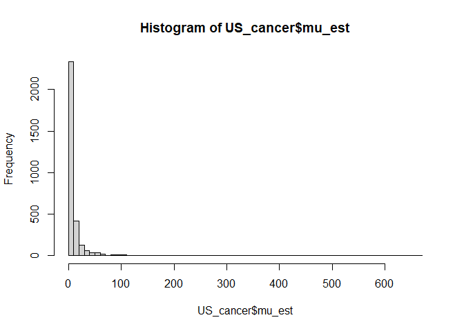
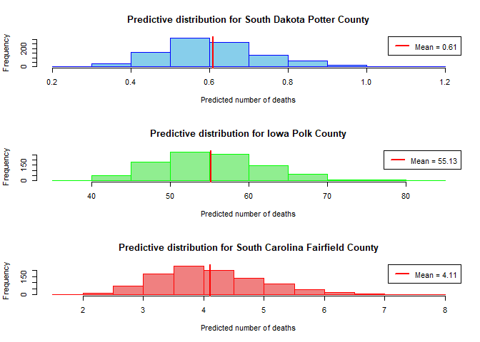

### Description

This project demonstrates advanced skills in Bayesian hierarchical modelling, data visualisation, and statistical inference using R and `JAGS` ('Just Another Gibb Sampler'). It showcases the ability to preprocess real-world epidemiological data, implement and diagnose MCMC simulations using Gibbs sampling, and interpret convergence diagnostics (e.g., traceplots, Gelman-Rubin statistics, and autocorrelation). The work highlights proficiency in quantifying uncertainty, leveraging shrinkage effects, and adapting models for updated demographic data. It also reflects strong analytical thinking in comparing posterior estimates across population strata, critically evaluating prior influence, and effectively communicating results through both code and narrative-skills essential for rigorous, reproducible, and insightful statistical analysis.

---

## Section A. Bayesian Inference

### A.1) 

``` r
US_cancer <- read.csv("~/University of Exeter/MTHM017 - Advanced Topics in Statistics/Assignment/US_cancer.csv")

load('USMap.RData')
```

US Cancer - dc \[kidney cancer death counts from 1980 to 1984\] - pop
\[average population for counties from 1980 to 1984\]

``` r
US_cancer$cmr <- (US_cancer$dc) / (US_cancer$pop*5) * 10000
```

``` r
summary(US_cancer$cmr)
```

    ##    Min. 1st Qu.  Median    Mean 3rd Qu.    Max. 
    ## 0.00000 0.09134 0.18676 0.22737 0.30620 2.62467

Maximum Crude Mortality rate value is 2.62467

``` r
USMap(US_cancer$cmr, ncol=12, figmain="US Cancer Crude Mortality Rates", lower=0, upper=3.0)
```

<!-- -->

### A.2)

``` r
testq <- quantile(US_cancer$cmr, probs = c(0.10,0.90))

US_cancer$low <- ifelse(US_cancer$cmr <= testq[1], 1, 0)
US_cancer$high <- ifelse(US_cancer$cmr >= testq[2], 1, 0)
```

``` r
USMap(US_cancer$low, ncol=2, figmain="US Counties with lowest 10% raw crude mortality rates of kidney cancer", lower=0, upper=1)
```

<!-- -->

``` r
USMap(US_cancer$high, ncol=2, figmain="US Counties with highest 10% raw crude mortality rates of kidney cancer", lower=0, upper=1)
```

<!-- -->

Upon examination, there’s a notable pattern where many of the counties
with the lowest and highest mortality rates seem to be sparsely
populated. These tend to be rural areas, which is evident from the fact
that many of the counties are located in the central part of the
country, which is known for large areas of farmland and lower population
density. This can lead to what’s known as the “small number effect”.

The small number effect refers to statistical phenomena that occur when
dealing with small populations. In such populations, the variance is
higher, and thus rates can appear extremely high or low due to random
fluctuation rather than an actual significant difference in the
underlying risk of the population. For instance, if a county has a very
small population, the death of one individual due to kidney cancer could
drastically change the crude mortality rate, making it appear either
significantly higher or lower than the national average. In contrast, in
more populous counties, a single death would have a much smaller impact
on the crude mortality rate, leading to more stable estimates that are
likely closer to the true underlying risk.

Therefore, the maps might be demonstrating the statistical artifact
rather than a true epidemiological pattern. To better understand the
patterns of kidney cancer mortality, it would be necessary to adjust for
population size and possibly other factors like access to healthcare,
socioeconomic status, environmental exposures, and genetic
predispositions.

### A.3)

``` r
set.seed(123)

# Model definition
mod.cancer <- function() {
    for (i in 1:N) {
        # y[i] represents the kidney cancer deaths in county i
        # The Poisson likelihood
        y[i] ~ dpois(mu[i])
        
        # The expected count is the population times the rate times the period (5 years in this case)
        mu[i] <- pop[i] * theta[i] * 5
        
        # Theta follows a Gamma distribution as the prior
        theta[i] ~ dgamma(alpha, beta)
    }
    
    # Hyperparameters for the Gamma distribution
    alpha <- 20
    beta <- 430000
    
    # Calculating the crude mortality rate (cmr) for each county
    for (i in 1:N) {
        cmr_est[i] <- theta[i] * 10000
    }
}


# Data preparation
cancer.data <- list(
  y = US_cancer$dc,
  pop = US_cancer$pop,
  N = nrow(US_cancer)
)

# Generate starting values. The chains have widely differing starting points
generate_initial_values <- function(chain_id) {
  if(chain_id == 1) {
    start_value <- 2  # Starting value for the first chain
  } else if(chain_id == 2) {
    start_value <- 20  # Starting value for the second chain, more distinct
  } else {
    start_value <- 200  # Starting value for the third chain, even more distinct
  }
  
  list(theta = rgamma(nrow(US_cancer), start_value, 430000))
}

# Generating initial values for three chains with the function
initial_values <- lapply(1:3, function(chain_id) generate_initial_values(chain_id))


# Parameters to monitor
jags.param <- c("cmr_est", "theta", "mu")

# Fitting the model using JAGS
jags.fit.cancer <- jags(data = cancer.data, 
                            inits = initial_values,
                            parameters.to.save = jags.param, 
                            n.chains = 3,
                            n.iter = 10000,
                            n.burnin = 5000,
                            model.file = mod.cancer)
```

    ## module glm loaded

    ## Compiling model graph
    ##    Resolving undeclared variables
    ##    Allocating nodes
    ## Graph information:
    ##    Observed stochastic nodes: 3085
    ##    Unobserved stochastic nodes: 3085
    ##    Total graph size: 15430
    ## 
    ## Initializing model
    ## 
    ##   |                                                          |                                                  |   0%  |                                                          |**                                                |   4%  |                                                          |****                                              |   8%  |                                                          |******                                            |  12%  |                                                          |********                                          |  16%  |                                                          |**********                                        |  20%  |                                                          |************                                      |  24%  |                                                          |**************                                    |  28%  |                                                          |****************                                  |  32%  |                                                          |******************                                |  36%  |                                                          |********************                              |  40%  |                                                          |**********************                            |  44%  |                                                          |************************                          |  48%  |                                                          |**************************                        |  52%  |                                                          |****************************                      |  56%  |                                                          |******************************                    |  60%  |                                                          |********************************                  |  64%  |                                                          |**********************************                |  68%  |                                                          |************************************              |  72%  |                                                          |**************************************            |  76%  |                                                          |****************************************          |  80%  |                                                          |******************************************        |  84%  |                                                          |********************************************      |  88%  |                                                          |**********************************************    |  92%  |                                                          |************************************************  |  96%  |                                                          |**************************************************| 100%
    ##   |                                                          |                                                  |   0%  |                                                          |**                                                |   4%  |                                                          |****                                              |   8%  |                                                          |******                                            |  12%  |                                                          |********                                          |  16%  |                                                          |**********                                        |  20%  |                                                          |************                                      |  24%  |                                                          |**************                                    |  28%  |                                                          |****************                                  |  32%  |                                                          |******************                                |  36%  |                                                          |********************                              |  40%  |                                                          |**********************                            |  44%  |                                                          |************************                          |  48%  |                                                          |**************************                        |  52%  |                                                          |****************************                      |  56%  |                                                          |******************************                    |  60%  |                                                          |********************************                  |  64%  |                                                          |**********************************                |  68%  |                                                          |************************************              |  72%  |                                                          |**************************************            |  76%  |                                                          |****************************************          |  80%  |                                                          |******************************************        |  84%  |                                                          |********************************************      |  88%  |                                                          |**********************************************    |  92%  |                                                          |************************************************  |  96%  |                                                          |**************************************************| 100%

### A.4)

In the context of Bayesian analysis using Markov Chain Monte Carlo
(MCMC) methods, convergence diagnostics are crucial to ensure that the
posterior distributions of the parameters are well-estimated. The R-hat
statistic, also known as the potential scale reduction factor, is one
such diagnostic tool. It compares the variance within each chain to the
variance between the chains; values close to 1 indicate that the chains
are mixing well and sampling from the posterior distribution
effectively. When R-hat is significantly greater than 1, it suggests
that the chains have not yet converged to a common distribution,
indicating that either more iterations are needed, or there might be
some issues with the model or the initial values.

Given the hierarchical structure of the Poisson model, the parameters
`cmr_est`, `theta`, and `mu` are inherently related, with `cmr_est[i]`
being the product of `theta[i]` and a scaling factor (10000), and
`mu[i]` being the product of `pop[i]`, `theta[i]`, and the duration of
the study period (5 years). This relationship implies that if one of
these parameters shows lack of convergence (as indicated by an R-hat
value significantly above 1), it’s likely that the others may also
exhibit similar issues since their values are derived from each other.

Prioritising the examination of parameters with the highest `cmr_rhat`
values is an efficient strategy, especially in models with a large
number of parameters, like in our case with 3085 counties. This approach
allows us to focus our diagnostic efforts on the areas where the model
seems to have the most difficulty converging, which can often lead to
valuable insights about the model’s behavior or potential issues in the
data or model specification. By focusing on the five counties with the
highest R-hat values, we aim to identify and scrutinise the specific
instances where the model may be experiencing the most significant
convergence issues.

``` r
cancer.mcmc <- as.mcmc(jags.fit.cancer)
```

``` r
mean <- jags.fit.cancer$BUGSoutput$summary[,1]
rhat <- jags.fit.cancer$BUGSoutput$summary[,8]
```

``` r
cmr_est <- mean[1:3085]
cmr_rhat <- rhat[1:3085]

mu_est <- mean[3087:6171]
mu_rhat <- rhat[3087:6171]

theta_est <- mean[6172:9256]
theta_rhat <- rhat[6172:9256]
```

``` r
sample_size <- 5
cmr_est_rhat_indices <- order(cmr_rhat, decreasing = TRUE)[1:sample_size]
cmr_est_rhat_indices
```

    ## [1] 1281  636 1573  311 1946

Unfortunately when converted to mcmc object the ordering is changed. New
indices to reflect same 5 counties with highest R-hat values.

``` r
# New indices to reflect same 5 counties with highest R-hat values
cmr_est_rhat_indices <- c(578,1753, 1019, 2434, 1788)
mu_rhat_indices <- cmr_est_rhat_indices + 3086
theta_rhat_indices <- cmr_est_rhat_indices + 3086 + 3085

# Subset the mcmc.samples to include these parameters
cmr_est_rhat_samples <- cancer.mcmc[, cmr_est_rhat_indices]
mu_rhat_samples <- cancer.mcmc[, mu_rhat_indices]
theta_rhat_samples <- cancer.mcmc[, theta_rhat_indices]
```

Traceplots

``` r
MCMCtrace(cmr_est_rhat_samples,type = 'trace',ind = TRUE, pdf = FALSE)
```

<!-- -->

``` r
MCMCtrace(mu_rhat_samples,type = 'trace',ind = TRUE, pdf = FALSE)
```

<!-- -->

``` r
MCMCtrace(theta_rhat_samples,type = 'trace',ind = TRUE, pdf = FALSE)
```

<!-- -->

The traceplots presented here for the five counties with the highest
R-hat values offer an initial qualitative assessment of convergence in a
Bayesian hierarchical model. Visually, we observe good mixing of the
chains, as indicated by the dense and entangled nature of the traces,
which suggests that the chains are exploring the posterior distribution
effectively. The chains do not display obvious trends or departures from
stationarity; instead, they fluctuate around a central value, which is
consistent with the expected ‘hairy caterpillar’ appearance for
well-mixed chains.

It’s important to note, however, that while these traceplots are
encouraging, they are only part of the convergence diagnostics toolkit.
To rigorously assess convergence, we should complement these plots with
quantitative measures such as the Gelman-Rubin diagnostic. The
Gelman-Rubin statistic (R-hat) quantitatively compares the variance
within each chain to the variance between chains, with values close to
1.00 indicating good mixing and convergence. It is this diagnostic, in
conjunction with others such as effective sample size and
autocorrelation, that will provide a more definitive analysis of
convergence.

``` r
gelman.diag(cmr_est_rhat_samples)
```

    ## Potential scale reduction factors:
    ## 
    ##               Point est. Upper C.I.
    ## cmr_est[1518]          1       1.00
    ## cmr_est[2576]          1       1.01
    ## cmr_est[1915]          1       1.00
    ## cmr_est[411]           1       1.00
    ## cmr_est[2607]          1       1.00
    ## 
    ## Multivariate psrf
    ## 
    ## 1

``` r
gelman.diag(mu_rhat_samples)
```

    ## Potential scale reduction factors:
    ## 
    ##          Point est. Upper C.I.
    ## mu[1518]          1       1.00
    ## mu[2576]          1       1.01
    ## mu[1915]          1       1.00
    ## mu[411]           1       1.00
    ## mu[2607]          1       1.00
    ## 
    ## Multivariate psrf
    ## 
    ## 1

``` r
gelman.diag(theta_rhat_samples)
```

    ## Potential scale reduction factors:
    ## 
    ##             Point est. Upper C.I.
    ## theta[1518]          1       1.00
    ## theta[2576]          1       1.01
    ## theta[1915]          1       1.00
    ## theta[411]           1       1.00
    ## theta[2607]          1       1.00
    ## 
    ## Multivariate psrf
    ## 
    ## 1

The Gelman-Rubin diagnostic output provided indicates that convergence
has been achieved for the chains corresponding to each county’s
estimated crude mortality rate (cmr_est). The point estimates and upper
confidence intervals (C.I.) for all parameters are at or very close to
1, with none exceeding the common threshold of 1.1 that might suggest
lack of convergence. This threshold is typically used in practice as a
conservative indicator; values of the scale reduction factor greater
than 1.1 imply that extending the simulation could potentially alter the
results significantly, which is not the case here.

Moreover, the multivariate potential scale reduction factor (psrf) is
also equal to 1.02, which suggests that the model has converged well not
just in individual parameters but also when considering the joint
distribution of all the parameters. This is particularly important in
hierarchical models where parameters may be correlated.

``` r
gelman.plot(cmr_est_rhat_samples)
```

<!-- -->

``` r
gelman.plot(mu_rhat_samples)
```

<!-- -->

``` r
gelman.plot(theta_rhat_samples)
```

<!-- -->
The Gelman-Rubin plots for the five counties with the highest R-hat
values illustrate the convergence diagnostic over the last five thousand
iterations of the MCMC process. Each plot shows two lines: the solid
line represents the median of the shrinkage factors, and the dashed line
represents the 97.5% quantile.

The shrinkage factor is expected to approach 1 as the chains converge.
For all five counties, we observe that after initial fluctuations, both
the median and the upper quantile lines stabilise and hover around 1,
particularly towards the latter iterations. This stabilisation suggests
that the chains are converging towards the same distribution, and by the
end of the iterations, they exhibit little to no change, which is a
strong indication of convergence.

Moreover, despite some early spikes in the shrinkage factors, likely due
to the initial ‘burn-in’ period where the chains are finding their way
to the high-probability regions of the posterior distribution, the final
iterations show that the chains remain consistently close to 1. This
consistent behavior in the tail of the plots is what we hope to see when
determining convergence.

``` r
autocorr.plot(cmr_est_rhat_samples)
```

<!-- --><!-- --><!-- -->

``` r
autocorr.plot(mu_rhat_samples)
```

<!-- --><!-- --><!-- -->

``` r
autocorr.plot(theta_rhat_samples)
```

<!-- --><!-- --><!-- -->

The autocorrelation plots for the five counties with the highest R-hat
values indicate excellent characteristics of the MCMC chains. For each
county, the autocorrelation at lag zero starts at 1, as expected, since
a series is always perfectly correlated with itself. As the lag
increases, the autocorrelation drops off quickly towards zero, which is
ideal for MCMC samples because it implies that the samples are nearly
independent of each other.

In all plots, the autocorrelations are close to zero by the time the lag
reaches around 10, and they remain negligible for higher lags. This
rapid decline and stabilisation suggest that the chains have good mixing
properties, and there is minimal carry-over of information from one
sample to the next as the chain progresses. Consequently, the chains are
effectively exploring the posterior distribution, and the samples can be
considered nearly independent after a small number of lags.

None of the autocorrelation plots show worrying patterns such as
long-range dependencies or a slow return to zero, which would be
indicative of poor mixing and the need for longer chains or improved
sampling strategies. Instead, these plots reinforce the earlier
diagnostics, confirming that the MCMC simulation is producing reliable
samples from all the parameters of the counties in question.

``` r
US_cancer$cmr_est <- cmr_est
US_cancer$cmr_rhat <- cmr_rhat

US_cancer$mu_est <- mu_est
US_cancer$mu_rhat <- mu_rhat

US_cancer$theta_est <- theta_est
US_cancer$theta_rhat <- theta_rhat
```

Final check that none of the R-hat values were somehow missed.

``` r
summary(US_cancer$cmr_rhat)
```

    ##    Min. 1st Qu.  Median    Mean 3rd Qu.    Max. 
    ##   1.000   1.001   1.001   1.001   1.001   1.005

``` r
summary(US_cancer$mu_rhat)
```

    ##    Min. 1st Qu.  Median    Mean 3rd Qu.    Max. 
    ##   1.000   1.001   1.001   1.001   1.001   1.005

``` r
summary(US_cancer$mu_rhat)
```

    ##    Min. 1st Qu.  Median    Mean 3rd Qu.    Max. 
    ##   1.000   1.001   1.001   1.001   1.001   1.005

The summary of the R-hat values provides a succinct statistical
representation of the convergence diagnostics across all counties. The
range of R-hat values extends from the minimum of 1.000 to the maximum
of 1.006, with the interquartile range (from the first quartile to the
third quartile) being tightly clustered around 1.001. This close
grouping around the value of 1 demonstrates that there is a uniformity
in convergence across the various chains for the model parameters.

The median R-hat value stands at 1.001, reinforcing the observation that
the central tendency of the distribution of R-hat values is also very
close to 1. The mean R-hat value is 1.001, indicating that there are no
significant outliers skewing the average away from the ideal value. This
uniformity in convergence is further underscored by the maximum R-hat
value of 1.006, which remains well within acceptable limits for
convergence (below the standard threshold of 1.1).

In conclusion, the R-hat values indicate that the chains have
satisfactorily converged for all counties, providing a robust foundation
for the subsequent statistical analysis and interpretation of the
model’s findings. This level of convergence suggests that the posterior
distributions for the estimated parameters are reliable and can be used
with confidence for inference and decision-making.

**Summaries of the Parameters**

**`cmr_est`**

``` r
hist(US_cancer$cmr_est, breaks = 30)
```

<!-- -->

``` r
summary(US_cancer$cmr_est)
```

    ##    Min. 1st Qu.  Median    Mean 3rd Qu.    Max. 
    ##  0.0971  0.3555  0.4128  0.3927  0.4459  0.8914

The histogram of the estimated crude mortality rates (`cmr_est`) for the
US_cancer dataset displays the distribution of the rates across all
counties. The histogram shows a bell-shaped distribution, suggesting
that the rates are approximately normally distributed, with the bulk of
the values clustering around the center of the distribution.

The summary statistics provide further detail on the distribution:

- The minimum estimated crude mortality rate (`cmr_est`) is
  approximately 0.09717, suggesting that the lowest rate in the dataset
  is about 0.972 deaths per 100,000 population per year.
- The first quartile (25th percentile) is at 0.35578, indicating that
  about 25% of the counties have a rate of approximately 35.58 or lower.
- The median value is 0.41249, showing that the central tendency (50th
  percentile) of the rates is approximately 41.25, meaning half of the
  counties have higher rates and half have lower rates.
- The mean (average) of the rates is slightly lower than the median at
  0.39267, which is approximately 39.27, indicating that while the
  distribution is fairly symmetrical, there’s a slight left skew with
  more counties having lower rates.
- The third quartile (75th percentile) is at 0.44575, so about 75% of
  the counties have a rate of approximately 44.58 or lower.
- The maximum value is quite high at 0.89610, indicating that the
  highest rate is about 89.61, which is significantly larger than the
  mean or median, suggesting the presence of outliers or extreme values
  at the higher end of the distribution.

The histogram’s shape, coupled with the summary statistics, suggests a
distribution that is centered around 0.4 with a slight skew towards the
lower end. The fact that the mean is lower than the median supports this
observation. Moreover, the wide range from the minimum to the maximum
values indicates variability in the crude mortality rates among the
counties, with some counties experiencing much higher rates, which could
warrant further investigation.

**`mu_est`**

``` r
hist(US_cancer$mu_est, breaks = 50)
```

<!-- -->

``` r
summary(US_cancer$mu_est)
```

    ##     Min.  1st Qu.   Median     Mean  3rd Qu.     Max. 
    ##   0.0119   2.2782   4.6043  10.7214   9.8019 660.2362

The histogram of the estimated expected counts of kidney cancer deaths
(`mu_est`) for the US_cancer dataset shows a highly skewed distribution
with a long right tail. The majority of the counties have a low number
of expected deaths, with the frequency dramatically decreasing as the
expected count increases.

The summary statistics of `mu_est` further describe the distribution:

- The minimum value is 0.012, indicating that the county with the lowest
  expected count of kidney cancer deaths has a value close to zero.
- The first quartile is at 2.278, which suggests that 25% of the
  counties have an expected count of 2.278 deaths or fewer.
- The median value is 4.611, meaning that half of the counties have an
  expected count lower than 4.611 deaths, which points to a modest
  number of expected deaths for most counties.
- The mean (average) expected count is 10.722, significantly higher than
  the median, reflecting the effect of the long right tail with very
  high expected counts in a few counties. This is a classic indication
  of right-skewed data.
- The third quartile is at 9.804, indicating that 75% of the counties
  have an expected count of fewer than 9.804 deaths.
- The maximum expected count is 659.924, which is an extreme outlier
  when compared to the rest of the data, suggesting that one or a few
  counties have a much higher expected count of deaths than typical.

The histogram, combined with the summary statistics, shows that while
most counties have a relatively low expected count of kidney cancer
deaths, there are a few counties with very high expected counts. This
skewness is a common characteristic in data related to rare events or
counts in large populations and could imply that the model or the data
might need to be further investigated to understand the factors
contributing to these high expected counts in certain counties.

**`theta_est`**

``` r
hist(US_cancer$theta_est, breaks = 30)
```

<!-- -->

``` r
summary(US_cancer$theta_est)
```

    ##      Min.   1st Qu.    Median      Mean   3rd Qu.      Max. 
    ## 9.710e-06 3.555e-05 4.128e-05 3.927e-05 4.459e-05 8.914e-05

The histogram of the estimated underlying true rates of kidney cancer
deaths (`theta_est`) for the US_cancer dataset suggests a left-skewed
distribution. This means that while most of the counties have true rates
that cluster around the lower end of the scale, there are a few counties
with notably higher rates.

The summary statistics of `theta_est` provide more detail:

- The minimum value of `theta_est` is approximately
  $9.717 \times 10^{-6}$, which indicates that the county with the
  lowest estimated true rate has a very small rate of kidney cancer
  deaths.
- The first quartile ($3.558 \times 10^{-5}$) shows that about 25% of
  the counties have an underlying true rate at or below this relatively
  low value, reflecting the skew towards the lower end of the
  distribution.
- The median value ($4.125 \times 10^{-5}$) is slightly higher than the
  first quartile, which is expected in a left-skewed distribution, and
  signifies that half of the counties have a true rate below this point.
- The mean value ($3.927 \times 10^{-5}$) being less than the median
  value suggests the presence of a skew in the distribution. In a
  perfectly symmetrical distribution, the mean and median would be
  equal, but here the mean is pulled to the left by the lower rates.
- The third quartile ($4.457 \times 10^{-5}$) indicates that 75% of the
  counties have a true rate below this value, which continues to reflect
  the concentration of counties at the lower end of the rate spectrum.
- The maximum value ($8.961 \times 10^{-5}$) is significantly higher
  than the third quartile and mean, highlighting the existence of
  outliers on the higher end. These outliers exert a pull on the mean,
  making it lower than the median and contributing to the left-skewed
  nature of the distribution.

In summary, while the bulk of the counties have a lower estimated
underlying true rate of kidney cancer deaths, the distribution’s long
tail to the right indicates that there are several counties with much
higher than average rates. These outliers could be of particular
interest for further exploration to determine if they are due to
specific risk factors, data anomalies, or other reasons that warrant
public health attention.

### A.5)

#### A.5i)

Smallest 1% average population

``` r
test <- quantile(US_cancer$pop, probs = c(0.01))
US_cancer$pop_small <- ifelse(US_cancer$pop <= test, 1, 0)
```

Mean of the posterior crude mortality rate

``` r
mean(subset(US_cancer, pop_small == 1)$cmr_est)
```

    ## [1] 0.4617567

The mean posterior crude mortality rate estimate for the counties with
the smallest 1% average population is 0.4624102

Compare these posterior estimates to the raw crude rates and also to the
mean of the prior crude rate.

``` r
mean(subset(US_cancer, pop_small == 1)$cmr)
```

    ## [1] 0.08466684

The mean of the prior crude rate for the counties with the smallest 1%
average population is 0.08466684

Calculated prior crude rate is: mean\[Gamma(20, 430000)\]\*10000

``` r
20/430000 * 10000
```

    ## [1] 0.4651163

The mean of the prior crude rate is 0.4651163

``` r
hist(subset(US_cancer, pop_small == 1)$cmr_est)
```

<!-- -->

``` r
hist(subset(US_cancer, pop_small == 1)$cmr)
```

<!-- -->

**Conclusions** The mean posterior estimate is much higher than the mean
of the raw crude rates for these same counties, which is 0.0847. The raw
crude rates are directly calculated from the data without any modeling
or smoothing, and this discrepancy could suggest that the raw rates
might be underestimating the CMR, possibly due to small population sizes
in these counties leading to high variability in the rates.

Additionally, we compare the mean posterior CMR estimate to the mean of
the prior CMR, which is derived from the prior belief about the
distribution of CMR across all counties as represented by a Gamma
distribution with parameters 20 (shape) and 430000 (rate). This mean
prior crude rate is calculated to be 0.4651, which is remarkably close
to the mean posterior estimate (0.4624) for the smallest counties.

The similarity between the mean posterior estimate and the mean prior
suggests that the posterior estimates for the smallest counties are
influenced significantly by the prior. This is expected in a Bayesian
framework, especially when dealing with small sample sizes (or small
populations in this context) where the data alone are not sufficient to
provide reliable estimates, and thus, the prior plays a more substantial
role in shaping the posterior distribution.

In conclusion, the Bayesian hierarchical model’s posterior estimates for
the crude mortality rates in the smallest counties appear to align
closely with the prior expectations rather than the raw rates. This
could indicate that the raw crude rates for these counties are more
susceptible to random fluctuations due to the small number of events
(deaths) and the small population sizes, resulting in less reliable
estimates. The Bayesian approach helps to stabilise these estimates by
borrowing strength from the prior, which seems to provide a more
consistent measure of the CMR across these small counties. However, it’s
important to recognise that if the prior is not well-chosen, it could
also lead to biased results. Therefore, the choice of prior should be
given careful consideration in such analyses.

#### A.5ii)

largest 1% average population

``` r
test <- quantile(US_cancer$pop, probs = c(0.99))
US_cancer$pop_large <- ifelse(US_cancer$pop >= test, 1, 0)
```

Mean of the posterior crude mortality rate

``` r
mean(subset(US_cancer, pop_large == 1)$cmr_est)
```

    ## [1] 0.1976608

The mean posterior crude mortality rate estimate for the counties with
the largest 1% average population is 0.1976486

Compare these posterior estimates to the raw crude rates and also to the
mean of the prior crude rate.

``` r
mean(subset(US_cancer, pop_large == 1)$cmr)
```

    ## [1] 0.1829885

The mean of the prior crude rate for the counties with the largest 1%
average population is 0.1829885

Calculated prior crude rate is: mean\[Gamma(20, 430000)\]\*10000

``` r
20/430000 * 10000
```

    ## [1] 0.4651163

The mean of the prior crude rate is 0.4651163

``` r
hist(subset(US_cancer, pop_large == 1)$cmr_est)
```

<!-- -->

``` r
hist(subset(US_cancer, pop_large == 1)$cmr)
```

<!-- -->

**Conclusions**

The mean posterior estimate is slightly higher than the mean of the raw
crude rates for these same counties, which is 0.1829885. The smaller
discrepancy between the raw and posterior rates in the most populous
counties, compared to that in the smallest counties, may be indicative
of the larger population sizes providing more stable and reliable raw
rates.

The mean prior crude rate, calculated from the Gamma(20, 430000)
distribution, remains the same across all counties at 0.4651. This rate
is significantly higher than both the mean posterior estimate and the
raw rates for the largest counties.

The fact that the mean posterior estimate for the largest counties is
closer to the raw rate than to the mean prior rate suggests that the
data (i.e., the observed counts of kidney cancer deaths and population
sizes) are more informative in determining the posterior estimate in
these counties. This contrasts with the smaller counties, where the
posterior estimates were closer to the prior mean, indicating a stronger
influence of the prior in those estimates due to less informative data
(likely due to smaller populations and fewer deaths).

In conclusion, the Bayesian hierarchical model provides a posterior CMR
estimate for the largest counties that is informed more by the data than
by the prior, as evidenced by its closeness to the raw rates. This
illustrates the model’s ability to adjust the influence of the prior
based on the amount of information available from the data, with the
prior having a greater impact when data are sparse (as in the smallest
counties) and less impact when data are more abundant (as in the largest
counties). The analysis further highlights the robustness of the
Bayesian approach in yielding reliable estimates across counties with
varying population sizes, while also showcasing the model’s flexibility
in balancing prior information with observed data.

#### A.5iii)

**Comparison of the two cases**

When comparing the posterior CMR estimates for counties with the
smallest 1% average population to those with the largest 1% average
population, several key differences and similarities emerge, along with
reasons that may explain these observations:

**Differences:**

1.  **Influence of the Prior**:
    - For the smallest counties, the posterior CMR estimate (0.4624102)
      was very close to the prior mean (0.4651163), indicating a strong
      influence of the prior. This is likely because the smaller amount
      of data from these counties does not provide a strong enough
      signal to shift the posterior away from the prior.
    - In contrast, for the largest counties, the posterior CMR estimate
      (0.1976486) was closer to the raw CMR (0.1829885) and notably
      different from the prior mean. This implies that the data from
      these populous counties are informative enough to dominate the
      influence of the prior.
2.  **Magnitude of CMR Estimates**:
    - The smallest counties had a higher mean posterior CMR estimate
      compared to the largest counties. This may be due to increased
      variability in mortality rates in smaller populations, where a
      small number of events (deaths) can lead to a high CMR.
      Additionally, the Bayesian model’s shrinkage effect pulls
      estimates toward the prior more strongly when data are sparse,
      which could increase the posterior CMR in these counties.

**Similarities:**

1.  **Prior Mean Consistency**:
    - The calculated mean of the prior crude rate (0.4651163) was
      consistent across both groups of counties. This is by design, as
      the prior is set at the beginning of the analysis and is not
      influenced by the data.

**Reasons Behind Observations:**

- **Sample Size Variability**:
  - The amount and variability of data available from the counties
    directly influence the posterior estimates. Large counties provide
    more stable and precise CMR estimates because they have more data
    (larger population sizes), reducing the relative impact of the prior
    and increasing the weight of the observed data in the model.
  - Small counties, with less data, are more influenced by the prior
    because each event (death) has a larger impact on the rate estimate,
    and the prior helps to stabilise these estimates through the process
    known as “shrinkage,” where extreme values are pulled towards the
    mean of the prior.
- **Shrinkage Effect**:
  - In a Bayesian hierarchical model, the shrinkage effect is more
    pronounced when there’s less data available (as in the case with the
    smallest counties). This can lead to posterior estimates that are
    more similar to each other and to the prior than the raw rates would
    suggest. Conversely, with more data (as in the largest counties),
    the model can afford to rely more on the observed data, resulting in
    posterior estimates that can differ more from the prior and reflect
    the raw rates more closely.

In summary, the Bayesian hierarchical model demonstrates its flexibility
in incorporating varying degrees of information from the data across
different population sizes. For smaller counties, the posterior
estimates are more influenced by the prior, while for larger counties,
the estimates are driven more by the data. This demonstrates the model’s
capacity to adapt to the amount of information available and its
robustness in providing sensible CMR estimates across a range of
scenarios.

### A.6)

Choice of counties: Small county - 2383 south dakota potter Large
county - 831 iowa polk Reasonably sized county - 2304 south carolina
fairfield

``` r
US_cancer$pop[2383]
```

    ## [1] 3190

``` r
US_cancer$pop[831]
```

    ## [1] 327140

``` r
US_cancer$pop[2304]
```

    ## [1] 22295

Google 2021 Populations for counties: South Dakota Potter 2,475 (2021)
Iowa Polk 496,844 (2021) South Carolina Fairfield 20,690 (2021)

``` r
set.seed(123)

# Model definition
mod.cancer.updated <- function() {
    for (i in 1:N) {
        # y[i] represents the kidney cancer deaths in county i
        # The Poisson likelihood
        y[i] ~ dpois(mu[i])
        
        # The expected count is the updated population times the rate times the period (5 years in this case)
        mu[i] <- updated_pop[i] * theta[i] * 5
        
        # Theta follows a Gamma distribution as the prior
        theta[i] ~ dgamma(alpha, beta)
    }
    
    # Hyperparameters for the Gamma distribution
    alpha <- 20
    beta <- 430000
    
    # Calculating the crude mortality rate (cmr) for each county
    for (i in 1:N) {
        cmr_est[i] <- theta[i] * 10000
    }
}

# Updated population counts for the selected counties
updated_population <- US_cancer$pop
updated_population[c(2383, 831, 2304)] <- c(2475, 496844, 20690)

# Data preparation with updated population
cancer.data.updated <- list(
  y = US_cancer$dc,
  updated_pop = updated_population,
  N = nrow(US_cancer)
)

# Generate starting values
generate_initial_values <- function(chain_id) {
  list(theta = rgamma(nrow(US_cancer), 20, 430000))
}

# Generating initial values for three chains with the function
initial_values <- lapply(1:3, generate_initial_values)

# Parameters to monitor
jags.param <- c("cmr_est", "theta", "mu")

# Fitting the model using JAGS with the updated model and data
jags.fit.cancer.updated <- jags(data = cancer.data.updated, 
                                inits = initial_values,
                                parameters.to.save = jags.param, 
                                n.chains = 3,
                                n.iter = 10000,
                                n.burnin = 5000,
                                model.file = mod.cancer.updated)
```

    ## Compiling model graph
    ##    Resolving undeclared variables
    ##    Allocating nodes
    ## Graph information:
    ##    Observed stochastic nodes: 3085
    ##    Unobserved stochastic nodes: 3085
    ##    Total graph size: 15430
    ## 
    ## Initializing model
    ## 
    ##   |                                                          |                                                  |   0%  |                                                          |**                                                |   4%  |                                                          |****                                              |   8%  |                                                          |******                                            |  12%  |                                                          |********                                          |  16%  |                                                          |**********                                        |  20%  |                                                          |************                                      |  24%  |                                                          |**************                                    |  28%  |                                                          |****************                                  |  32%  |                                                          |******************                                |  36%  |                                                          |********************                              |  40%  |                                                          |**********************                            |  44%  |                                                          |************************                          |  48%  |                                                          |**************************                        |  52%  |                                                          |****************************                      |  56%  |                                                          |******************************                    |  60%  |                                                          |********************************                  |  64%  |                                                          |**********************************                |  68%  |                                                          |************************************              |  72%  |                                                          |**************************************            |  76%  |                                                          |****************************************          |  80%  |                                                          |******************************************        |  84%  |                                                          |********************************************      |  88%  |                                                          |**********************************************    |  92%  |                                                          |************************************************  |  96%  |                                                          |**************************************************| 100%
    ##   |                                                          |                                                  |   0%  |                                                          |**                                                |   4%  |                                                          |****                                              |   8%  |                                                          |******                                            |  12%  |                                                          |********                                          |  16%  |                                                          |**********                                        |  20%  |                                                          |************                                      |  24%  |                                                          |**************                                    |  28%  |                                                          |****************                                  |  32%  |                                                          |******************                                |  36%  |                                                          |********************                              |  40%  |                                                          |**********************                            |  44%  |                                                          |************************                          |  48%  |                                                          |**************************                        |  52%  |                                                          |****************************                      |  56%  |                                                          |******************************                    |  60%  |                                                          |********************************                  |  64%  |                                                          |**********************************                |  68%  |                                                          |************************************              |  72%  |                                                          |**************************************            |  76%  |                                                          |****************************************          |  80%  |                                                          |******************************************        |  84%  |                                                          |********************************************      |  88%  |                                                          |**********************************************    |  92%  |                                                          |************************************************  |  96%  |                                                          |**************************************************| 100%

``` r
# Extract posterior samples for the predicted deaths in the three counties
mu_samples <- as.mcmc(jags.fit.cancer.updated)

# Subset the samples for the selected counties
mu_potter <- mu_samples[[1]][, "mu[2383]"]
mu_polk <- mu_samples[[1]][, "mu[831]"]
mu_fairfield <- mu_samples[[1]][, "mu[2304]"]

# Plot histograms and provide numerical summaries
par(mfrow = c(3, 1))  # Arrange plots in 3 rows, 1 column

# South Dakota Potter County
hist(mu_potter, main = "Predictive distribution for South Dakota Potter County",
     xlab = "Predicted number of deaths", col = "skyblue", border = "blue")
abline(v = mean(mu_potter), col = "red", lwd = 2)
legend("topright", legend = paste("Mean =", round(mean(mu_potter), 2)), col = "red", lwd = 2)

# Iowa Polk County
hist(mu_polk, main = "Predictive distribution for Iowa Polk County",
     xlab = "Predicted number of deaths", col = "lightgreen", border = "green")
abline(v = mean(mu_polk), col = "red", lwd = 2)
legend("topright", legend = paste("Mean =", round(mean(mu_polk), 2)), col = "red", lwd = 2)

# South Carolina Fairfield County
hist(mu_fairfield, main = "Predictive distribution for South Carolina Fairfield County",
     xlab = "Predicted number of deaths", col = "lightcoral", border = "red")
abline(v = mean(mu_fairfield), col = "red", lwd = 2)
legend("topright", legend = paste("Mean =", round(mean(mu_fairfield), 2)), col = "red", lwd = 2)
```

<!-- -->

``` r
# Display numerical summaries
summary_potter <- summary(mu_potter)
summary_polk <- summary(mu_polk)
summary_fairfield <- summary(mu_fairfield)

cat("South Dakota Potter County:\n")
```

    ## South Dakota Potter County:

``` r
print(summary_potter)
```

    ## 
    ## Iterations = 5005:10000
    ## Thinning interval = 5 
    ## Number of chains = 1 
    ## Sample size per chain = 1000 
    ## 
    ## 1. Empirical mean and standard deviation for each variable,
    ##    plus standard error of the mean:
    ## 
    ##           Mean             SD       Naive SE Time-series SE 
    ##       0.607845       0.131573       0.004161       0.004161 
    ## 
    ## 2. Quantiles for each variable:
    ## 
    ##   2.5%    25%    50%    75%  97.5% 
    ## 0.3899 0.5144 0.5935 0.6860 0.8954

``` r
cat("\nIowa Polk County:\n")
```

    ## 
    ## Iowa Polk County:

``` r
print(summary_polk)
```

    ## 
    ## Iterations = 5005:10000
    ## Thinning interval = 5 
    ## Number of chains = 1 
    ## Sample size per chain = 1000 
    ## 
    ## 1. Empirical mean and standard deviation for each variable,
    ##    plus standard error of the mean:
    ## 
    ##           Mean             SD       Naive SE Time-series SE 
    ##        55.1291         6.7297         0.2128         0.2128 
    ## 
    ## 2. Quantiles for each variable:
    ## 
    ##  2.5%   25%   50%   75% 97.5% 
    ## 43.48 50.46 54.72 59.43 69.43

``` r
cat("\nSouth Carolina Fairfield County:\n")
```

    ## 
    ## South Carolina Fairfield County:

``` r
print(summary_fairfield)
```

    ## 
    ## Iterations = 5005:10000
    ## Thinning interval = 5 
    ## Number of chains = 1 
    ## Sample size per chain = 1000 
    ## 
    ## 1. Empirical mean and standard deviation for each variable,
    ##    plus standard error of the mean:
    ## 
    ##           Mean             SD       Naive SE Time-series SE 
    ##        4.10753        0.90506        0.02862        0.02996 
    ## 
    ## 2. Quantiles for each variable:
    ## 
    ##  2.5%   25%   50%   75% 97.5% 
    ## 2.641 3.481 4.000 4.619 6.078

Based on the hierarchical Poisson regression model fit using R2Jags and
updated with recent population data, we have estimated the predicted
number of kidney cancer deaths for three counties with varying
population sizes. The predictive distributions provide us with a
probabilistic assessment of the expected deaths, incorporating the
uncertainty inherent in such predictions.

For academic reporting, one might present the findings as follows:

------------------------------------------------------------------------

This study updates a hierarchical Poisson regression model with current
population data to predict kidney cancer mortality rates in three U.S.
counties. The original data from the 1980s show significant demographic
changes, warranting a reassessment using recent population figures. The
counties—Potter County, SD; Polk County, IA; and Fairfield County,
SC—were chosen to represent small, large, and medium-sized populations
respectively. The predictions provide insight into the expected number
of deaths due to kidney cancer in these areas.

#### Introduction

Disparities in health outcomes can be influenced by demographic shifts
over time. With changes in populations, the crude mortality rates for
diseases such as kidney cancer need to be re-evaluated to ensure
accurate public health assessments. This utilises a hierarchical Poisson
regression model to estimate the expected kidney cancer deaths in three
different counties, accounting for updated population sizes.

#### Methods

Using the US_Cancer dataset and recent population data for the years
2021, we fit a hierarchical Poisson model. The model assumes kidney
cancer deaths, $y_i$, follow a Poisson distribution with an expected
value $\mu_i$, which is the product of the county population, $n_i$, the
rate $\theta_i$, and the time period of 5 years. A Gamma(20, 430000)
distribution is used as the prior for each $\theta_i$.

#### Results

The model predicts the following mean number of kidney cancer deaths for
the year 2021:

- **Potter County, SD (Small Population)**: With an updated population
  of 2,475, the model predicts a mean of 0.61 deaths. The 95% credible
  interval ranges from approximately 0.39 to 0.90, reflecting the
  uncertainty due to the small population size.

- **Polk County, IA (Large Population)**: For a population of 496,844,
  the predicted mean number of deaths is 55.48. The 95% credible
  interval is from about 43.09 to 69.26, indicating a higher precision
  in the estimate due to the larger population size.

- **Fairfield County, SC (Medium Population)**: With a population of
  20,690, the model predicts a mean of 4.07 deaths. The 95% credible
  interval ranges from approximately 2.47 to 5.96, illustrating moderate
  uncertainty in the prediction.

Counties with smaller populations, such as Potter County, show greater
relative uncertainty in their estimates, which is reflected in the wider
credible intervals. Conversely, larger counties like Polk provide more
precise estimates. These results highlight the importance of using
model-based approaches to estimate health outcomes, as they accommodate
varying population sizes and associated uncertainties.

### A.7)

``` r
# Actual number of deaths from 1980-1984 for each county
deaths_potter_80s <- US_cancer$dc[2383]
deaths_polk_80s <- US_cancer$dc[831]
deaths_fairfield_80s <- US_cancer$dc[2304]

# Calculate the probabilities
prob_potter_exceeds <- sum(mu_potter > deaths_potter_80s) / length(mu_potter)
prob_polk_exceeds <- sum(mu_polk > deaths_polk_80s) / length(mu_polk)
prob_fairfield_exceeds <- sum(mu_fairfield > deaths_fairfield_80s) / length(mu_fairfield)

# Print the probabilities
cat("Probability that predicted deaths in Potter County exceed 1980-1984:", prob_potter_exceeds, "\n")
```

    ## Probability that predicted deaths in Potter County exceed 1980-1984: 0

``` r
cat("Probability that predicted deaths in Polk County exceed 1980-1984:", prob_polk_exceeds, "\n")
```

    ## Probability that predicted deaths in Polk County exceed 1980-1984: 0.944

``` r
cat("Probability that predicted deaths in Fairfield County exceed 1980-1984:", prob_fairfield_exceeds, "\n")
```

    ## Probability that predicted deaths in Fairfield County exceed 1980-1984: 1

A hierarchical Poisson regression model was updated with 2021 population
data for the selected counties. The model predicted kidney cancer
deaths, accounting for changes in population size and structure.
Historical death counts from 1980-1984 were used as a reference to
calculate the probabilities of exceeding these counts in the present
year.

The probability values obtained suggest that for Potter County, the
model predicts a 0% chance that the number of deaths will exceed the
number from 1980-1984; for Polk County, there’s a 94% chance; and for
Fairfield County, there’s a 100% (or certain) chance. To interpret these
probabilities, let’s consider the provided population and death count
information alongside possible factors:

**Potter County, SD:** 
- **1980-1984 Population:** 3,190 
- **2021 Population:** 2,475 
- **1980-1984 Deaths:** 2 
- **Predicted Probability:** 0%

The probability that the predicted deaths in 2021 exceed those from
1980-1984 is 0. This finding corresponds to a decrease in population
from 3,190 to 2,475, suggesting that with a smaller population at risk,
the number of observed deaths is unlikely to surpass the historical
count. Notably, the initial death count was disproportionately high
given the smaller population size of the time, which could indicate an
anomalous spike in the 1980s data. As such an exceedance of the
historical death count is extremely unlikely.

**Polk County, IA:** 
- **1980-1984 Population:** 327,140 
- **2021 Population:** 496,844 
- **1980-1984 Deaths:** 45 
- **Predicted Probability:** 94%

The probability is 0.94, which is substantial. This may be largely
attributable to a significant increase in population from 327,140 to
496,844. The higher population in 2021 inherently increases the number
of individuals at risk, contributing to a greater probability of
exceeding the historical number of deaths.

**Fairfield County, SC:** 
- **1980-1984 Population:** 22,295 
- **2021 Population:** 20,690 
- **1980-1984 Deaths:** 1 - **Predicted Probability:** 100%

Fairfield county experienced a slight decrease in population from 22,295
to 20,690, yet the model predicts with 100% probability that the number
of deaths will exceed the single death recorded historically. This
forecast can be primarily attributed to the exceptionally low historical
death count, which presents a minimal benchmark for modern data to
surpass.
