## Aim
The aim of this part of the assignment is to perform clustering on country-level data that determine the overall development of the country in order to see whether there are groups of countries that share common socio-economic and
health indices.

## Data
The data within country data.csv contains the following information:

- child_mort: the number of deaths per 1,000 live births of children under the age of five.
- income: net income per person in dollars.
- inflation: Consumer Price Index (CPI).
- LE: the average number of years a newborn can expect to live if current mortality rates remain constant throughout their lifetime.
- total_fer: the average number of children a woman would give birth to during her reproductive years if she experienced the current age-specific fertility rates throughout her reproductive life.

## C 1. Initial Data Analysis.
### C.1(i) 
Create a summary table for the country data.csv dataset and visualise
the distributions of variables.


```python
# Import necessary libraries
import pandas as pd
import numpy as np
import matplotlib.pyplot as plt
import seaborn as sns

# Load the data
data_dir = 'C:/Users/shaun/Documents/University of Exeter/MTHM503/Assignment/Data/'
data = pd.read_csv(data_dir + 'country_data.csv')
```


```python
data.info()
```

    <class 'pandas.core.frame.DataFrame'>
    RangeIndex: 36 entries, 0 to 35
    Data columns (total 6 columns):
     #   Column      Non-Null Count  Dtype  
    ---  ------      --------------  -----  
     0   country     36 non-null     object 
     1   child_mort  36 non-null     float64
     2   income      36 non-null     int64  
     3   inflation   36 non-null     float64
     4   LE          36 non-null     float64
     5   total_fer   36 non-null     float64
    dtypes: float64(4), int64(1), object(1)
    memory usage: 1.8+ KB
    

All columns have correct datatypes, hence type casting is not required.

- Categorical Features : country
- Numerical Features : child_mort, exports, health, imports, income, inflation, life_expec, total_fer and gdpp


```python
cols = list (data.columns)
numerical_features = cols [1:]
categorical_features = ['Country']
```


```python
# Check missing values
isNull = data.isnull().sum().to_frame(name='isNull').T
isNa = data.isna().sum().to_frame(name='isNa').T
Unique = data.nunique().to_frame(name='Unique').T
NA_summary = pd.concat([Unique, isNa, isNull])
NA_summary
```


<div>
<style scoped>
    .dataframe tbody tr th:only-of-type {
        vertical-align: middle;
    }

    .dataframe tbody tr th {
        vertical-align: top;
    }

    .dataframe thead th {
        text-align: right;
    }
</style>
<table border="1" class="dataframe">
  <thead>
    <tr style="text-align: right;">
      <th></th>
      <th>country</th>
      <th>child_mort</th>
      <th>income</th>
      <th>inflation</th>
      <th>LE</th>
      <th>total_fer</th>
    </tr>
  </thead>
  <tbody>
    <tr>
      <th>Unique</th>
      <td>36</td>
      <td>32</td>
      <td>35</td>
      <td>36</td>
      <td>33</td>
      <td>33</td>
    </tr>
    <tr>
      <th>isNa</th>
      <td>0</td>
      <td>0</td>
      <td>0</td>
      <td>0</td>
      <td>0</td>
      <td>0</td>
    </tr>
    <tr>
      <th>isNull</th>
      <td>0</td>
      <td>0</td>
      <td>0</td>
      <td>0</td>
      <td>0</td>
      <td>0</td>
    </tr>
  </tbody>
</table>
</div>


There is no missing values in the data, hence missing value handling is not required.


```python
print ("Shape of data: {}" . format (data.shape))
print ("Number of rows: {}" . format (data.shape [0]))
print ("Number of columns: {}" . format (data.shape [1]))
```

    Shape of data: (36, 6)
    Number of rows: 36
    Number of columns: 6
    

Summary table for country data


```python
# Country data summary table
data[numerical_features].describe(percentiles= [0.01, 0.05, 0.25, 0.5, 0.75, 0.95, 0.99])
```


<div>
<style scoped>
    .dataframe tbody tr th:only-of-type {
        vertical-align: middle;
    }

    .dataframe tbody tr th {
        vertical-align: top;
    }

    .dataframe thead th {
        text-align: right;
    }
</style>
<table border="1" class="dataframe">
  <thead>
    <tr style="text-align: right;">
      <th></th>
      <th>child_mort</th>
      <th>income</th>
      <th>inflation</th>
      <th>LE</th>
      <th>total_fer</th>
    </tr>
  </thead>
  <tbody>
    <tr>
      <th>count</th>
      <td>36.000000</td>
      <td>36.000000</td>
      <td>36.000000</td>
      <td>36.000000</td>
      <td>36.000000</td>
    </tr>
    <tr>
      <th>mean</th>
      <td>31.394444</td>
      <td>22608.166667</td>
      <td>6.482556</td>
      <td>72.911111</td>
      <td>2.799444</td>
    </tr>
    <tr>
      <th>std</th>
      <td>36.878743</td>
      <td>17492.338400</td>
      <td>6.524248</td>
      <td>9.447230</td>
      <td>1.673050</td>
    </tr>
    <tr>
      <th>min</th>
      <td>3.000000</td>
      <td>814.000000</td>
      <td>-1.900000</td>
      <td>52.000000</td>
      <td>1.230000</td>
    </tr>
    <tr>
      <th>1%</th>
      <td>3.000000</td>
      <td>1026.100000</td>
      <td>-1.123350</td>
      <td>52.805000</td>
      <td>1.286000</td>
    </tr>
    <tr>
      <th>5%</th>
      <td>3.150000</td>
      <td>1510.000000</td>
      <td>0.343000</td>
      <td>55.725000</td>
      <td>1.390000</td>
    </tr>
    <tr>
      <th>25%</th>
      <td>4.500000</td>
      <td>5545.000000</td>
      <td>1.205000</td>
      <td>67.175000</td>
      <td>1.797500</td>
    </tr>
    <tr>
      <th>50%</th>
      <td>12.250000</td>
      <td>19900.000000</td>
      <td>5.015000</td>
      <td>76.200000</td>
      <td>2.090000</td>
    </tr>
    <tr>
      <th>75%</th>
      <td>54.075000</td>
      <td>37625.000000</td>
      <td>9.095000</td>
      <td>80.750000</td>
      <td>2.707500</td>
    </tr>
    <tr>
      <th>95%</th>
      <td>113.000000</td>
      <td>46475.000000</td>
      <td>21.275000</td>
      <td>81.775000</td>
      <td>6.152500</td>
    </tr>
    <tr>
      <th>99%</th>
      <td>121.600000</td>
      <td>57785.000000</td>
      <td>23.180000</td>
      <td>82.520000</td>
      <td>7.024500</td>
    </tr>
    <tr>
      <th>max</th>
      <td>123.000000</td>
      <td>62300.000000</td>
      <td>23.600000</td>
      <td>82.800000</td>
      <td>7.490000</td>
    </tr>
  </tbody>
</table>
</div>


Visualisation for distribution of variables

The following performs univariate analysis for the numerical features in the dataset. The analysis employs two types of plots: a histogram with a kernel density estimate (KDE) on the left and a box plot on the right.


```python
# Univariate analysis
for i in range(0, 5):
    fig, ax = plt.subplots(1, 2, figsize=(15, 4))
    plt.suptitle(numerical_features[i], fontsize=20, fontweight='bold')

    # Left Plot
    sns.histplot(x=numerical_features[i], data=data, ax=ax[0], kde=True, stat='density')

    # Right Plot - Box plot
    sns.boxplot(x=numerical_features[i], data=data, ax=ax[1])
```


    
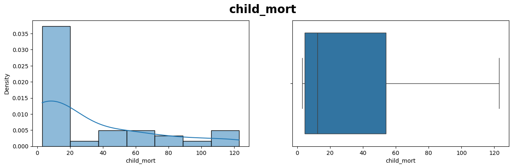
    


    
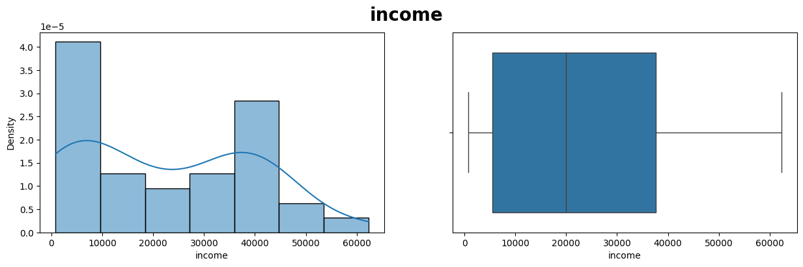
    


    
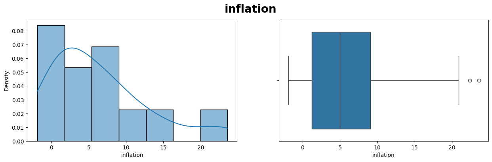
    


    
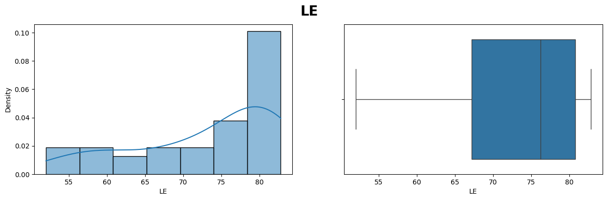
    


    
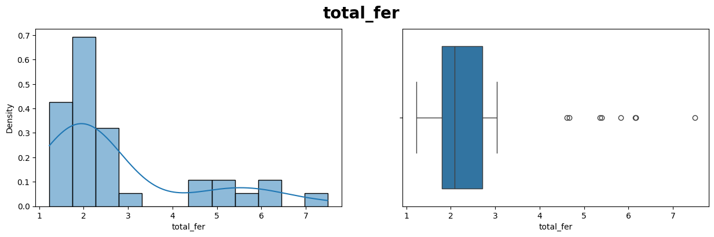
    


From the above plot, we can observe:
- A small dataset.
- Some outliers and a skewed distribution.
- All distributions are positively skewed, except for "LE," which is negatively skewed.

To my surprise, there are outliers only in inflation and total_fer. This is likely due to the small sample size (only 36 countries in the dataset). However, for the purpose of this analysis, outliers should not be removed, as abnormalities in socio-economic or health indices could signify something gravely wrong in that country and which might require assistance or intervention.

### C.1(ii) 
Using this and other analyses you think appropriate, comment on the distribution of variables and describe the relationships between different socio-economic and health indices.

'child_mort' (Child Mortality): the number of deaths per 1,000 live births of children under the age of five.
- Lower values (indicating lower child mortality rates) are better.
- We would expect countries with better healthcare systems to have lower child mortality rates.
- In turn, we would expect countries with better socio-economic conditions to have better healthcare systems.


‘income’ (Net Income per capita): net income per person in dollars.
- Higher values are better as these should correlate well with higher standards of living. 


‘inflation’ (Inflation Rate): Consumer Price Index (CPI).
- In general, with current understanding, it is undesirable to have inflation running too high or too low.  E.g. currently, major western economies, including the UK and US, have an inflation target of about 2% per annum.  


‘LE’ (Life Expectancy): the average number of years a newborn can expect to live if current mortality rates remain constant throughout their lifetime. 
- Assuming that the quality of life is acceptable, higher values are better.
- Longer life expectancy is often associated with better healthcare, living conditions, and overall development.  Lifestyle, not necessarily a function of income, is also an important contributor to Life Expectancy. 


'total_fer' (Total Fertility Rate): the average number of children a woman would give birth to during her reproductive years if she experienced the current age-specific fertility rates throughout her reproductive life.
- This is an index with many complex issues directly impacting it.  It is directly impacted by religion & belief with respect to birth control; education; access to birth control or birth promotion; cost of raising children; and some form of happiness-security index that could measure how much a couple want to have, or not to have, children. 
- Countries with low Total Fertility Rate could face declining population that, in turn, could result in negative Inflation Rate. 


Pair plot to show pairwise relationships across multiple variables. It displays the relationship between each pair of features in a multi-dimensional dataset, and allows us to spot potential patterns or correlations.


```python
# Bivariate Analysis
plt.figure(figsize = (25,25))
sns.pairplot(data)
plt.suptitle('Pair Plot of Numerical Features', y=1.02)
plt.show()
```


    <Figure size 2500x2500 with 0 Axes>


    
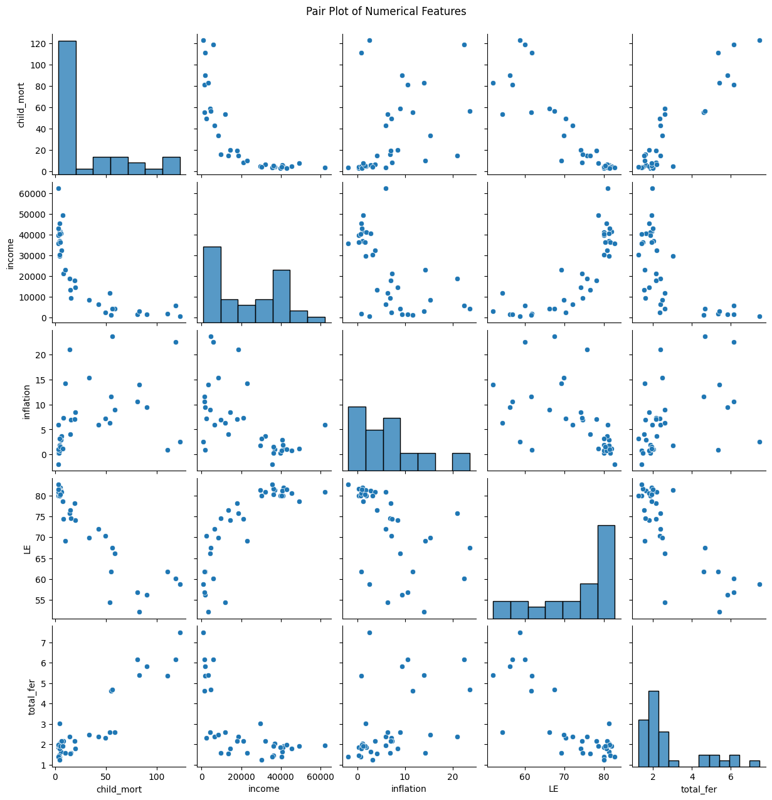
    


In the pairplot, it is evident that most features exhibit well-defined correlations with one another, displaying either positive or negative trends. One could consider log-transforming the data to possibly achieve more linear trends. 

Correlation heatmap to identify patterns of correlation (positive or negative) between pairs of features. The color intensity and annotation values provide insights into the strength and direction of the correlation relationships.


```python
# Correlation Heatmap
plt.figure(figsize = (12,8))  
sns.heatmap(data[numerical_features].corr(method='pearson'),annot = True, cmap='viridis')
plt.title('Correlation Heatmap')
plt.show()
```


    
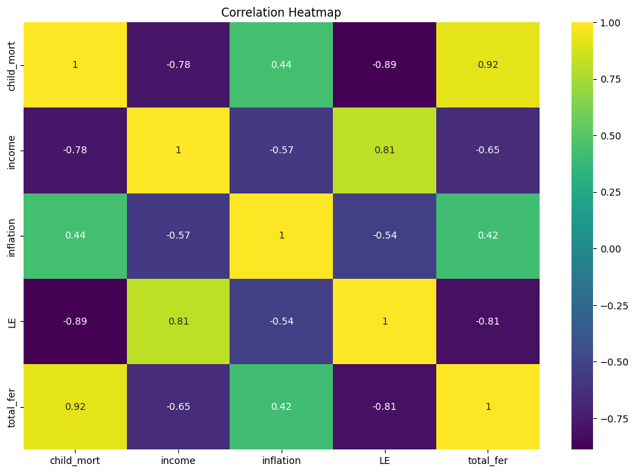
    


Following feature pairs are highly correlated (positively or negatively):

- child_mort and total_fer (correlation factor = 0.92), 
- LE and child_mort (correlation factor = -0.89) 
- income and LE (correlation factor = 0.81) 

Indicates the potential presence of features that may be redundant due to their high correlation with other features.

**Child Mortality** appears to have a strong relationship with the Total Fertility Rate, perhaps suggesting that in countries where Child Mortality is high, there is pressure on women to have more births in order to sustain the overall country population. Conversely, there are strong inverse relationships with Life Expectancy and Net Income per Capita, likely suggesting that in richer countries, there is better healthcare, and people can live longer with fewer children dying young.

**Net Income per Capita**, besides the strong inverse relationship with Child Mortality discussed above, unsurprisingly, has a strong relationship with Life Expectancy, reinforcing the notion that richer countries likely have better healthcare and a higher standard of living where people can live longer.

The **Inflation** Rate does not appear to have any strong relationships, inverse or otherwise, with other indices.

**Life Expectancy**, as discussed above, has a strong inverse relationship with Child Mortality and a strong relationship with Net Income per Capita. Its strong inverse relationship with Total Fertility Rate could be due to less pressure on women to have more children if the country's working population is adequately sustained with people living longer.

**Total Fertility Rate**: Its strong relationship with Child Mortality and its strong inverse relationship with Life Expectancy have already been discussed.

## C 2. Hierarchical clustering.

### C.2(i)
Each row of the data contains information on the socio-economic and health indices of the specific country. Before performing cluster analysis, scale your variable and print the first two rows of this processed data. Explain why the data should be scaled to perform a cluster analysis.

**Explanation of Scaling:**

Cluster analysis aims to group similar data points together based on their features. However, if the variables in your dataset have different scales or units, it can introduce bias into the clustering process. Variables with larger magnitudes or wider ranges may disproportionately influence the clustering algorithm, leading to clusters being formed based on the variables with the highest scale rather than on the actual patterns in the data.

Scaling resolves this issue by transforming the variables to a comparable scale. In this case the features have incomparable units (metrics are percentages, dollar values, whole numbers). There are two primary scaling techniques: standardization and normalization.

-------------------------------

**Standardization (Z-score normalization):**
Formula: Z=(X−μ)/σ, where X is the original value, μ is the mean, and σ is the standard deviation.

Effect: Standardization transforms the data to have a mean of 0 and a standard deviation of 1.

Advantage: It is particularly useful when the variables have different units or different ranges of values.

-------------------------------

**Normalization (Min-Max scaling):**
Formula: norm=(X−X_min)/ (X_max-X_min), where X_min and X_max are the minimum and maximum values of the variable, respectively.

Effect: Normalization scales the data to a range between 0 and 1.

Advantage: It is beneficial when the variables need to be on a similar scale, especially in cases where the algorithm used in clustering is sensitive to the absolute values of the variables.

-------------------------------

**Why Scaling is Necessary:**

Equal Weightage: Scaling ensures that each variable contributes equally to the clustering process. Without scaling, variables with larger scales could dominate the distance calculations, leading to biased cluster formation.

Algorithm Sensitivity: Many clustering algorithms, such as k-means, hierarchical clustering, or DBSCAN, rely on distance measures. Scaling prevents variables with larger ranges from disproportionately influencing the distance metrics, enabling the algorithm to focus on the inherent patterns within the data.

Convergence Speed: Standardizing or normalizing the data can also improve the convergence speed and stability of some clustering algorithms, making them more robust and efficient.

In this case, I have opted to employ Z-score standardization owing to its robustness in handling outliers.

The scaling of variables and printing the first two rows of the processed data are as follows:


```python
from sklearn.preprocessing import StandardScaler

# Extract features for scaling (excluding 'country' column)
features = data[numerical_features]

# Initialize the StandardScaler
scaler = StandardScaler()

# Scale the features
scaled_data = scaler.fit_transform(features)

# Print the first two rows of scaled data
print(pd.DataFrame(scaled_data, columns=features.columns).head(2))

```

       child_mort    income  inflation        LE  total_fer
    0    1.617184 -1.217449   0.459731 -1.793982   1.831028
    1    2.409200 -0.968720   2.474344 -1.375307   2.037133
    

### C.2(ii)
Using your preferred choice of distance function (i.e. Euclidean distance, Manhattan distance, etc.), create a distance matrix for these data and produce a visualisation of the resulting distance matrix. Are there any clusters or groups of countries that stand out in the visualisation?

In this case, I have chosen to use the Manhattan/(cityblock) distance function.


```python
from scipy.spatial.distance import pdist, squareform

# Calculate Manhattan distance. squareform to convert pairwise distances into square distance matrix
manhattan_sq_distance_matrix = squareform(pdist(scaled_data, 'cityblock'))

# Create a DataFrame for the distance matrix
distance_matrix_df = pd.DataFrame(manhattan_sq_distance_matrix, index=data['country'], columns=data['country'])

# Create a heatmap for the distance matrix
plt.figure(figsize=(10, 8))
sns.heatmap(distance_matrix_df, cmap='viridis', annot=False, fmt=".2f", cbar_kws={'label': 'Manhattan Distance'})
plt.title('Manhattan Distance Matrix between Countries')
plt.show()
```


    
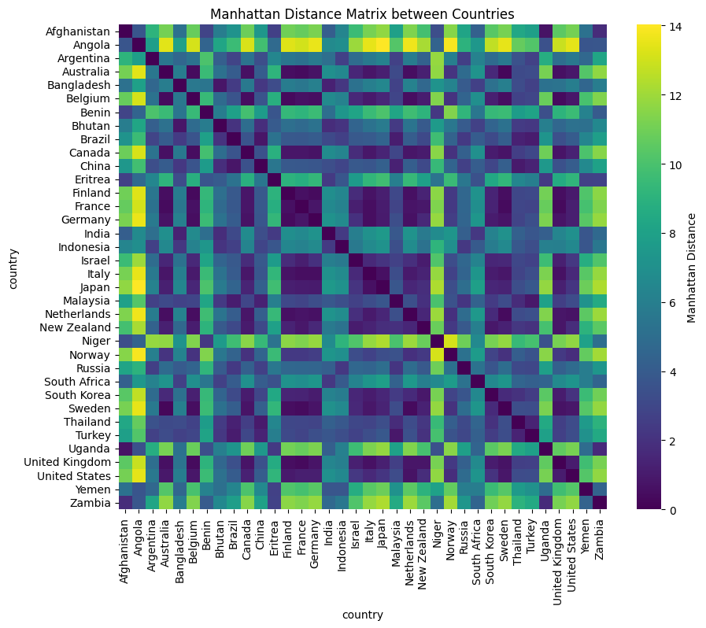
    


In the above heatmap, we can observe the calculated Manhattan distance between countries. However, no noticeable clusters stand out. This is likely attributable to the fact that countries are not ordered by numerical features but rather by alphabetical order.

To assess the identification of clusters, I generated a clustermap wherein the arrangement of rows and columns is determined by their similarity, ensuring that comparable rows and columns are positioned in proximity. The resultant plot exhibits dendrograms for both rows and columns, portraying the hierarchical structure of clusters. The heatmap within illustrates dataset values, with colors indicating varying magnitudes. The reordering of rows and columns is based on their positions in the dendrograms, thereby grouping clusters with akin values.


```python
plt.figure(figsize=(10, 8))
sns.clustermap(pd.DataFrame(scaled_data, index=data['country'], columns=numerical_features), metric='cityblock', cmap='viridis', method='complete')
plt.title('Manhattan Distance Clustermap')
plt.show()
```


    <Figure size 1000x800 with 0 Axes>


    
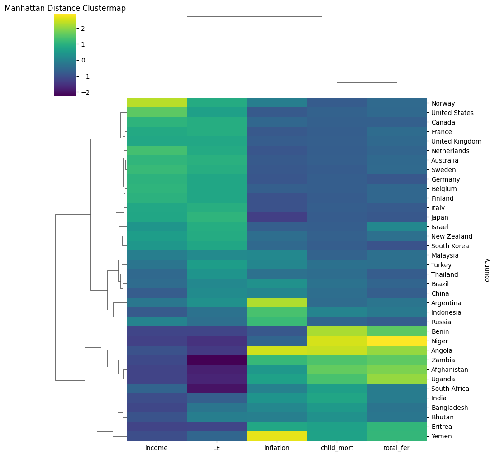
    


In the cluster map, distinct clusters and groups of countries are evident. Specifically, at the upper end of the cluster map, countries such as Norway, the United States, Canada, and extending to South Korea display remarkably similar Manhattan distance scores for all numerical features in the dataset. A comparable pattern is discernible in the group of countries spanning from Malaysia to Russia. However, within this group, Argentina, Indonesia, and Russia stand out as inflation outliers.

A semblance of similarity persists, albeit to a lesser extent, among countries situated at the lower end of the graph.

### C.2(iii)
Produce a dendrogram by performing hierarchical clustering. Using your dendrogram visualisation as a guide, choose an appropriate number of clusters and label each country according to its cluster membership. How many countries are in each of your clusters?

Hierarchical clustering using Manhattan/(cityblock) distance


```python
from scipy.cluster.hierarchy import linkage, dendrogram, cut_tree
# Calculate Manhattan distance and get a condensed distance matrix
manhattan_distance_matrix = pdist(scaled_data, metric='cityblock')

# Perform hierarchical clustering using Manhattan distance
linkage_matrix = linkage(manhattan_distance_matrix, method='complete')

# Create a dendrogram
plt.figure(figsize=(12, 8))
dendrogram(linkage_matrix, labels=data['country'].tolist(), orientation='top', distance_sort='descending', show_leaf_counts=True)
plt.title('Hierarchical Clustering Dendrogram (Manhattan Distance)')
plt.xlabel('Countries')
plt.ylabel('Manhattan Distance')
plt.show()
```


    
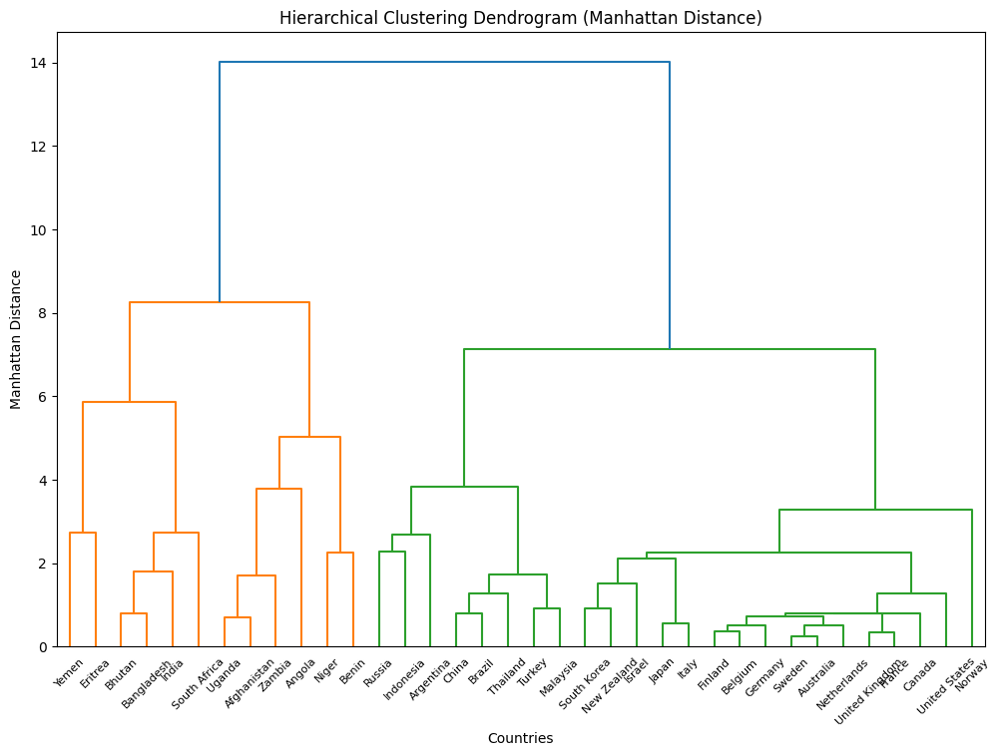
    


The dendrogram generated from hierarchical clustering with complete linkage suggests that the countries should be separated into 2 or 4 distinct clusters. As our aim is to achieve a meaningful separation of countries, we will divide them into 4 clusters.


```python
# Cut the tree into 4 clusters
num_clusters_hc = 4
cluster_hc_ids = cut_tree(linkage_matrix, n_clusters=num_clusters_hc)

# Add cluster label to original data
data['cluster_hc'] = cluster_hc_ids

cluster_counts_hc = data['cluster_hc'].value_counts()

# Display the number of countries in each cluster
for cluster_hc, count in cluster_counts_hc.items():
    print(f'Cluster {cluster_hc}: {count} countries')
```

    Cluster 2: 16 countries
    Cluster 1: 8 countries
    Cluster 0: 6 countries
    Cluster 3: 6 countries
    

As seen above each cluster contains 6 to 16 countries.

### C.2(iv)
Compare socio-economic and health indices for each of your clusters. Using this information, choose names for your clusters and give a potential explanation for the level of development of these countries.


Comparing clusters


```python
print("Cluster 0 of Hierarchical Clustering model")
print(data[data['cluster_hc'] == 0].country.unique())
print('--------------------------------------------')

print("Cluster 1 of Hierarchical Clustering model")
print(data[data['cluster_hc'] == 1].country.unique())
print('--------------------------------------------')

print("Cluster 2 of Hierarchical Clustering model")
print(data[data['cluster_hc'] == 2].country.unique())
print('--------------------------------------------')

print("Cluster 3 of Hierarchical Clustering model")
print(data[data['cluster_hc'] == 3].country.unique())

```

    Cluster 0 of Hierarchical Clustering model
    ['Afghanistan' 'Angola' 'Benin' 'Niger' 'Uganda' 'Zambia']
    --------------------------------------------
    Cluster 1 of Hierarchical Clustering model
    ['Argentina' 'Brazil' 'China' 'Indonesia' 'Malaysia' 'Russia' 'Thailand'
     'Turkey']
    --------------------------------------------
    Cluster 2 of Hierarchical Clustering model
    ['Australia' 'Belgium' 'Canada' 'Finland' 'France' 'Germany' 'Israel'
     'Italy' 'Japan' 'Netherlands' 'New Zealand' 'Norway' 'South Korea'
     'Sweden' 'United Kingdom' 'United States']
    --------------------------------------------
    Cluster 3 of Hierarchical Clustering model
    ['Bangladesh' 'Bhutan' 'Eritrea' 'India' 'South Africa' 'Yemen']
    


```python
cluster_hc_means = data.groupby('cluster_hc')[numerical_features].mean()

# Print the mean values for each cluster
print(cluster_hc_means)
```

                child_mort    income  inflation         LE  total_fer
    cluster_hc                                                       
    0           101.216667   2494.00   9.979167  57.616667   6.063333
    1            16.900000  15857.50  10.513750  74.125000   1.957500
    2             4.475000  40056.25   1.607938  80.868750   1.847500
    3            52.683333   5195.00  10.610000  65.366667   3.196667
    

In the analysis of various indices, income emerges as a predominant driver and influencer. Thus, my initial focus is directed towards this pivotal index. As a gauge of a reasonable standard of living, I subsequently turn my attention to Life Expectancy (LE) and Child Mortality for further refinement.

Net Income per Capita (income) notably distinguishes cluster2, implying that the countries within this cluster exhibit high-income characteristics. Consequently, one would anticipate robust healthcare systems, reflected in a prolonged Life Expectancy and diminished Child Mortality. Indeed, the mean Life Expectancy and low Child Mortality rates in this cluster substantiate this notion. I propose the nomenclature "Developed Countries" for cluster2.

Conversely, cluster0 has the lowest Net Income per Capita, signifying economic adversity. If their cost-of-living is not abnormally low (which would offset their low income), then I would expect that with their low income, these countries would suffer poorer healthcare and hence have higher Child Mortality and lower Life Expectancy.  Indeed, this cluster has the highest Child Mortality and lowest Life Expectancy.  I would label this cluster “Underdeveloped Countries". 

The two remaining clusters, cluster1 and cluster3, exhibit socio-economic and health indices positioned between the extremes of cluster2 and cluster0. Relying primarily on Income and Life Expectancy, I propose "Upper Developing Countries" for cluster1 and "Lower Developing Countries" for cluster3.


```python
sns.pairplot(data, hue='cluster_hc', palette='viridis', diag_kind='kde')
plt.suptitle('Pair Plot of Numerical Features Colored by Hierarchical Clustering model', y=1.02)
plt.show()
```


    
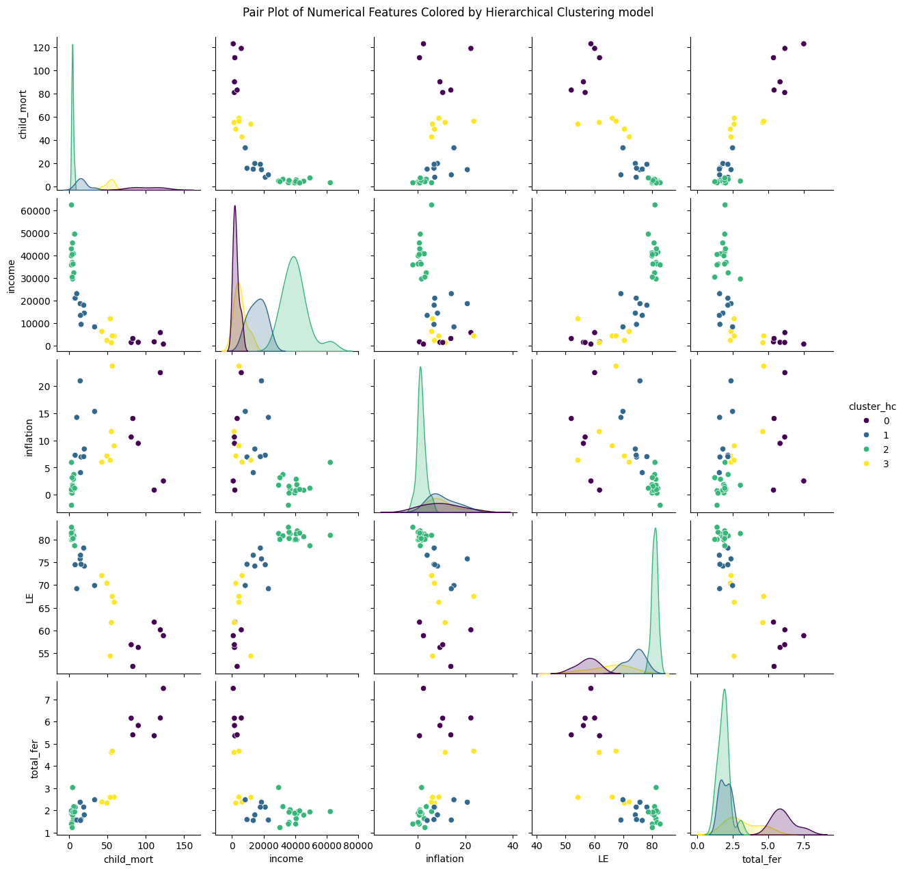
    


In the pairplot above, colored by hierarchical clustering groupings, it is evident that most clusters are well-separated. However, there is a noticeable degree of intermingling among clusters in the pairplot. 

Upon examining the kernel density estimates, it becomes evident that all countries in group 2 share similar values for most features, with income exhibiting the highest degree of dispersion. Cluster 0 consistently displays the highest degree of dispersion among all features, except for income, where all values appear somewhat similar. The level of development for each cluster, as theorized above by their names, can be further observed and confirmed in the pairplot.

In the following, I conduct Principal Component Analysis (PCA) on Health Indicators and separately on Socio-economic Indicators. The aim is to identify the first principal components for both Health Indicators and Socio-economic Indicators, capturing the maximum variance in each category. These principal components will be used to represent the essential information for plotting countries based on their Health and Socio-economic profiles.

Health indicators:
- 'child_mort': Child mortality rate is a health indicator, reflecting the number of children who die before reaching the age of one per 1,000 live births.
- 'LE' (Life Expectancy): Life Expectancy is a health indicator, representing the average number of years a person can expect to live.


Socio-economic indicators:
- 'income': Income is a key socio-economic indicator, reflecting the financial well-being of individuals or a nation.
- 'inflation': Inflation is also a socio-economic indicator, representing the rate at which the general level of prices for goods and services is rising.
- 'total_fer': While fertility rates can indirectly influence certain health outcomes, such as maternal and child health, the total fertility rate itself is more closely linked to socio-economic factors. Factors such as education, income, employment opportunities, access to family planning services, and cultural norms play significant roles in shaping fertility patterns within a population.


```python
from sklearn.decomposition import PCA

# Selected columns for Health Indicators
health_cols = ['child_mort', 'LE']
health_data = data[health_cols]

# Selected columns for Socio-economic Indicators
socio_economic_cols = ['income', 'inflation', 'total_fer']
socio_economic_data = data[socio_economic_cols]

# Standardize the data before applying PCA
scaler2 = StandardScaler()
health_data_standardized = scaler2.fit_transform(health_data)
socio_economic_data_standardized = scaler2.fit_transform(socio_economic_data)

# Apply PCA for Health Indicators
health_pca = PCA(n_components=1, random_state=42)
health_pca_result = health_pca.fit_transform(health_data_standardized)

# Apply PCA for Socio-economic Indicators
socio_economic_pca = PCA(n_components=1, random_state=42)
socio_economic_pca_result = socio_economic_pca.fit_transform(socio_economic_data_standardized)

# Combine PCA results
combined_pca_result = np.concatenate((health_pca_result, socio_economic_pca_result), axis=1)

# Selecting countries for plot
countries = data['country'].tolist()

# Scatter plot of health against socio-economic PCA
plt.figure(figsize=(10, 6))
plt.scatter(combined_pca_result[:, 0], combined_pca_result[:, 1], c='blue')

# Label each point with the corresponding country name
for i, country in enumerate(countries):
    plt.annotate(country, (combined_pca_result[i, 0], combined_pca_result[i, 1]))

# Set plot labels and title
plt.xlabel('Health Indicators PC1')
plt.ylabel('Socio-Economic Indicators PC1')
plt.title('Socio-Economic PC1 vs Health Indicators PC1')

# Show the plot
plt.show()
```


    
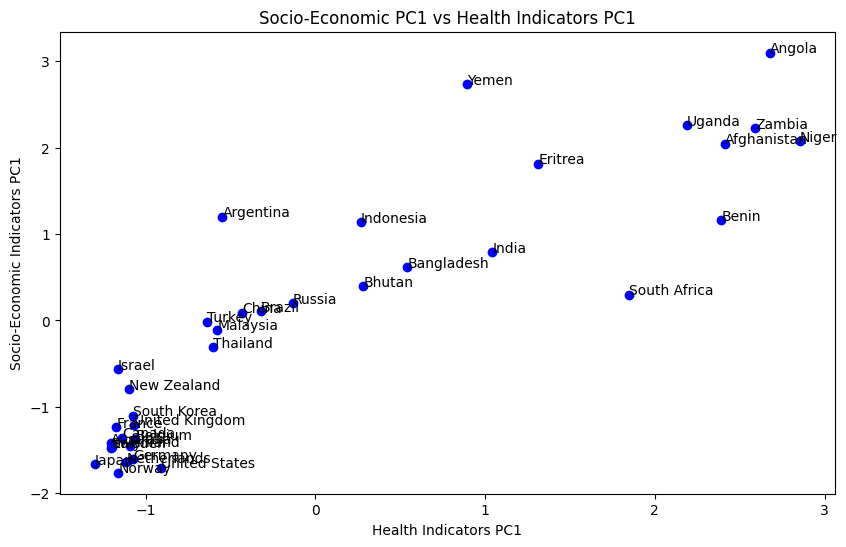
    


```python
health_loadings_df = pd.DataFrame(
    health_pca.components_, # This attribute holds the loadings of variables
    columns=health_cols,
    index=['PC1']
)

socio_economic_loadings_df = pd.DataFrame(
    socio_economic_pca.components_, # This attribute holds the loadings of variables
    columns=socio_economic_cols,
    index=['PC1']
)
```


```python
health_loadings_df
```


<div>
<style scoped>
    .dataframe tbody tr th:only-of-type {
        vertical-align: middle;
    }

    .dataframe tbody tr th {
        vertical-align: top;
    }

    .dataframe thead th {
        text-align: right;
    }
</style>
<table border="1" class="dataframe">
  <thead>
    <tr style="text-align: right;">
      <th></th>
      <th>child_mort</th>
      <th>LE</th>
    </tr>
  </thead>
  <tbody>
    <tr>
      <th>PC1</th>
      <td>0.707107</td>
      <td>-0.707107</td>
    </tr>
  </tbody>
</table>
</div>


- Child Mortality Rate (child_mort):
The positive loading of 0.707107 suggests a positive relationship between the variable "child_mort" and the first principal component (PC1) of health indicators.
Higher values of "child_mort" contribute positively to the first principal component.

- Life Expectancy (LE):
The negative loading of -0.707107 indicates a negative relationship between the variable "LE" and the first principal component (PC1) of health indicators.
Higher values of "LE" contribute negatively to the first principal component.


In summary, the first principal component (PC1) of health indicators is influenced positively by higher values of Child Mortality Rate and negatively by higher values of Life Expectancy. This information can be useful in understanding the underlying patterns or relationships in your data captured by the first principal component of health indicators.


```python
socio_economic_loadings_df
```


<div>
<style scoped>
    .dataframe tbody tr th:only-of-type {
        vertical-align: middle;
    }

    .dataframe tbody tr th {
        vertical-align: top;
    }

    .dataframe thead th {
        text-align: right;
    }
</style>
<table border="1" class="dataframe">
  <thead>
    <tr style="text-align: right;">
      <th></th>
      <th>income</th>
      <th>inflation</th>
      <th>total_fer</th>
    </tr>
  </thead>
  <tbody>
    <tr>
      <th>PC1</th>
      <td>-0.618173</td>
      <td>0.539257</td>
      <td>0.571895</td>
    </tr>
  </tbody>
</table>
</div>


- Income:
The negative loading of -0.618173 implies a negative relationship between the variable "income" and the first principal component (PC1) of socio-economic indicators. Higher values of "income" contribute negatively to the first principal component.

- Inflation:
The positive loading of 0.539257 indicates a positive relationship between the variable "inflation" and the first principal component (PC1) socio-economic indicators.
Higher values of "inflation" contribute positively to the first principal component.

- Total Fertility Rate (total_fer):
The positive loading of 0.571895 suggests a positive relationship between the variable "total_fer" and the first principal component (PC1) of socio-economic indicators.
Higher values of "total_fer" contribute positively to the first principal component.

In summary, the first principal component (PC1) of socio-economic indicators is influenced negatively by higher values of income and positively by higher values of inflation and total fertility rate. This information can be valuable in understanding the underlying patterns or relationships in your data captured by the first principal component of socio-economic indicators. Unfortunately, PCA does not fully preserve interpretability as it combines all socio-economic columns, each of which may not have a clearly defined desirable value. However, it can be inferred that lower values are generally considered more desirable.


```python
# Assuming 'cluster_hc' is the cluster labels column in your original DataFrame
cluster_hc_labels = data['cluster_hc'].tolist()

# Add 'cluster_hc' column to combined_pca_result
combined_pca_result_hclabels = np.column_stack((combined_pca_result, cluster_hc_labels))

# Create pandas data frame
dfhc = pd.DataFrame(combined_pca_result_hclabels, columns=['Health Indicators PC1', 'Socio-Economic Indicators PC1', 'hccluster'])

# Plotting scatterplot
plt.figure(figsize=(10,8))
plt.scatter(
    dfhc['Health Indicators PC1'], 
    dfhc['Socio-Economic Indicators PC1'], 
    c=dfhc['hccluster'], 
    cmap='viridis',
    edgecolors='k'
)

# Labeling the axes
plt.xlabel('Health Indicators PC1')
plt.ylabel('Socio-Economic Indicators PC1')
plt.title('Socio-Economic vs Health Indicators with HC Cluster Labels')

# Add a colorbar to show the correspondence between colors and cluster numbers
cbar = plt.colorbar()
cbar.set_label('HC Cluster Number')

# Customize the colorbar ticks and tick labels
cbar.set_ticks(np.arange(4))
cbar.set_ticklabels(['Cluster 0', 'Cluster 1', 'Cluster 2','Cluster 3'])

# Displaying the plot
plt.show()
```


    
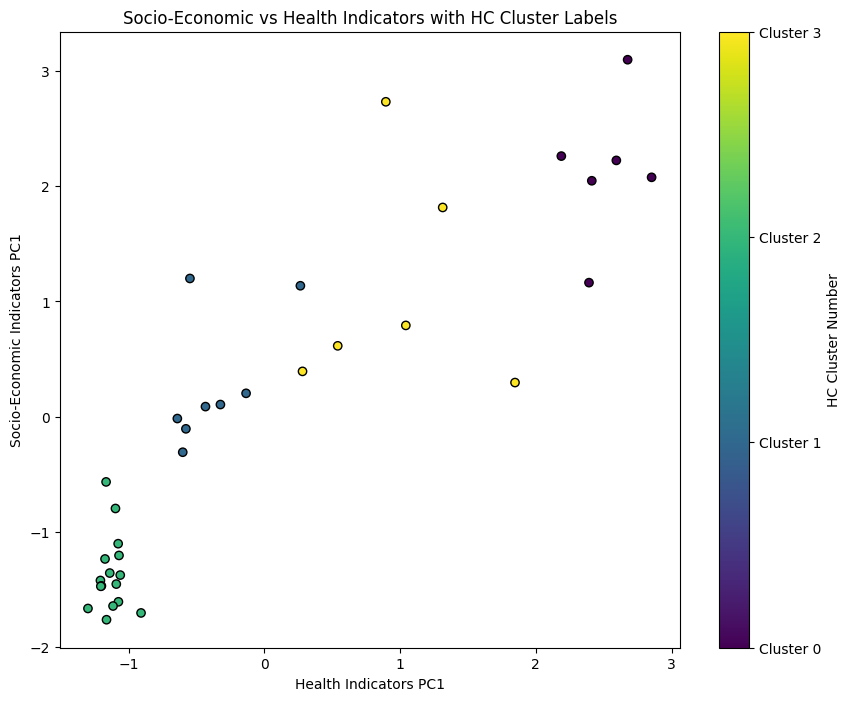
    


The plot titled 'Socio-Economic vs Health Indicators with Cluster Labels' above utilises the same health and socio-economic indicators, as well as principal components. Therefore, we can apply the same principal component loading analysis.

As we can see from the 'Socio-Economic vs Health Indicators with Cluster Labels' plot. The country clusters are separated well by the first principal component of the Health Indicators and the first principal component of the Socio-economic Indicators. 

Cluster 2 exhibits the lowest mean scores on Health indicator PC1 and Socio-economic indicator PC1. This finding further supports the notion that this group of countries is more developed than the other clusters.

On the other hand, Cluster 0 demonstrates the highest mean scores on Health indicator PC1 and Socio-economic indicator PC1, implying that this group of countries is the least developed among the clusters.

Average inflation of cluster 1, 2 and 3 are similar. This leads me to believe that inflation is not that useful in comparing between clusters. Below is a boxplot of income, child_mort, LE, total_fer grouped by cluster.


```python
plt.figure(figsize=(12, 6))

# Create the boxplot for income
plt.subplot(221)
sns.boxplot(x='cluster_hc', y='income', data=data)
plt.title('Income by Cluster')
plt.xlabel('Cluster')
plt.ylabel('Income')

# Create the boxplot for child_mort
plt.subplot(222)
sns.boxplot(x='cluster_hc', y='child_mort', data=data)
plt.title('Child Mortality by Cluster')
plt.xlabel('Cluster')
plt.ylabel('Child Mortality')

# Create the boxplot for LE
plt.subplot(223)
sns.boxplot(x='cluster_hc', y='LE', data=data)
plt.title('Life Expectancy by Cluster')
plt.xlabel('Cluster')
plt.ylabel('Life Expectancy')

# Create the boxplot for total_fer
plt.subplot(224)
sns.boxplot(x='cluster_hc', y='total_fer', data=data)
plt.title('Total Fertility Rate by Cluster')
plt.xlabel('Cluster')
plt.ylabel('Total Fertility Rate')

# Show the plot
plt.tight_layout()
plt.show()
```


    
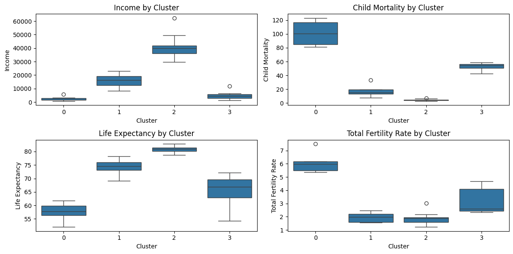
    


Cluster 0: This cluster is characterised by having the most negative values: high child mortality, lowest income, lowest life expectancy.
- income, lowest on average
- child mortality, significantly higher than other clusters
- life expectancy, lowest on average
- total_fer, highest on average

Cluster 1: This cluster is characterised by showing slightly above average values for most features in comparison with other clusters
- income, slightly above average (2nd highest)
- child mortality, slightly below average (2nd lowest)
- life expectancy, above average, ~ 74 years
- total_fer, slightly below, ~ 2


Cluster 2: This cluster is characterised by showing really strong or positive values such as highest income, high life expectancy, low child mortality.
- income, significantly higher than other clusters
- child mortality, lowest
- life expectancy, highest, ~ 80 years
- total_fer, lowest, ~ 2

Cluster 3: This cluster is characterised by showing slightly below average values for most features in comparison with other clusters
- income, slightly below average (2nd lowest)
- child mortality, below average, significant difference compared to cluster 1 and 2.
- life expectancy, slightly below average, ~ 65 years
- total_fer, slightly above, ~ 3

**Names for Clusters**
- Cluster 0: Underdeveloped Countries
- Cluster 1: Upper Developing Countries
- Cluster 2: Developed Countries
- Cluster 3: Lower Developing Countries

Child Mortality:
- Developed Countries: Typically, developed countries have lower child mortality rates. Access to advanced healthcare, vaccination programs, and overall better living conditions contribute to healthier environments for children.
- Developing Countries: Higher child mortality rates are often associated with developing countries due to factors such as inadequate healthcare, poor sanitation, and limited access to clean water.

Income:
- Developed Countries: Higher levels of income are generally found in developed countries. These nations often have well-established economies, higher GDP per capita, and a more evenly distributed wealth among the population.
- Developing Countries: Lower income levels are common in developing countries. Factors such as limited industrialization, lack of infrastructure, and lower educational attainment contribute to lower incomes for a significant portion of the population.

Inflation:
- Developed Countries: Developed countries tend to have more stable economies and lower inflation rates. Effective economic policies, well-regulated financial systems, and mature markets contribute to economic stability.
- Developing Countries: Inflation rates may be higher in developing countries due to factors like economic volatility, political instability, and inadequate fiscal policies.

Life Expectancy:
- Developed Countries: Higher life expectancy is a characteristic of developed countries. Access to quality healthcare, better nutrition, and overall improved living conditions contribute to longer life spans.
- Developing Countries: Lower life expectancy is often observed in developing countries, where healthcare services may be limited, and living conditions are not as favorable.

Total Fertility Rate:
- Developed Countries: Generally, developed countries tend to have lower total fertility rates. Factors such as better education, access to family planning, and women's participation in the workforce contribute to smaller family sizes.
- Developing Countries: Higher total fertility rates are common in developing countries, where issues such as limited access to family planning, cultural norms, and economic dependence on larger families may influence birth rates.

## C 3. K-means clustering
For the same dataset, perform k-means clustering. Choose an appropriate value
for the number of clusters. How do your results differ from the results you
obtained with hierarchical clustering?

Finding optimal number of clusters


```python
from sklearn.cluster import KMeans

# Elbow Method for K means
# Import ElbowVisualizer
from yellowbrick.cluster import KElbowVisualizer
model = KMeans(n_init=10, random_state=42)
# k is range of number of clusters.
visualizer = KElbowVisualizer(model, k=(2,10), metric='distortion', distance_metric='euclidean', timings=False, locate_elbow=True)
visualizer.fit(scaled_data)     # Fit the data to the visualizer
visualizer.show()               # Finalize and render the figure
```


    
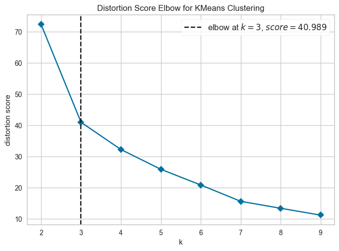
    


    <Axes: title={'center': 'Distortion Score Elbow for KMeans Clustering'}, xlabel='k', ylabel='distortion score'>


```python
# Silhouette Score for K means
# Import ElbowVisualizer
from yellowbrick.cluster import KElbowVisualizer
model = KMeans(n_init=10, random_state=42)
# k is range of number of clusters.
visualizer = KElbowVisualizer(model, k=(2,10), metric='silhouette', distance_metric='euclidean', timings=False, locate_elbow=True)
visualizer.fit(scaled_data)     # Fit the data to the visualizer
visualizer.show()               # Finalize and render the figure
```


    
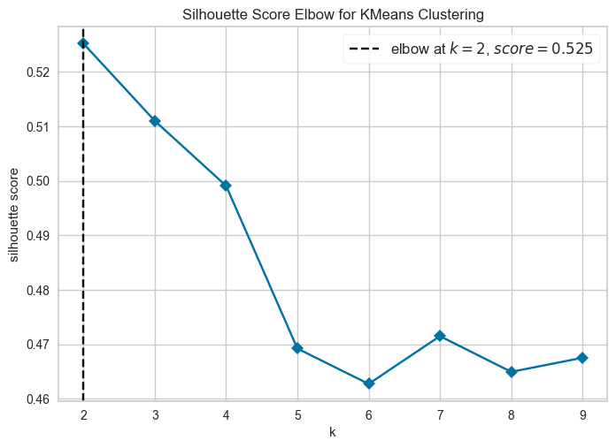
    


    <Axes: title={'center': 'Silhouette Score Elbow for KMeans Clustering'}, xlabel='k', ylabel='silhouette score'>


```python
# Calinski Harabasz Score for K means
# Import ElbowVisualizer
from yellowbrick.cluster import KElbowVisualizer
model = KMeans(n_init=10, random_state=42)
# k is range of number of clusters.
visualizer = KElbowVisualizer(model, k=(2,10), metric='calinski_harabasz', distance_metric='euclidean', timings=False, locate_elbow=True)
visualizer.fit(scaled_data)     # Fit the data to the visualizer
visualizer.show()               # Finalize and render the figure
```


    
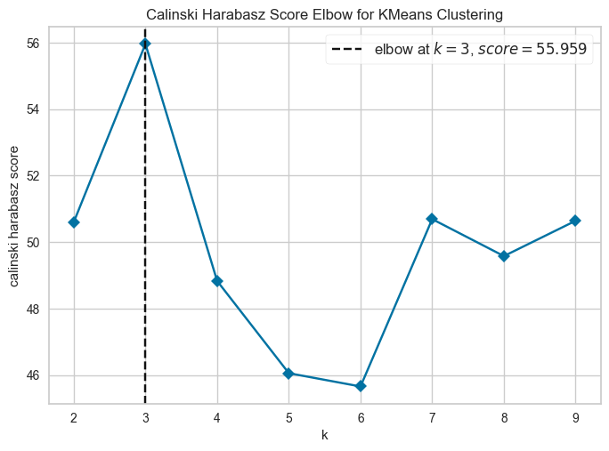
    


    <Axes: title={'center': 'Calinski Harabasz Score Elbow for KMeans Clustering'}, xlabel='k', ylabel='calinski harabasz score'>


```python
# Calculate Manhattan distance and get a condensed distance matrix
euclidean_distance_matrix = pdist(scaled_data, metric='euclidean')

# Perform hierarchical clustering using Manhattan distance
linkage_matrix = linkage(euclidean_distance_matrix, method='complete')

# Create a dendrogram
plt.figure(figsize=(12, 8))
dendrogram(linkage_matrix, labels=data['country'].tolist(), orientation='top', distance_sort='descending', show_leaf_counts=True)
plt.title('Hierarchical Clustering Dendrogram (Euclidean Distance)')
plt.xlabel('Countries')
plt.ylabel('Euclidean Distance')
plt.show()
```


    
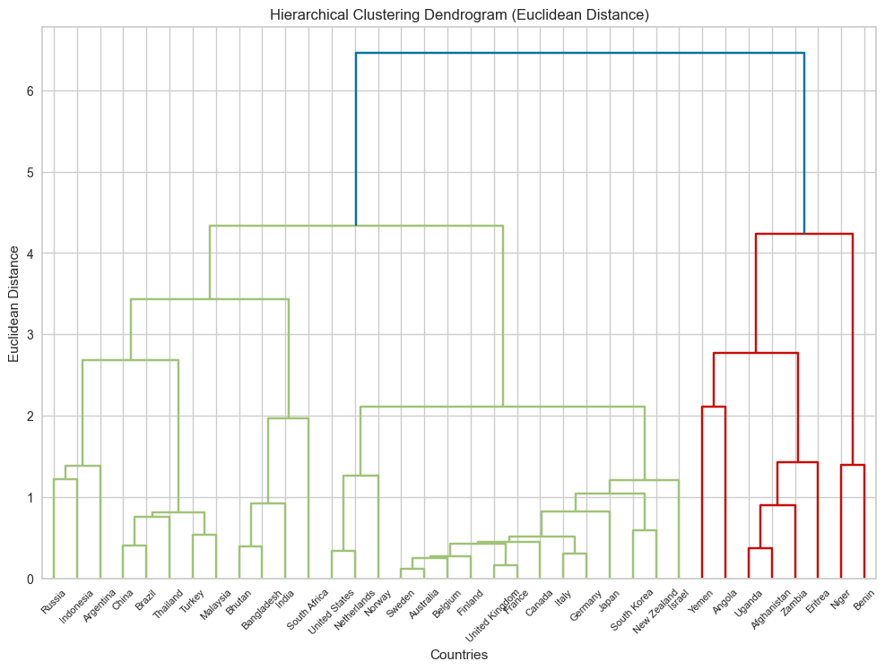
    


From the above visualizations, two of the three suggest that I should fit a k-means clustering model with 3 clusters. This differs from what I had fitted earlier using Hierarchical Clustering, partially due to the change in the distance metric used. In the earlier Hierarchical Clustering, I employed the Manhattan distance, whereas for k-means, I used the Euclidean distance.


```python
num_clusters_km = 3
kmeans_model = KMeans(n_clusters=num_clusters_km, n_init=10, random_state=42)


data['cluster_km'] = kmeans_model.fit_predict(scaled_data)
```


```python
cluster_counts_km = data['cluster_km'].value_counts()

# Display the number of countries in each cluster
for cluster_km, count in cluster_counts_km.items():
    print(f'Cluster {cluster_km}: {count} countries')
```

    Cluster 0: 16 countries
    Cluster 2: 12 countries
    Cluster 1: 8 countries
    


```python
print("Cluster 0 of KMeans Clustering model")
print(data[data['cluster_km'] == 0].country.unique())
print('--------------------------------------------')

print("Cluster 1 of KMeans Clustering model")
print(data[data['cluster_km'] == 1].country.unique())
print('--------------------------------------------')

print("Cluster 2 of KMeans Clustering model")
print(data[data['cluster_km'] == 2].country.unique())
print('--------------------------------------------')

```

    Cluster 0 of KMeans Clustering model
    ['Australia' 'Belgium' 'Canada' 'Finland' 'France' 'Germany' 'Israel'
     'Italy' 'Japan' 'Netherlands' 'New Zealand' 'Norway' 'South Korea'
     'Sweden' 'United Kingdom' 'United States']
    --------------------------------------------
    Cluster 1 of KMeans Clustering model
    ['Afghanistan' 'Angola' 'Benin' 'Eritrea' 'Niger' 'Uganda' 'Yemen'
     'Zambia']
    --------------------------------------------
    Cluster 2 of KMeans Clustering model
    ['Argentina' 'Bangladesh' 'Bhutan' 'Brazil' 'China' 'India' 'Indonesia'
     'Malaysia' 'Russia' 'South Africa' 'Thailand' 'Turkey']
    --------------------------------------------
    


```python
cluster_km_means = data.groupby('cluster_km')[numerical_features].mean()

# Print the mean values for each cluster
print(cluster_km_means)
```

                child_mort    income  inflation         LE  total_fer
    cluster_km                                                       
    0             4.475000  40056.25   1.607938  80.868750     1.8475
    1            89.850000   2608.00  11.884375  59.362500     5.7075
    2            28.316667  12677.50   9.380833  71.333333     2.1300
    


```python
sns.pairplot(data.drop('cluster_hc', axis=1), hue='cluster_km', palette='viridis', diag_kind='kde')
plt.suptitle('Pair Plot of Numerical Features Colored by K-Means Cluster', y=1.02)
plt.show()
```


    
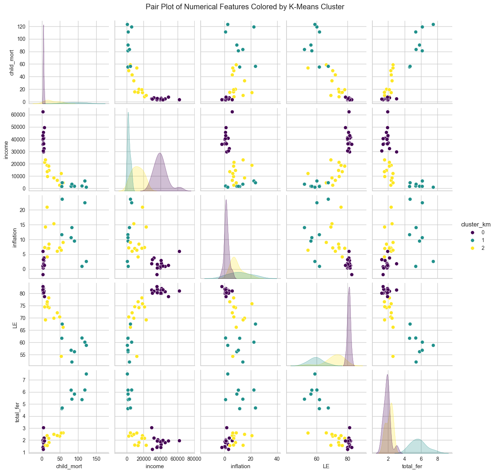
    


```python
plt.figure(figsize=(12, 6))

# Create the boxplot for income
plt.subplot(221)
sns.boxplot(x='cluster_km', y='income', data=data)
plt.title('Income by Cluster')
plt.xlabel('Cluster')
plt.ylabel('Income')

# Create the boxplot for child_mort
plt.subplot(222)
sns.boxplot(x='cluster_km', y='child_mort', data=data)
plt.title('Child Mortality by Cluster')
plt.xlabel('Cluster')
plt.ylabel('Child Mortality')

# Create the boxplot for LE
plt.subplot(223)
sns.boxplot(x='cluster_km', y='LE', data=data)
plt.title('Life Expectancy by Cluster')
plt.xlabel('Cluster')
plt.ylabel('Life Expectancy')

# Create the boxplot for total_fer
plt.subplot(224)
sns.boxplot(x='cluster_km', y='total_fer', data=data)
plt.title('Total Fertility Rate by Cluster')
plt.xlabel('Cluster')
plt.ylabel('Total Fertility Rate')

# Show the plot
plt.tight_layout()
plt.show()
```


    
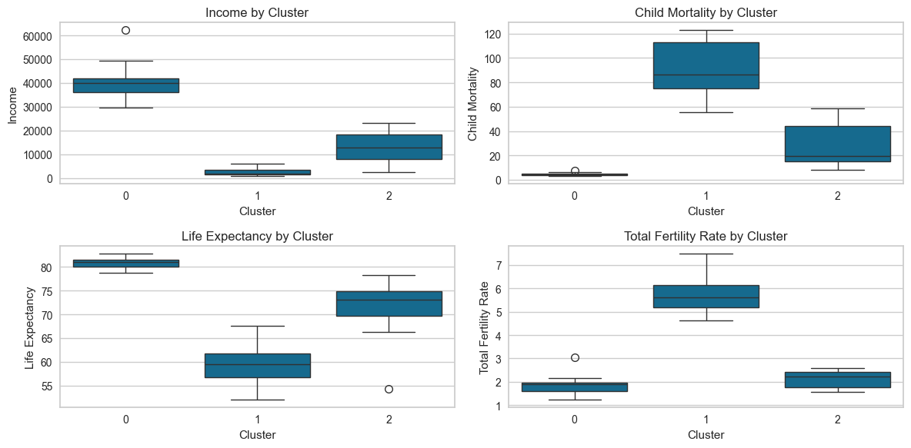
    


Looking the variables "Income", "Life_Expec", "Child_Mort", and "Total_Fer", we can conclude which group of countries are more in need of help.

- Cluster = 0: 

    Developed Countries
    Countries with highest values in "Income" & "Life_Expec" and lowest values in "Child_Mort" & "Total_Fer".

- Cluster = 1:

    Underdeveloped Countries
    Countries with the lowest values in "Income" & "Life_Expec" and highest values in "Child_Mort" & "Total_Fer".

- Cluster = 2:

    Developing Countries
    Countries with middle values in "Income" & "Life_Expec" and middle values in "Child_Mort" & "Total_Fer".


```python
import matplotlib.cm as cm
import matplotlib.colors as colors


# saving cluster_km labels
cluster_km_labels = data['cluster_km'].tolist()

# Add 'cluster_km' column to combined_pca_result
combined_pca_result_kmlabels = np.column_stack((combined_pca_result, cluster_km_labels))

# Create pandas data frame
dfkm = pd.DataFrame(combined_pca_result_kmlabels, columns=['Health Indicators PC1', 'Socio-Economic Indicators PC1', 'kmcluster'])

# Creating subplots
fig, (ax1, ax2) = plt.subplots(1, 2, figsize=(16,8), sharex=True, sharey=True, gridspec_kw={'width_ratios': [1, 1], 'height_ratios': [1]})

# Plotting scatterplot for kmcluster
scatter1 = ax1.scatter(
    dfkm['Health Indicators PC1'], 
    dfkm['Socio-Economic Indicators PC1'], 
    c=dfkm['kmcluster'], 
    cmap='viridis',
    edgecolors='k'
)

# Labeling the axes for kmcluster
ax1.set_xlabel('Health Indicators PC1')
ax1.set_ylabel('Socio-Economic Indicators PC1')
ax1.set_title('Socio-Economic vs Health Indicators with k-mean Cluster Labels')

# Add a colorbar to show the correspondence between colors and cluster numbers for kmcluster
cbar1 = ax1.figure.colorbar(mappable=scatter1, ax=ax1, shrink=0.7, label='KM Cluster Number')
cbar1.set_ticks(np.arange(3))
cbar1.set_ticklabels(['Cluster 0', 'Cluster 1', 'Cluster 2'])

# Plotting scatterplot for hccluster
scatter2 = ax2.scatter(
    dfhc['Health Indicators PC1'], 
    dfhc['Socio-Economic Indicators PC1'], 
    c=dfhc['hccluster'], 
    cmap='viridis',
    edgecolors='k'
)

# Labeling the axes for hccluster
ax2.set_xlabel('Health Indicators PC1')
ax2.set_ylabel('Socio-Economic Indicators PC1')
ax2.set_title('Socio-Economic vs Health Indicators with HC Cluster Labels')

# Add a colorbar to show the correspondence between colors and cluster numbers for hccluster
cbar2 = ax2.figure.colorbar(mappable=scatter2, ax=ax2, shrink=0.7, label='HC Cluster Number')
cbar2.set_ticks(np.arange(4))
cbar2.set_ticklabels(['Cluster 0', 'Cluster 1', 'Cluster 2','Cluster 3'])

# Displaying the plot
plt.show()
```


    
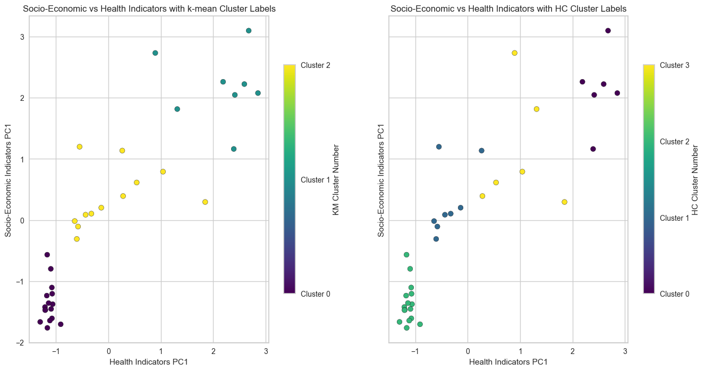
    


We can use the plots above to visualise and discuss the main difference in results between the Hierarchical clusters (4 clusters) and K-Means clusters (3 clusters).

- The lower left cluster (Hierarchical cluster2, K-Means cluster0) in each plot is common. These are the Developed Countries.
- K-means cluster1 in the upper right is the same as Hierarchical cluster0 (also upper right) with 2 countries from cluster3 added. These are the Underdeveloped Countries. 
- All other countries in between these extremes are characterised as Developing Countries (K-Means cluster2; all of Hierarchical cluster1 plus 4 countries from Hierarchical cluster3)


## C 4. Allocating new observations to clusters

The dataset new countries.csv contains information for 8 new countries.

### C.4(i)
Assign each new country to the cluster (either from hierarchical clustering
or k-means clustering) whose centroid is nearest to the new country’s
variables values.

I will assign the new countries to the k-means clustering.


```python
# Load new data
new_data = pd.read_csv(data_dir + 'new_countries.csv')
```


```python
scaled_new_data = scaler.transform(new_data[numerical_features])

# Predict the clusters for the new countries based on their scaled features
predicted_km_clusters = kmeans_model.predict(scaled_new_data)

new_data['predicted_km_cluster'] = predicted_km_clusters
```


```python
print(new_data[['country', 'predicted_km_cluster']])
```

              country  predicted_km_cluster
    0         Armenia                     2
    1            Chad                     1
    2  Czech Republic                     0
    3         Namibia                     2
    4          Poland                     0
    5        Portugal                     0
    6           Spain                     0
    7     Switzerland                     0
    

### C.4(ii)
Based on your summaries and plots, does the cluster allocation of the new countries deviate from your expectations and practical knowledge?

The cluster allocation of the new countries do not deviate from my expectations and practical knowledge. 

## C 5. Putting data back into context

You are a data analyst working for the United Nations (UN) that wants to
enhance its funding strategy by identifying a group of countries that are in
direct need of aid. Based on your analysis, suggest a group of countries and a
selection of socio-economic and health indices that UN needs to focus on the
most.

Create a new data frame containing underdeveloped countries called help_data


```python
full_data = pd.concat([data, new_data], ignore_index=True)

help_data = full_data.loc[(full_data['cluster_hc'] ==  0) | (full_data['cluster_km'] == 1) | (full_data['predicted_km_cluster'] == 1)]
```


```python
help_data[numerical_features].describe(percentiles= [0.01, 0.05, 0.25, 0.5, 0.75, 0.95, 0.99])
```


<div>
<style scoped>
    .dataframe tbody tr th:only-of-type {
        vertical-align: middle;
    }

    .dataframe tbody tr th {
        vertical-align: top;
    }

    .dataframe thead th {
        text-align: right;
    }
</style>
<table border="1" class="dataframe">
  <thead>
    <tr style="text-align: right;">
      <th></th>
      <th>child_mort</th>
      <th>income</th>
      <th>inflation</th>
      <th>LE</th>
      <th>total_fer</th>
    </tr>
  </thead>
  <tbody>
    <tr>
      <th>count</th>
      <td>9.000000</td>
      <td>9.000000</td>
      <td>9.000000</td>
      <td>9.000000</td>
      <td>9.000000</td>
    </tr>
    <tr>
      <th>mean</th>
      <td>96.533333</td>
      <td>2532.666667</td>
      <td>11.273889</td>
      <td>59.044444</td>
      <td>5.805556</td>
    </tr>
    <tr>
      <th>std</th>
      <td>31.745511</td>
      <td>1680.371685</td>
      <td>7.865799</td>
      <td>4.423548</td>
      <td>0.920531</td>
    </tr>
    <tr>
      <th>min</th>
      <td>55.200000</td>
      <td>814.000000</td>
      <td>0.885000</td>
      <td>52.000000</td>
      <td>4.610000</td>
    </tr>
    <tr>
      <th>1%</th>
      <td>55.288000</td>
      <td>862.480000</td>
      <td>1.018200</td>
      <td>52.336000</td>
      <td>4.614800</td>
    </tr>
    <tr>
      <th>5%</th>
      <td>55.640000</td>
      <td>1056.400000</td>
      <td>1.551000</td>
      <td>53.680000</td>
      <td>4.634000</td>
    </tr>
    <tr>
      <th>25%</th>
      <td>81.000000</td>
      <td>1540.000000</td>
      <td>6.390000</td>
      <td>56.500000</td>
      <td>5.360000</td>
    </tr>
    <tr>
      <th>50%</th>
      <td>90.200000</td>
      <td>1820.000000</td>
      <td>10.600000</td>
      <td>58.800000</td>
      <td>5.820000</td>
    </tr>
    <tr>
      <th>75%</th>
      <td>119.000000</td>
      <td>3280.000000</td>
      <td>14.000000</td>
      <td>61.700000</td>
      <td>6.160000</td>
    </tr>
    <tr>
      <th>95%</th>
      <td>139.200000</td>
      <td>5332.000000</td>
      <td>23.120000</td>
      <td>65.220000</td>
      <td>7.130000</td>
    </tr>
    <tr>
      <th>99%</th>
      <td>147.840000</td>
      <td>5786.400000</td>
      <td>23.504000</td>
      <td>67.044000</td>
      <td>7.418000</td>
    </tr>
    <tr>
      <th>max</th>
      <td>150.000000</td>
      <td>5900.000000</td>
      <td>23.600000</td>
      <td>67.500000</td>
      <td>7.490000</td>
    </tr>
  </tbody>
</table>
</div>


In the following, I standardize the help_data frame containing underdeveloped countries and conduct Principal Component Analysis (PCA) on Health Indicators and separately on Socio-economic Indicators. The objective is to identify the first principal components for both Health Indicators and Socio-economic Indicators, capturing the maximum variance in each category to spread the countries as much as possible on these two axes. These principal components will be used to represent essential information for plotting countries based on their Health and Socio-economic profiles.


Instead of utilizing all numerical features in the PCA, I have decided to focus on the following:


Health indicators:
- 'child_mort': Child mortality rate is a health indicator, reflecting the number of children who die before reaching the age of one per 1,000 live births.
- 'LE' (Life Expectancy): Life Expectancy is a health indicator, representing the average number of years a person can expect to live.

Socio-economic indicators:
- 'income': Income is a key socio-economic indicator, reflecting the financial well-being of individuals or a nation.


In this case, I have excluded 'inflation' and 'total_fer' from socio-economic indicators while retaining the same health indicators as used earlier. The reason for excluding 'inflation' and 'total_fer' is due to both these features having many complex issues impacting them and their interpretation.

In the case of the total fertility rate, it is influenced by factors such as religion and belief, the availability of contraceptives, the cost of raising children, and some form of a happiness-security index that could measure how much a couple wants to have, or not have, children. Inflation, as previously discussed, lacks a universally perfect rate, making it a challenging numerical indicator to interpret.


```python
from sklearn.decomposition import PCA

# Selected columns for Health Indicators
health_cols = ['child_mort', 'LE']
health_helpdata = help_data[health_cols]

# Selected columns for Socio-economic Indicators
socio_economic_cols_adj = ['income']
socio_economic_helpdata = help_data[socio_economic_cols_adj]

# Standardize the data before applying PCA
scaler3 = StandardScaler()
health_helpdata_standardized = scaler3.fit_transform(health_helpdata)
socio_economic_helpdata_standardized = scaler3.fit_transform(socio_economic_helpdata)

# Apply PCA for Health Indicators
health_helppca = PCA(n_components=1, random_state=42)
health_pca_helpresult = health_helppca.fit_transform(health_helpdata_standardized)

# Apply PCA for Socio-economic Indicators
socio_economic_helppca = PCA(n_components=1, random_state=42)
socio_economic_helppca_result = socio_economic_helppca.fit_transform(socio_economic_helpdata_standardized)

# Combine PCA results
combined_pca_helpresult = np.concatenate((health_pca_helpresult, socio_economic_helppca_result), axis=1)

# Selecting countries for plot
help_countries = help_data['country'].tolist()

# Scatter plot of health against socio-economic PCA
plt.figure(figsize=(10, 6))
plt.scatter(combined_pca_helpresult[:, 0], combined_pca_helpresult[:, 1], c='blue')

# Label each point with the corresponding country name
for i, help_country in enumerate(help_countries):
    plt.annotate(help_country, (combined_pca_helpresult[i, 0], combined_pca_helpresult[i, 1]))

# Set plot labels and title
plt.xlabel('Health Indicators PC1')
plt.ylabel('Socio-Economic Indicators PC1')
plt.title('Help Countries Socio-Economic PC1 vs Health Indicators PC1')

# Show the plot
plt.show()
```


    
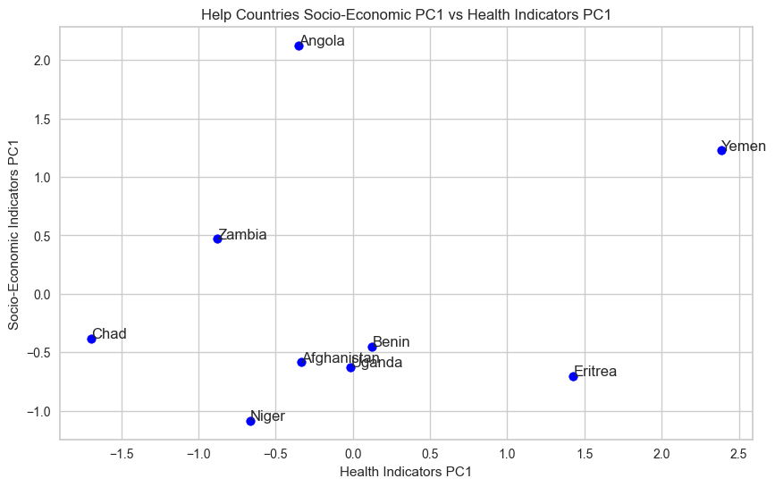
    


```python
health_loadings_helpdf = pd.DataFrame(
    health_helppca.components_, # This attribute holds the loadings of variables
    columns=health_cols,
    index=['PC1']
)

socio_economic_loadings_helpdf = pd.DataFrame(
    socio_economic_helppca.components_, # This attribute holds the loadings of variables
    columns=socio_economic_cols_adj,
    index=['PC1']
)
```


```python
print(health_loadings_helpdf)
print('--------------')
print(socio_economic_loadings_helpdf)

```

         child_mort        LE
    PC1   -0.707107  0.707107
    --------------
         income
    PC1     1.0
    

From the loaded data, it is evident that a lower value of health indicators corresponds to a more unfavorable condition for the country, as indicated by higher child mortality rates and lower life expectancy. Additionally, a lower value of socio-economic indicators is associated with lower income, thereby indicating a poorer economic situation for the country.

Consequently, the countries facing the most challenges are positioned in the bottom-left quadrant of the 'Help Countries Socio-Economic PC1 vs Health Indicators PC1' plot.

To compile a prioritized list of countries for the UN's attention, we will aggregate the health indicators (PC1) and socio-economic indicators (PC1). Subsequently, we will arrange the countries in ascending order based on the corresponding values.


```python
# Sum Health Indicators PC1 and Socio-Economic Indicators PC1 
sum_pca_helpresult = [[row[0] + row[1]] for row in combined_pca_helpresult]

# Combine to complete_pca_helpresult along with help_countries preparing to create data frame
complete_pca_helpresult = np.column_stack((help_countries, combined_pca_helpresult, sum_pca_helpresult))

# Create data frame
help_df = pd.DataFrame(complete_pca_helpresult, columns=['country', 'Health Indicators PC1', 'Socio-Economic Indicators PC1', 'SumIndicators'])


# Change to numeric
help_df['SumIndicators'] = pd.to_numeric(help_df['SumIndicators'])

# Order countries by Sum
help_df[['country', 'SumIndicators']].sort_values(by='SumIndicators', ascending=True)

```


<div>
<style scoped>
    .dataframe tbody tr th:only-of-type {
        vertical-align: middle;
    }

    .dataframe tbody tr th {
        vertical-align: top;
    }

    .dataframe thead th {
        text-align: right;
    }
</style>
<table border="1" class="dataframe">
  <thead>
    <tr style="text-align: right;">
      <th></th>
      <th>country</th>
      <th>SumIndicators</th>
    </tr>
  </thead>
  <tbody>
    <tr>
      <th>8</th>
      <td>Chad</td>
      <td>-2.074981</td>
    </tr>
    <tr>
      <th>4</th>
      <td>Niger</td>
      <td>-1.751562</td>
    </tr>
    <tr>
      <th>0</th>
      <td>Afghanistan</td>
      <td>-0.915032</td>
    </tr>
    <tr>
      <th>5</th>
      <td>Uganda</td>
      <td>-0.640135</td>
    </tr>
    <tr>
      <th>7</th>
      <td>Zambia</td>
      <td>-0.405277</td>
    </tr>
    <tr>
      <th>2</th>
      <td>Benin</td>
      <td>-0.324423</td>
    </tr>
    <tr>
      <th>3</th>
      <td>Eritrea</td>
      <td>0.724436</td>
    </tr>
    <tr>
      <th>1</th>
      <td>Angola</td>
      <td>1.773663</td>
    </tr>
    <tr>
      <th>6</th>
      <td>Yemen</td>
      <td>3.613311</td>
    </tr>
  </tbody>
</table>
</div>


The top five countries on which the UN should prioritize its focus are as follows:
1. Chad
2. Niger
3. Afghanistan
4. Uganda
5. Zambia

