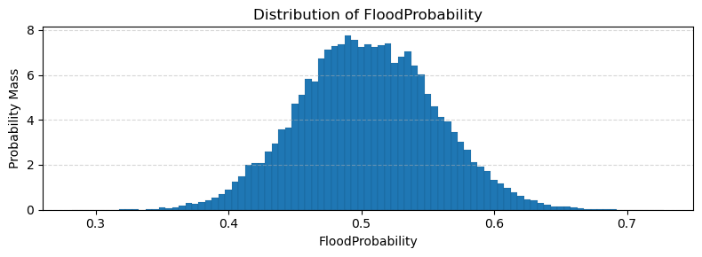
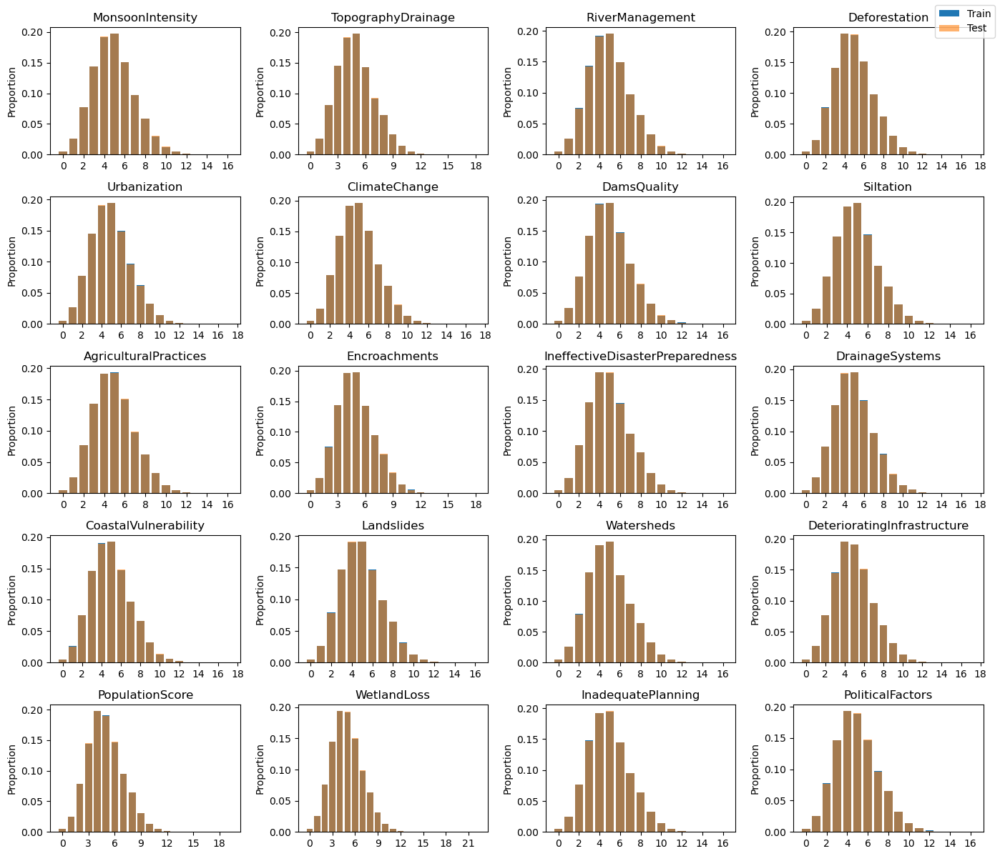
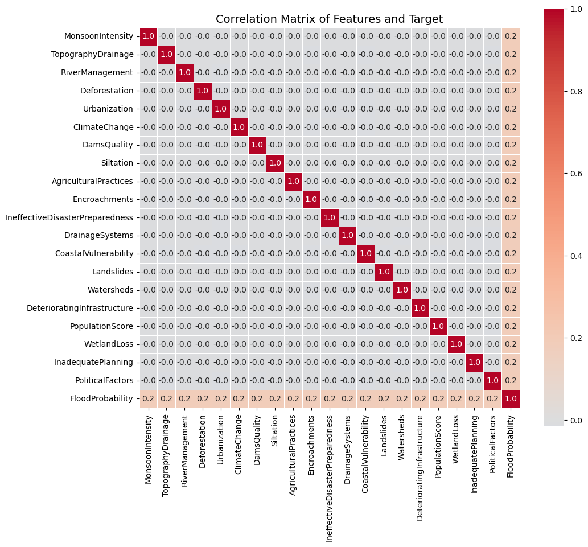
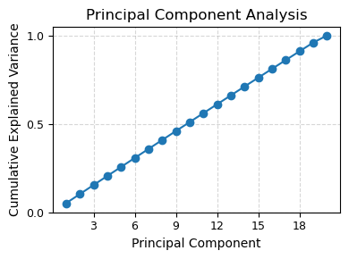
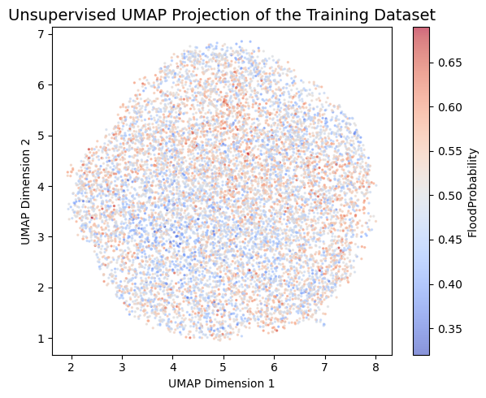
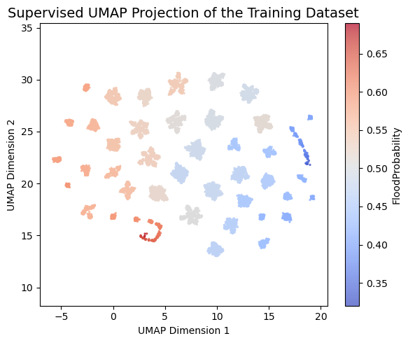
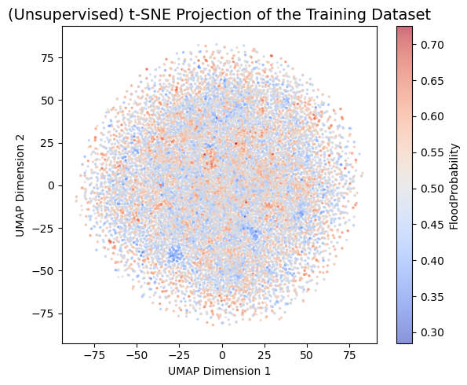

---
### Link to the Kaggle Competition

> https://www.kaggle.com/competitions/playground-series-s4e5/overview

---

```python
# Standard library
import datetime
from collections import defaultdict

# Data manipulation
import numpy as np
import pandas as pd

# Visualisation
import matplotlib.pyplot as plt
from matplotlib.ticker import MaxNLocator
import seaborn as sns

# Machine learning and modelling
from sklearn.base import clone
from sklearn.linear_model import LinearRegression, Ridge
from sklearn.ensemble import ExtraTreesRegressor, RandomForestRegressor  # Optional: if used later
from sklearn.pipeline import make_pipeline, Pipeline
from sklearn.model_selection import KFold
from sklearn.preprocessing import StandardScaler, PolynomialFeatures, SplineTransformer
from sklearn.metrics import r2_score
from sklearn.decomposition import PCA
from sklearn.manifold import TSNE

# UMAP for dimensionality reduction
import umap

# Statistical modelling
import statsmodels.api as sm

```


## Loading the Data

We begin by loading the dataset and observing its structure. The training data consists of over one million rows and twenty features.

**Key Insights:**

- Given the dataset's size, it's important to select algorithms that scale efficiently with large volumes of data. Methods reliant on distance computations (e.g., k-nearest neighbors) or those involving kernel matrices may not be computationally feasible.
- To optimise training time, especially during experimentation, it may be practical to use a simple train–test split instead of full cross-validation. While five-fold cross-validation offers robust performance estimates, it can be prohibitively time-consuming at this scale.


```python
train = pd.read_csv('train.csv', index_col='id')
test = pd.read_csv('test.csv', index_col='id')

initial_features = list(test.columns)
train
```


<div>
<style scoped>
    .dataframe tbody tr th:only-of-type {
        vertical-align: middle;
    }

    .dataframe tbody tr th {
        vertical-align: top;
    }

    .dataframe thead th {
        text-align: right;
    }
</style>
<table border="1" class="dataframe">
  <thead>
    <tr style="text-align: right;">
      <th></th>
      <th>MonsoonIntensity</th>
      <th>TopographyDrainage</th>
      <th>RiverManagement</th>
      <th>Deforestation</th>
      <th>Urbanization</th>
      <th>ClimateChange</th>
      <th>DamsQuality</th>
      <th>Siltation</th>
      <th>AgriculturalPractices</th>
      <th>Encroachments</th>
      <th>...</th>
      <th>DrainageSystems</th>
      <th>CoastalVulnerability</th>
      <th>Landslides</th>
      <th>Watersheds</th>
      <th>DeterioratingInfrastructure</th>
      <th>PopulationScore</th>
      <th>WetlandLoss</th>
      <th>InadequatePlanning</th>
      <th>PoliticalFactors</th>
      <th>FloodProbability</th>
    </tr>
    <tr>
      <th>id</th>
      <th></th>
      <th></th>
      <th></th>
      <th></th>
      <th></th>
      <th></th>
      <th></th>
      <th></th>
      <th></th>
      <th></th>
      <th></th>
      <th></th>
      <th></th>
      <th></th>
      <th></th>
      <th></th>
      <th></th>
      <th></th>
      <th></th>
      <th></th>
      <th></th>
    </tr>
  </thead>
  <tbody>
    <tr>
      <th>0</th>
      <td>5</td>
      <td>8</td>
      <td>5</td>
      <td>8</td>
      <td>6</td>
      <td>4</td>
      <td>4</td>
      <td>3</td>
      <td>3</td>
      <td>4</td>
      <td>...</td>
      <td>5</td>
      <td>3</td>
      <td>3</td>
      <td>5</td>
      <td>4</td>
      <td>7</td>
      <td>5</td>
      <td>7</td>
      <td>3</td>
      <td>0.445</td>
    </tr>
    <tr>
      <th>1</th>
      <td>6</td>
      <td>7</td>
      <td>4</td>
      <td>4</td>
      <td>8</td>
      <td>8</td>
      <td>3</td>
      <td>5</td>
      <td>4</td>
      <td>6</td>
      <td>...</td>
      <td>7</td>
      <td>2</td>
      <td>0</td>
      <td>3</td>
      <td>5</td>
      <td>3</td>
      <td>3</td>
      <td>4</td>
      <td>3</td>
      <td>0.450</td>
    </tr>
    <tr>
      <th>2</th>
      <td>6</td>
      <td>5</td>
      <td>6</td>
      <td>7</td>
      <td>3</td>
      <td>7</td>
      <td>1</td>
      <td>5</td>
      <td>4</td>
      <td>5</td>
      <td>...</td>
      <td>7</td>
      <td>3</td>
      <td>7</td>
      <td>5</td>
      <td>6</td>
      <td>8</td>
      <td>2</td>
      <td>3</td>
      <td>3</td>
      <td>0.530</td>
    </tr>
    <tr>
      <th>3</th>
      <td>3</td>
      <td>4</td>
      <td>6</td>
      <td>5</td>
      <td>4</td>
      <td>8</td>
      <td>4</td>
      <td>7</td>
      <td>6</td>
      <td>8</td>
      <td>...</td>
      <td>2</td>
      <td>4</td>
      <td>7</td>
      <td>4</td>
      <td>4</td>
      <td>6</td>
      <td>5</td>
      <td>7</td>
      <td>5</td>
      <td>0.535</td>
    </tr>
    <tr>
      <th>4</th>
      <td>5</td>
      <td>3</td>
      <td>2</td>
      <td>6</td>
      <td>4</td>
      <td>4</td>
      <td>3</td>
      <td>3</td>
      <td>3</td>
      <td>3</td>
      <td>...</td>
      <td>2</td>
      <td>2</td>
      <td>6</td>
      <td>6</td>
      <td>4</td>
      <td>1</td>
      <td>2</td>
      <td>3</td>
      <td>5</td>
      <td>0.415</td>
    </tr>
    <tr>
      <th>...</th>
      <td>...</td>
      <td>...</td>
      <td>...</td>
      <td>...</td>
      <td>...</td>
      <td>...</td>
      <td>...</td>
      <td>...</td>
      <td>...</td>
      <td>...</td>
      <td>...</td>
      <td>...</td>
      <td>...</td>
      <td>...</td>
      <td>...</td>
      <td>...</td>
      <td>...</td>
      <td>...</td>
      <td>...</td>
      <td>...</td>
      <td>...</td>
    </tr>
    <tr>
      <th>1117952</th>
      <td>3</td>
      <td>3</td>
      <td>4</td>
      <td>10</td>
      <td>4</td>
      <td>5</td>
      <td>5</td>
      <td>7</td>
      <td>10</td>
      <td>4</td>
      <td>...</td>
      <td>7</td>
      <td>8</td>
      <td>7</td>
      <td>2</td>
      <td>2</td>
      <td>1</td>
      <td>4</td>
      <td>6</td>
      <td>4</td>
      <td>0.495</td>
    </tr>
    <tr>
      <th>1117953</th>
      <td>2</td>
      <td>2</td>
      <td>4</td>
      <td>3</td>
      <td>9</td>
      <td>5</td>
      <td>8</td>
      <td>1</td>
      <td>3</td>
      <td>5</td>
      <td>...</td>
      <td>9</td>
      <td>4</td>
      <td>4</td>
      <td>3</td>
      <td>7</td>
      <td>4</td>
      <td>9</td>
      <td>4</td>
      <td>5</td>
      <td>0.480</td>
    </tr>
    <tr>
      <th>1117954</th>
      <td>7</td>
      <td>3</td>
      <td>9</td>
      <td>4</td>
      <td>6</td>
      <td>5</td>
      <td>9</td>
      <td>1</td>
      <td>3</td>
      <td>4</td>
      <td>...</td>
      <td>5</td>
      <td>5</td>
      <td>5</td>
      <td>5</td>
      <td>6</td>
      <td>5</td>
      <td>5</td>
      <td>2</td>
      <td>4</td>
      <td>0.485</td>
    </tr>
    <tr>
      <th>1117955</th>
      <td>7</td>
      <td>3</td>
      <td>3</td>
      <td>7</td>
      <td>5</td>
      <td>2</td>
      <td>3</td>
      <td>4</td>
      <td>6</td>
      <td>4</td>
      <td>...</td>
      <td>6</td>
      <td>8</td>
      <td>5</td>
      <td>3</td>
      <td>4</td>
      <td>6</td>
      <td>7</td>
      <td>6</td>
      <td>4</td>
      <td>0.495</td>
    </tr>
    <tr>
      <th>1117956</th>
      <td>4</td>
      <td>5</td>
      <td>6</td>
      <td>9</td>
      <td>5</td>
      <td>5</td>
      <td>2</td>
      <td>8</td>
      <td>4</td>
      <td>5</td>
      <td>...</td>
      <td>4</td>
      <td>8</td>
      <td>6</td>
      <td>5</td>
      <td>5</td>
      <td>6</td>
      <td>7</td>
      <td>7</td>
      <td>8</td>
      <td>0.560</td>
    </tr>
  </tbody>
</table>
<p>1117957 rows × 21 columns</p>
</div>


## Target Variable: `FloodProbability` Distribution

The target variable, `FloodProbability`, ranges from 0.285 to 0.725. All values are discrete and occur in increments of 0.005, suggesting that the target has been finely quantised, likely as a result of post-processing or model calibration.

To visualise the distribution, we plot a histogram using a bin width of 0.005, ensuring that each unique target value is represented in its own bin. The resulting distribution is symmetric and closely resembles a normal distribution centered around 0.5, indicating a well-balanced target variable.


```python
bin_edges = np.arange(0.2825, 0.7300, 0.005)

plt.figure(figsize=(8, 3))
plt.hist(train['FloodProbability'], bins=bin_edges, density=True, edgecolor='black', linewidth=0.05)
plt.title('Distribution of FloodProbability')
plt.xlabel('FloodProbability')
plt.ylabel('Probability Mass')
plt.grid(axis='y', linestyle='--', alpha=0.5)
plt.tight_layout()
plt.show()

```


    

    


## Feature Distributions

All features in the dataset are integer-valued and exhibit right-skewed distributions, with the majority of values concentrated near the lower end of the range. Visual comparison of the training and test sets reveals that their feature distributions are virtually identical. Overlapping histograms show no meaningful divergence - if discrepancies existed, the bars representing each set (plotted in different colors) would be clearly distinguishable.


```python
import matplotlib.pyplot as plt
from matplotlib.ticker import MaxNLocator

# Plot feature distributions for train vs test
fig, axs = plt.subplots(5, 4, figsize=(14, 12))  # Slightly wider for better spacing

for col, ax in zip(initial_features, axs.ravel()):
    # Relative frequency in training set
    train_dist = train[col].value_counts(normalize=True).sort_index()
    ax.bar(train_dist.index, train_dist.values, label='Train', alpha=1.0)

    # Relative frequency in test set
    test_dist = test[col].value_counts(normalize=True).sort_index()
    ax.bar(test_dist.index, test_dist.values, label='Test', alpha=0.6)

    ax.set_title(col)
    ax.xaxis.set_major_locator(MaxNLocator(integer=True))
    ax.set_ylabel('Proportion')

# Add legend only once, outside the grid
handles, labels = ax.get_legend_handles_labels()
fig.legend(handles, labels, loc='upper right', fontsize='medium')

plt.tight_layout()
plt.show()

```


    

    


## Correlation

The correlation matrix reveals several interesting patterns:

- There is virtually no linear correlation among the features - the pairwise correlation coefficients are all extremely close to zero.
- However, each feature exhibits a noticeable correlation with the target variable `FloodProbability`, suggesting that while features may be mutually uncorrelated, they individually contribute predictive information.

A subtle and intriguing detail emerges from the correlation heatmap: none of the feature-feature correlations are exactly `0.0`; instead, all are `-0.0`. While this might appear negligible, the consistent sign indicates that every pair of features is negatively correlated, albeit at an imperceptibly small scale. This observation hints at a form of weak statistical dependence across the feature set, despite the absence of meaningful linear correlation.


```python
# Prepare the list of features including the target
corr_features = initial_features + ['FloodProbability']

# Compute correlation matrix
correlation_matrix = np.corrcoef(train[corr_features], rowvar=False)

# Plot heatmap
plt.figure(figsize=(11, 11))
sns.heatmap(
    correlation_matrix,
    center=0,
    cmap='coolwarm',
    annot=True,
    fmt='.1f',
    xticklabels=corr_features,
    yticklabels=corr_features,
    square=True,
    linewidths=0.5,
    cbar_kws={'shrink': 0.8}
)
plt.title('Correlation Matrix of Features and Target', fontsize=14)
plt.tight_layout()
plt.show()

```


    

    


## Dimensionality Reduction

### Principal Component Analysis (PCA)
To assess the intrinsic dimensionality of the dataset, we apply Principal Component Analysis (PCA). The cumulative explained variance curve shows a gradual increase across components, indicating that the variance is distributed relatively evenly across all dimensions. This suggests that the dataset is effectively full-rank, and no small subset of principal components captures a dominant share of the variance.

In other words, linear dimensionality reduction would not be beneficial, as each feature contributes unique information that cannot be easily compressed without significant loss of signal.


```python
# Fit PCA on the feature set
pca = PCA()
pca.fit(train[initial_features])

# Plot cumulative explained variance
plt.figure(figsize=(4, 3))
plt.plot(np.arange(1, len(initial_features) + 1), pca.explained_variance_ratio_.cumsum(), marker='o')
plt.title('Principal Component Analysis', fontsize=12)
plt.xlabel('Principal Component', fontsize=10)
plt.ylabel('Cumulative Explained Variance', fontsize=10)
plt.xticks(fontsize=9)
plt.yticks([0, 0.5, 1.0], fontsize=9)
plt.gca().xaxis.set_major_locator(MaxNLocator(integer=True))
plt.grid(True, linestyle='--', alpha=0.5)
plt.tight_layout()
plt.show()
```


    

    


### UMAP
We apply Unsupervised Uniform Manifold Approximation and Projection (UMAP) to reduce the high-dimensional feature space to two dimensions. UMAP is particularly useful for visualising structure, identifying clusters, or uncovering non-linear patterns that may not be evident in the raw feature space.

However, in this case, the 2D projection does not reveal any clear structure or separation with respect to the target variable, `FloodProbability`. The data appears uniformly scattered, suggesting that UMAP does not expose any obvious low-dimensional manifold in this dataset.


```python
# Function to plot the embedding
def plot_embedding(embedding, target, title):
    plt.figure(figsize=(6, 5))
    plt.scatter(
        embedding[:, 0],
        embedding[:, 1],
        s=2,
        c=target,
        cmap='coolwarm',
        alpha=0.6
    )
    plt.gca().set_aspect('equal', 'datalim')
    plt.title(title, fontsize=14)
    plt.xlabel('UMAP Dimension 1')
    plt.ylabel('UMAP Dimension 2')
    plt.colorbar(label='FloodProbability')
    plt.tight_layout()
    plt.show()

# Sample a subset for faster projection
train_sample = train.sample(10_000)

# Fit UMAP
reducer = umap.UMAP()
embedding = reducer.fit_transform(train_sample[initial_features])

# Plot the result
plot_embedding(
    embedding,
    train_sample['FloodProbability'],
    'Unsupervised UMAP Projection of the Training Dataset'
)

```  

    

    


### Supervised UMAP Projection
We also experiment with a supervised version of UMAP, which incorporates the target variable (`FloodProbability`) during the embedding process. This often enhances the separation of data based on the target and can reveal useful structure when relationships exist.

In this case, the resulting 2D projection does appear more organised visually. However, the structure largely reflects the quantised nature of the target, which consists of 83 discrete values. The apparent clustering is therefore an artifact of the target discretization rather than any meaningful data-driven separation. As a result, the supervised UMAP does not offer any additional insight beyond what was already known.


```python
# Sample a smaller subset for faster computation
train_sample = train.sample(10000, random_state=42)

# Fit Supervised UMAP using regression target
reducer = umap.UMAP(
    n_neighbors=50,         # smaller neighborhood for faster computation
    min_dist=0.5,           # moderate compression
    target_metric='manhattan',
    target_weight=0.6,
)

# Perform the supervised projection
embedding = reducer.fit_transform(
    train_sample[initial_features],
    y=train_sample['FloodProbability']
)

# Plotting function
def plot_embedding(embedding, target, title):
    plt.figure(figsize=(6, 5))
    scatter = plt.scatter(
        embedding[:, 0],
        embedding[:, 1],
        s=2,
        c=target,
        cmap='coolwarm',
        alpha=0.7
    )
    plt.gca().set_aspect('equal', 'datalim')
    plt.title(title, fontsize=14)
    plt.xlabel('UMAP Dimension 1')
    plt.ylabel('UMAP Dimension 2')
    cbar = plt.colorbar(scatter)
    cbar.set_label('FloodProbability')
    plt.tight_layout()
    plt.show()

# Visualise the result
plot_embedding(
    embedding,
    train_sample['FloodProbability'],
    'Supervised UMAP Projection of the Training Dataset'
)

```


    

    


### t-distributed Stochastic Neighbor Embedding (t-SNE)


We also apply t-distributed Stochastic Neighbor Embedding (t-SNE) to project the high-dimensional feature space into two dimensions. t-SNE is a popular non-linear technique that is particularly effective at capturing local structure and revealing clusters.

In this case, however, the t-SNE projection does not uncover any meaningful patterns or structure in relation to the target variable, `FloodProbability`. The visualisation resembles random noise, indicating that t-SNE, like UMAP, fails to reveal a low-dimensional manifold in this dataset. Thus, t-SNE offers no additional insight for exploratory purposes.


```python
# Sample a subset for computational efficiency
train_sample = train.sample(20_000, random_state=42)

# Fit and transform with t-SNE
reducer = TSNE(random_state=42, perplexity=30, max_iter=1000, learning_rate='auto')
embedding = reducer.fit_transform(train_sample[initial_features])

# Plot the result
plot_embedding(
    embedding,
    train_sample['FloodProbability'],
    '(Unsupervised) t-SNE Projection of the Training Dataset'
)

``` 

    

    


## Cross-Validation Strategy

To ensure consistency and reproducibility across all model evaluations, we define a unified cross-validation function that standardises how models are trained and validated.

For efficiency during early experimentation, we evaluate performance using only the first fold of the five-fold cross-validation split. This approach significantly reduces computation time while providing a reasonable estimate of model performance. If higher precision is required later in the modeling pipeline, we can easily enable all five folds by adjusting a single flag.


```python
from collections import defaultdict

# Configuration
kf = KFold(n_splits=5, shuffle=True, random_state=1)
SINGLE_FOLD = True       # Toggle for full vs. single-fold CV
COMPUTE_TEST_PRED = True # Toggle to compute test set predictions
oof = defaultdict(lambda: np.full_like(train.FloodProbability, np.nan, dtype=float))
test_pred = {}

def cross_validate(model, label, features=initial_features, n_repeats=1):
    """
    Evaluate a model using cross-validation.
    
    Parameters:
    - model: scikit-learn compatible regressor
    - label: string identifier for the model
    - features: list of feature names to use
    - n_repeats: number of training repeats with different random seeds

    Outputs:
    - Stores out-of-fold predictions in `oof[label]`
    - Stores averaged test predictions in `test_pred[label]` if enabled
    """
    start_time = datetime.datetime.now()
    scores = []
    oof_preds = np.full_like(train.FloodProbability, np.nan, dtype=float)

    for fold, (idx_tr, idx_va) in enumerate(kf.split(train)):
        X_tr = train.iloc[idx_tr][features]
        X_va = train.iloc[idx_va][features]
        y_tr = train.iloc[idx_tr].FloodProbability
        y_va = train.iloc[idx_va].FloodProbability

        y_pred = np.zeros_like(y_va, dtype=float)

        for i in range(n_repeats):
            m = clone(model)
            if n_repeats > 1:
                mm = m
                if isinstance(mm, Pipeline):
                    mm = mm[-1]
                if isinstance(mm, TransformedTargetRegressor):
                    mm = mm.regressor
                mm.set_params(random_state=i)

            m.fit(X_tr, y_tr)
            y_pred += m.predict(X_va)

        y_pred /= n_repeats
        score = r2_score(y_va, y_pred)
        print(f"# Fold {fold}: R² = {score:.5f}")
        scores.append(score)
        oof_preds[idx_va] = y_pred

        if SINGLE_FOLD:
            break

    elapsed_time = datetime.datetime.now() - start_time
    avg_score = np.mean(scores)
    print(f"{Fore.GREEN}# Overall R²: {avg_score:.5f} | Model: {label}"
          f"{' (single fold)' if SINGLE_FOLD else ''} "
          f"| Time: {int(np.round(elapsed_time.total_seconds() / 60))} min{Style.RESET_ALL}")
    oof[label] = oof_preds

    # Optional: generate test set predictions
    if COMPUTE_TEST_PRED:
        X_tr = train[features]
        y_tr = train.FloodProbability
        y_pred = np.zeros(len(test), dtype=float)

        for i in range(n_repeats):
            m = clone(model)
            if n_repeats > 1:
                mm = m
                if isinstance(mm, Pipeline):
                    mm = mm[-1]
                if isinstance(mm, TransformedTargetRegressor):
                    mm = mm.regressor
                mm.set_params(random_state=i)

            m.fit(X_tr, y_tr)
            y_pred += m.predict(test[features])

        y_pred /= n_repeats
        test_pred[label] = y_pred
```

## Linear Models 

We begin our modeling process with linear regression approaches, using various transformations to capture potential non-linearities in the data.

- A basic linear regression with standardised features provides a strong baseline.
- Adding polynomial features improves performance slightly, suggesting that some quadratic interactions among features are predictive.
- Applying spline transformations offers a more flexible form of non-linearity, but the performance gain is still modest.

These results indicate that while the relationship between features and the target is not purely linear, simple transformations are not sufficient to fully capture the underlying patterns.


```python
# Standard Linear Regression
model = make_pipeline(
    StandardScaler(),
    LinearRegression()
)
cross_validate(model, 'LinearRegression')

# Polynomial Features + Ridge Regression
model = make_pipeline(
    StandardScaler(),
    PolynomialFeatures(degree=2, include_bias=False),
    Ridge()
)
cross_validate(model, 'Poly-Ridge')

# Spline Transformation + Ridge Regression
model = make_pipeline(
    StandardScaler(),
    SplineTransformer(n_knots=5, degree=3),
    Ridge()
)
cross_validate(model, 'Spline-Ridge')

```

    # Fold 0: R² = 0.84589
    # Overall R²: 0.84589 | Model: LinearRegression (single fold) | Time: 0 min
    # Fold 0: R² = 0.84642
    # Overall R²: 0.84642 | Model: Poly-Ridge (single fold) | Time: 0 min
    # Fold 0: R² = 0.84627
    # Overall R²: 0.84627 | Model: Spline-Ridge (single fold) | Time: 0 min
    

### Linear Regression with Statistical Inference

As an alternative to `scikit-learn`'s `LinearRegression`, we use `statsmodels`, which provides detailed statistical diagnostics for linear models. This implementation allows us to inspect regression coefficients, along with their associated standard errors, t-statistics, and p-values.

This is particularly useful during exploratory analysis to:

- Assess the statistical significance of each feature,
- Interpret the magnitude and direction of feature effects,
- Check for potential multicollinearity or model instability.

While the model's predictive power is not the focus here, the regression summary offers valuable insights into how individual features relate to the target variable.


```python
import statsmodels.api as sm

# Add intercept term
X = sm.add_constant(train[initial_features])

# Fit OLS model and display summary
model = sm.OLS(train['FloodProbability'], X, missing='error')
results = model.fit()
results.summary()

```


<table class="simpletable">
<caption>OLS Regression Results</caption>
<tr>
  <th>Dep. Variable:</th>    <td>FloodProbability</td> <th>  R-squared:         </th>  <td>   0.845</td> 
</tr>
<tr>
  <th>Model:</th>                   <td>OLS</td>       <th>  Adj. R-squared:    </th>  <td>   0.845</td> 
</tr>
<tr>
  <th>Method:</th>             <td>Least Squares</td>  <th>  F-statistic:       </th>  <td>3.046e+05</td>
</tr>
<tr>
  <th>Date:</th>             <td>Wed, 02 Apr 2025</td> <th>  Prob (F-statistic):</th>   <td>  0.00</td>  
</tr>
<tr>
  <th>Time:</th>                 <td>00:32:02</td>     <th>  Log-Likelihood:    </th> <td>2.7820e+06</td>
</tr>
<tr>
  <th>No. Observations:</th>      <td>1117957</td>     <th>  AIC:               </th> <td>-5.564e+06</td>
</tr>
<tr>
  <th>Df Residuals:</th>          <td>1117936</td>     <th>  BIC:               </th> <td>-5.564e+06</td>
</tr>
<tr>
  <th>Df Model:</th>              <td>    20</td>      <th>                     </th>      <td> </td>    
</tr>
<tr>
  <th>Covariance Type:</th>      <td>nonrobust</td>    <th>                     </th>      <td> </td>    
</tr>
</table>
<table class="simpletable">
<tr>
                 <td></td>                    <th>coef</th>     <th>std err</th>      <th>t</th>      <th>P>|t|</th>  <th>[0.025</th>    <th>0.975]</th>  
</tr>
<tr>
  <th>const</th>                           <td>   -0.0533</td> <td>    0.000</td> <td> -234.995</td> <td> 0.000</td> <td>   -0.054</td> <td>   -0.053</td>
</tr>
<tr>
  <th>MonsoonIntensity</th>                <td>    0.0056</td> <td> 9.25e-06</td> <td>  606.734</td> <td> 0.000</td> <td>    0.006</td> <td>    0.006</td>
</tr>
<tr>
  <th>TopographyDrainage</th>              <td>    0.0056</td> <td> 9.09e-06</td> <td>  621.525</td> <td> 0.000</td> <td>    0.006</td> <td>    0.006</td>
</tr>
<tr>
  <th>RiverManagement</th>                 <td>    0.0057</td> <td> 9.18e-06</td> <td>  617.178</td> <td> 0.000</td> <td>    0.006</td> <td>    0.006</td>
</tr>
<tr>
  <th>Deforestation</th>                   <td>    0.0057</td> <td> 9.27e-06</td> <td>  612.404</td> <td> 0.000</td> <td>    0.006</td> <td>    0.006</td>
</tr>
<tr>
  <th>Urbanization</th>                    <td>    0.0057</td> <td> 9.14e-06</td> <td>  619.319</td> <td> 0.000</td> <td>    0.006</td> <td>    0.006</td>
</tr>
<tr>
  <th>ClimateChange</th>                   <td>    0.0057</td> <td> 9.25e-06</td> <td>  612.437</td> <td> 0.000</td> <td>    0.006</td> <td>    0.006</td>
</tr>
<tr>
  <th>DamsQuality</th>                     <td>    0.0057</td> <td> 9.13e-06</td> <td>  619.170</td> <td> 0.000</td> <td>    0.006</td> <td>    0.006</td>
</tr>
<tr>
  <th>Siltation</th>                       <td>    0.0056</td> <td> 9.21e-06</td> <td>  612.284</td> <td> 0.000</td> <td>    0.006</td> <td>    0.006</td>
</tr>
<tr>
  <th>AgriculturalPractices</th>           <td>    0.0056</td> <td>  9.2e-06</td> <td>  612.643</td> <td> 0.000</td> <td>    0.006</td> <td>    0.006</td>
</tr>
<tr>
  <th>Encroachments</th>                   <td>    0.0056</td> <td> 9.14e-06</td> <td>  618.374</td> <td> 0.000</td> <td>    0.006</td> <td>    0.006</td>
</tr>
<tr>
  <th>IneffectiveDisasterPreparedness</th> <td>    0.0056</td> <td> 9.16e-06</td> <td>  615.995</td> <td> 0.000</td> <td>    0.006</td> <td>    0.006</td>
</tr>
<tr>
  <th>DrainageSystems</th>                 <td>    0.0056</td> <td> 9.18e-06</td> <td>  613.641</td> <td> 0.000</td> <td>    0.006</td> <td>    0.006</td>
</tr>
<tr>
  <th>CoastalVulnerability</th>            <td>    0.0057</td> <td> 9.11e-06</td> <td>  622.228</td> <td> 0.000</td> <td>    0.006</td> <td>    0.006</td>
</tr>
<tr>
  <th>Landslides</th>                      <td>    0.0056</td> <td> 9.15e-06</td> <td>  616.245</td> <td> 0.000</td> <td>    0.006</td> <td>    0.006</td>
</tr>
<tr>
  <th>Watersheds</th>                      <td>    0.0056</td> <td> 9.14e-06</td> <td>  617.853</td> <td> 0.000</td> <td>    0.006</td> <td>    0.006</td>
</tr>
<tr>
  <th>DeterioratingInfrastructure</th>     <td>    0.0056</td> <td> 9.21e-06</td> <td>  609.647</td> <td> 0.000</td> <td>    0.006</td> <td>    0.006</td>
</tr>
<tr>
  <th>PopulationScore</th>                 <td>    0.0057</td> <td> 9.17e-06</td> <td>  618.914</td> <td> 0.000</td> <td>    0.006</td> <td>    0.006</td>
</tr>
<tr>
  <th>WetlandLoss</th>                     <td>    0.0056</td> <td>  9.2e-06</td> <td>  612.654</td> <td> 0.000</td> <td>    0.006</td> <td>    0.006</td>
</tr>
<tr>
  <th>InadequatePlanning</th>              <td>    0.0056</td> <td> 9.14e-06</td> <td>  613.363</td> <td> 0.000</td> <td>    0.006</td> <td>    0.006</td>
</tr>
<tr>
  <th>PoliticalFactors</th>                <td>    0.0056</td> <td>  9.1e-06</td> <td>  620.512</td> <td> 0.000</td> <td>    0.006</td> <td>    0.006</td>
</tr>
</table>
<table class="simpletable">
<tr>
  <th>Omnibus:</th>       <td>100155.250</td> <th>  Durbin-Watson:     </th>  <td>   2.000</td> 
</tr>
<tr>
  <th>Prob(Omnibus):</th>   <td> 0.000</td>   <th>  Jarque-Bera (JB):  </th> <td>148528.907</td>
</tr>
<tr>
  <th>Skew:</th>            <td> 0.703</td>   <th>  Prob(JB):          </th>  <td>    0.00</td> 
</tr>
<tr>
  <th>Kurtosis:</th>        <td> 4.100</td>   <th>  Cond. No.          </th>  <td>    265.</td> 
</tr>
</table><br/><br/>Notes:<br/>[1] Standard Errors assume that the covariance matrix of the errors is correctly specified.


### Additive Feature Structure

An inspection of the linear regression coefficients reveals that all features have approximately the same multiplicative coefficient, estimated to be around **0.00565**. This uniformity suggests that the model effectively reduces to a **weighted sum of features** with a common weight, plus an intercept term.

The model can be approximated as:

$$
\hat{y} = \beta \cdot \sum_{i=1}^{d} x_i + \alpha
$$

where:

- $\beta \approx 0.00565$,
- $\alpha \approx -0.053$,
- $x_i$ represents each feature,
- $d$ is the number of features.

This implies that the sum of all feature values is a strong linear predictor of the target. Using this simplified form, we can compute an approximate prediction for `FloodProbability`:

### Insight:
This surprisingly effective approximation highlights a latent structure in the dataset: the total feature magnitude strongly correlates with flood probability, even without modeling feature-specific effects.


```python
# Compute approximation using summed features
approx_prediction = train[initial_features].sum(axis=1) * 0.00565 - 0.053

# Evaluate goodness of fit
score = r2_score(train['FloodProbability'], approx_prediction)
print(f"R² Score (approximate model): {score:.5f}")
```

    R² Score (approximate model): 0.84476
    
